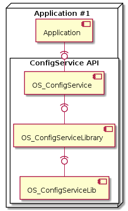
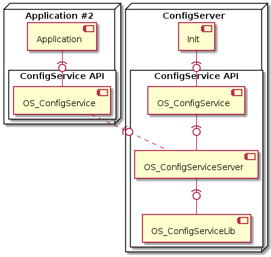

# ConfigService API

## Overview

The ConfigService can be deployed as a centralized configuration database for
all system components and applications. The hierarchical configuration database
managed by this service can store the settings for any application or
system component that opts to use this service. Instead of having
various applications or system component-specific configuration formats
that additionally store the corresponding values in different locations,
this service offers a standardized way of storing and preparing all the
relevant settings in one place.

The following sections will highlight the concepts and architecture of
the ConfigService, as well as the different options to utilize this
service in applications and system components. The required
initialization process will be demonstrated with various code examples.
Finally, a reference to a TRENTOS system will be provided that showcases
the usage.

### Concepts

The following concepts are based on the assumption that the system is
static and no applications are added or removed at runtime. All relevant
configuration parameters of the system are well known at image creation
time.

- **Handles:** The ConfigService API context can be instantiated and
    managed via handles.
- **Persisting the data:** Details about how the service persists the
    configuration data are hidden from the caller of the API. Depending
    on the intended system requirements, the ConfigService can either
    store the configuration database in a memory backend or make use of
    a file system, if it has access to a StorageServer instance.
- **Configuration Parameter Types:** The service supports four different types
    of storing the parameter values.
  - uint32
  - uint64
  - string (which can have a size of up to 32 bytes, including NUL
        terminator)
  - blob (which can have an arbitrary size and is broken down into
        blocks of 64 bytes)
- **Instantiation modes:** The ConfigService API can be integrated into three
    different ways.
  - As a Library: In this setup, all calls to the ConfigService API
        are mapped to a local configuration instance of the underlying
        Library.
  - As a Client: In this setup, all calls to the ConfigService API
        are mapped to an RPC, which in turn is received by an RPC Server
        that executes the function with its own Library instance -- but
        in a separate component.
  - As a Server: In this setup, all calls to the ConfigService API
        are received through RPCs from the connected clients and are in
        turn executed on the component\'s own local instance of the
        configuration Library.

#### Configuration Structure

As the following image shows, the parameters managed by the
ConfigService are grouped together in specific domains. Each domain
requires a unique name under which it can be found and identified.
Depending on how the system using the ConfigService is comprised
(possibly of two very similar apps or components), the grouping of
parameters under domains offers an easy way to avoid parameter naming
collision.

Because the configuration database is managed by this one service, all
calls made to the API in a Client-Server Model will be serialized and
dealt with in sequential order, thus maintaining the overall consistency
of the stored configuration data and avoiding possible race conditions
between different clients fetching or editing the settings.

In order to retrieve a parameter value through the API, a system component or an
application needs to be able to provide two things: the domain name and the
parameter name.


#### Configuration Backend

In its current implementation, the service offers two different ways of setting
up the configuration backend to store the settings. It can either use a memory
backend of the component hosting the Library instance (simply by allocating
memory on the heap of the component, large enough to store all the parameters)
or utilize a file system backend by connecting to a storage driver component
that implements the SDK\'s storage interface. The usage of a file system backend
opens up the possibility to inject the application and system settings through
the [Configuration Provisioning Tool](../tools/configuration-provisioning-tool.md)
that creates a provisioned image in a compatible format which then can be placed
at a location that can be accessed through a connected storage driver.

#### Access Management

A single ConfigService instance makes use of a single database to store
all the configuration parameters in. This means that in a system setup
that features a single ConfigServer component managing the available
configuration database, the clients connected to this server can access
all the parameters stored in this database. Restricting the read and
write access to the stored parameters is currently not implemented on a
client basis but instead needs to be set globally (e.g. through the
[Configuration Provisioning Tool](../tools/configuration-provisioning-tool.md)).

If a clear access separation between the clients is required for the intended
system design, it is recommended to either include the ConfigService library
directly into the components that should not share the database with other
components, or alternatively adding an additional server component to the
system.

### Architecture

The implementation can be divided into three layers:

1. **API layer:** Implements the API functions as exported via the
    central API header.
2. **RPC layer:** Implements the RPC functionality, i.e., the RPC
    Client and RPC Server.
3. **LIB layer:** Implements the actual functionality of the
    ConfigService and thereby takes care of reading and writing the
    configuration parameters into the respective memory or file system
    backend.


### Implementation

#### Layout if Used as a Library

If included as a Library, the ConfigService API will make use of the
local instance of the Library and use that instance to execute any calls
made to the API.



#### Layout if Used in a Client-Server Model

All API calls made by a component built as a client will be redirected
into RPCs to a remote instance of the Library. This setup will require
another component to act as the configuration Server accepting the RPCs.
The initialization of the configuration backend is the responsibility of
the Server component in this model. Due to the additional overhead of
RPC communication between RPC Client and RPC Server, this mode of
operation is expected to be slower.



## Usage

The following section will provide examples of how the API can be
instantiated in a TRENTOS system.

### Declaration of API Library in CMake

As already explained above, the ConfigService can be integrated in three
different ways with the following define flags that need to be set in
the **`CMakeLists.txt`** file:

| Define                                 | Build option       |
|----------------------------------------|--------------------|
| -                                      | As a Library       |
| OS_CONFIG_SERVICE_CAMKES_SERVER        | As a CAmkES Server |
| OS_CONFIG_SERVICE_CAMKES_CLIENT        | As a CAmkES Client |

If the Build option is "As a Library" or "As a CAmkES Server" it is
also necessary to choose a backend option:

| Define                                      | Build option          |
|---------------------------------------------|-----------------------|
| OS_CONFIG_SERVICE_BACKEND_FILESYSTEM        | Memory Backend        |
| OS_CONFIG_SERVICE_BACKEND_MEMORY            | File System Backend   |

If the component is built using a file system backend, it is recommended
to also take a look at the documentation of the
[FileSystem API](file-system_api.md).

The following libraries have to be linked in the declaration of the
component:

- os_core_api
- lib_debug
- os_configuration

If the file system backend is selected, this also needs to be linked with
**`os_filesystem`**.

## Example

### Instantiation of API in CMake

A possible **`CMakeLists.txt`** configuration for a CAmkES ConfigServer
component with a file system backend would result in:

```CMake
DeclareCAmkESComponent(
  ConfigServer
  SOURCES
      ...
  C_FLAGS
      ...
      # indicates the use of the filesystem backend
      -DOS_CONFIG_SERVICE_BACKEND_FILESYSTEM
      # indicates a CAmkES configuration server is being built
      -DOS_CONFIG_SERVICE_CAMKES_SERVER
  LIBS
      ...
      os_core_api
      lib_debug
      os_configuration
      os_filesystem
)
```

A client component will have to only include the relevant lib and set
the correct define:

```CMake
DeclareCAmkESComponent(
  ExampleClient
  SOURCES
      ...
  C_FLAGS
      ...
      -DOS_CONFIG_SERVICE_CAMKES_CLIENT
  LIBS
      ...
      os_core_api
      os_configuration
)
```

### Integrating the CAmkES Interface File When Building a Server Component

The SDK already provides the necessary files (**`os_core_api`**) to set up an
interface for the ConfigServer built as a CAmkES component. Import the
**`if_OS_ConfigService.camkes`** interface in the CAmkES component file of the
ConfigServer component and name the procedure
**`if_OS_ConfigService OS_ConfigServiceServer`** (this way it will be automatically
linked to functions of the library implementing the RPC calls) and also define a
dataport for the clients to connect to as seen in this example:

```c
import <if_OS_ConfigService.camkes>;

component ConfigServer {
  provides if_OS_ConfigService OS_ConfigServiceServer;

  //-------------------------------------------------
  // dataports for clients
  dataport Buf client01_dp;
  dataport Buf client02_dp;
}
```

A client would connect to this ConfigServer component by also integrating the
interface and setting a dataport:

```c
import <if_OS_ConfigService.camkes>;

component Client {
  control;

  uses if_OS_ConfigService OS_ConfigServiceServer;

  dataport Buf configServer_dp;
}
```

### Using the API in C

When initializing the configuration instance with a file system backend,
it is required to first initialize the file system handle that the
ConfigService makes use of. The initialization process of this can be
found in the documentation of the [FileSystem API](file-system_api.md) and won't
be covered in the following example.

Using the ConfigService API requires to include only one header:

```c
#include "OS_ConfigService.h"
```

To initialize the local configuration Library in a Server or Library
setup, the first step is to obtain the pointer to the local instance.

```c
// Get the pointer to the local configuration instance
OS_ConfigServiceLib_t* configLib = OS_ConfigService_getInstance();
```

If the mounted partition already contains a complete configuration file,
then these are the steps to follow to initialize this file and to be
able to write and retrieve configuration parameters from it.

**Warning:** Beware that the defined file names in the example need to be the
same ones that were used to create the provisioned configuration image with the
[Configuration Provisioning Tool](../tools/configuration-provisioning-tool.md),
otherwise the initialization process will not be able to find the files.

Initialize the backends:

```c
/* Defines -------------------------------------------------------------------*/
#define PARAMETER_FILE "PARAM.BIN"
#define DOMAIN_FILE "DOMAIN.BIN"
#define STRING_FILE "STRING.BIN"
#define BLOB_FILE "BLOB.BIN"

// initialized handle for the filesystem
// (the init process can be found in the documentation of the filesystem)
OS_FileSystem_Handle_t hFs;
OS_ConfigServiceBackend_t parameterBackend;
OS_ConfigServiceBackend_t domainBackend;
OS_ConfigServiceBackend_t stringBackend;
OS_ConfigServiceBackend_t blobBackend;
OS_ConfigServiceBackend_FileName_t name;

// small helper function to set the filename
static void initializeName(char* buf, size_t bufSize, char const* name)
{
    memset(buf, 0, bufSize);
    strncpy(buf, name, bufSize - 1);
    // domain backend
    initializeName(name.buffer, OS_CONFIG_BACKEND_MAX_FILE_NAME_SIZE, DOMAIN_FILE);
    OS_ConfigServiceBackend_initializeFileBackend(&domainBackend, name, hFs);
    // parameter backend
    initializeName(name.buffer, OS_CONFIG_BACKEND_MAX_FILE_NAME_SIZE,
                   PARAMETER_FILE);
    OS_ConfigServiceBackend_initializeFileBackend(&parameterBackend, name, hFs);
    // string parameter backend
    initializeName(name.buffer, OS_CONFIG_BACKEND_MAX_FILE_NAME_SIZE, STRING_FILE);
    OS_ConfigServiceBackend_initializeFileBackend(&stringBackend, name, hFs);
    // blob parameter backend
    initializeName(name.buffer, OS_CONFIG_BACKEND_MAX_FILE_NAME_SIZE, BLOB_FILE);
    OS_ConfigServiceBackend_initializeFileBackend(&blobBackend, name, hFs);
}
```

The backend in the configuration library instance is finally initialized with
the different parameter types:

```c
OS_ConfigServiceLib_Init(
    configLib,
    &parameterBackend,
    &domainBackend,
    &stringBackend,
    &blobBackend
);
```

Up to this point, the described initialization process refers to components
building the ConfigService as a Library or as a Server. The initialization for
components acting as Clients and connecting to a remote configuration instance
only requires a handle to be able to operate the API:

```c
#include "OS_ConfigService.h"
OS_ConfigService_ClientCtx_t ctx =
{
    .dataport = OS_DATAPORT_ASSIGN(configServer_dp)
};
OS_ConfigServiceHandle_t hConfig;
//Create remote handle of the ConfigServer API.
OS_ConfigService_createHandleRemote(&ctx, &hConfig);
```

If the configuration lib is run locally in the component, it is required to
create a local handle:

```c
OS_ConfigServiceHandle_t hConfig;
//Open a local handle of the ConfigServer API.
OS_ConfigService_createHandleLocal(&hConfig);
```

### A Further Example of Resources

To get a better understanding of how the ConfigService API can be utilized in a
system, it is recommended to take a look at the IoT Demo, which is part of this
SDK. This demo system contains a ConfigService Server component which sets up
the initial file system backend with a provisioned image from the
[Configuration Provisioning Tool](../tools/configuration-provisioning-tool.md).
Several components in this demo are connected to this ConfigService server as
clients and fetch their settings through it. The system setup and the overview
of the system architecture for this demo can be found in the corresponding
[IoT Demo App for QEMU](../demos/demo-iot_qemu.md) documentation.
