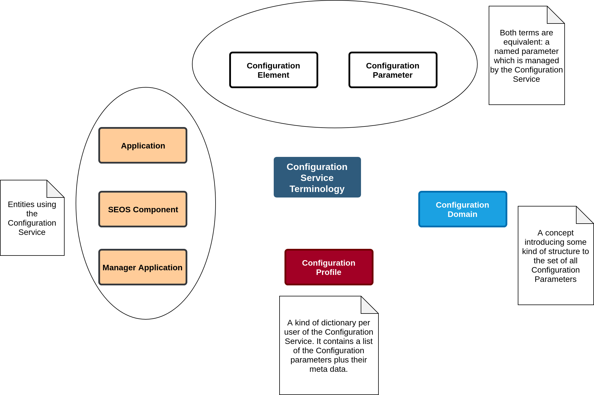

# Configuration Service
## Concept
* [SEOS-280](https://github.com/TRENT-OS/migrated_jira_issues/issues/2197) - Authenticate to see issue details
* the TRENTOS Configuration Service is a central database for configuration data.
    * there are several approaches to this in other systems. We want to pick the good things and try to avoid the bad things.
    * Windows Registry, see https://docs.microsoft.com/en-us/windows/win32/sysinfo/registry
    * Property API in Global Platform TEE internal API, see https://globalplatform.org/wp-content/uploads/2018/06/GPD_TEE_Internal_Core_API_Specification_v1.1.2.50_PublicReview.pdf
* each TRENTOS component and all applications can store configuration parameters there
* configuration elements
    * type
        * boolean
        * integer (32, 64)
        * small blobs (ie. content can be retrieved in one call)
        * IPv4 Addresses (32 bit integer)
        * IPv6 Addresses (128 bit integer)
        * ASCII/UTF-8 Strings
        * large blobs (basically "files" where contents usually can't be retrieved in one calls)
        * timestamp (store point in time as yyyy-mm-dd_hh:ss with resolution of 1 second, a 32-bit sec counter will roll over after 136,2 years)
        * high resolution timestamp (64-bit nano sec counter will roll over after 584,9 years)
    * data origin
        * constants
        * dynamically generated (ie timer, free memory .....). Note: when queried the Configuration Service will interact with some entity (kernel, hardware) to retrieve a value returned as the value of query. More formally: two consecutive queries of such configuration elements need not return identical values (given that there was no API based change of value in between).
* the configuration service provides an API to get and set these parameters
    * getParameter()
    * setParameter() if write access is supported
    * enumerateParameters()
    * ...
* each service or application has a configuration profile, which defines:
    * what parameters exist
    * parameter name
        * should be human readable string
    * parameter type
    * access rights
        * application access
            * read, write 
            * there can be read-only parameters, which are set by TRENTOS components
            * some parameters may not be accessible by the application at all. They can only be read by TRENTOS components and contain application specific data
        * manager application access (for now: assume there is one system wide manager application)
            * read/write
            * manage configuration data for an application
        * public access
            * read, write
        * TRENTOS components access
            * read, write
* details about persisting the configuration data are hidden by the configuration service
    * application gets an API to access the config data objects
    * may use 
        * database library
        * file system
        * raw memory

## Terminology



## Assumptions
* TRENTOS is a static system,  no applications are added or removed.
* all relevant configuration parameters are well known at system image creation time.


## API
### Retrieve a configuration element

```c
get_element(hConfigDomain_t, char*, hElement_t*)
get_element_name(hElement)
get_element_type(hElement, cfgTpye_t*)
get_element_size(hElement, size_t*)
get_element_value(hElement, void*, size_t*)
```

### Dedicated retrieve functions for element types
```c
get_as_blob(hElement)
get_as_bool(hElement)
get_as_u32(hElement)

get_as_u64(hElement)
get_as_string(hElement)
get_as_UUID(hElement)
get_as_IPv4(hElement)
get_as_IPv6(hElement)
get_as_timestamp(hElement)
```

### Enumerate configuration elements
```c
get_enumerator(hConfigDomain_t, hEnumerator*)
close_enumerator(hEnumerator)
reset_enumerator(hEnumerator)
increment_enumerator(hEnumerator*)
get_element(hEnumerator, hElement*)
```

### Manage configuration elements
```c
create_element(hConfigDomain, cfgtype_t cfgType, char* name, void* data, size_t len)
delete_element(hElement)
wipe_domain(hConfigDomain)
```
_Note: these management functions are only used for the creation of system images - for the initial implementation of the Configuration Server._

_Note: if these functions shall be available at runtime to all of the applications then the following open points need to be defined in the concept:_

* If an application creates an element: how should the read writes be set for all the other applications (note: applications are not supposed to know about each other).
* If an application deletes an element: should it really be enabled to do so in case this conifuration element is visiable to other applications as well.

### Enumerate configuration domains
```c
get_enumerator(hDomainEnumerator*)
close_enumerator(hDomainEnumerator)
reset_enumerator(hDomainEnumerator)
increment_enumerator(hEnumerator*)
get_element(hDomainEnumerator, hConfigDomain*)
```

### Elaboration of Configuration Service Concept needed:

* Configuration Domain:
        * Their purpose needs to be defined. For example it could be a simple flat domain merely existing to prevent name clashes of Configuration Parameters of different Applications. Or it could be a tree-like structure containing "well-known" places - similar to the Windows registry.

