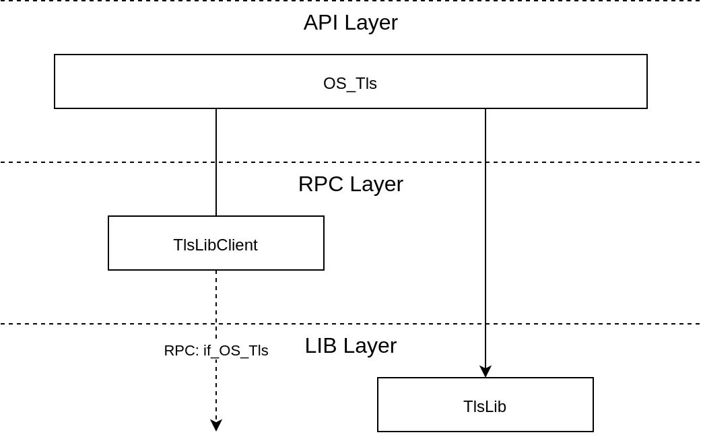

# TLS API

## Overview

The TLS API is an API provided by TRENTOS for the simple creation and usage of
TLS client connections according to the TLS 1.2 standard.

### Concepts

Here we introduce a few key concepts of the TLS API.

#### Only Secure Cipher-Suites

The basic idea to make the configuration of the TLS API instance as simple as
possible is to offer only secure cipher-suites. If the TLS server an application
wants to connect to, offers none of the cipher-suites supported by the TLS API,
the connection cannot be established.

#### Cipher-Suite Defines All Algorithms

In TLS, the cipher-suite only defines *most* but not all of the algorithms used
as part of a complete TLS-protocol run. Again, to make configuration simple, all
remaining algorithms (e.g. hash algorithms for sessions or certificates) and
their parameters (e.g. RSA key sizes for certificates) will be derived based on
the *weakest* of the selected cipher-suites! The idea here is that the choice of
cipher-suite becomes the defining choice for all algorithms, even though this
can be overridden with the policy parameter by more advanced users.

For this, the TLS API can be configured with an extra "policy", which extends
the algorithm selection with more algorithms (insofar the
[Crypto API](crypto_api.md) also supports them). Thus, it becomes possible to
use a cipher-suite that would enforce SHA256 as hash algorithm everywhere with a
SHA1 for certificate hashing -- even though the latter is no longer considered
secure, it may be necessary for legacy reasons.

#### Instantiation Modes

The TLS API can be instantiated in two modes in order to support the
implementation of the required modes of operation.

- **`OS_Tls_MODE_LIBRARY`**: This mode configures a TLS API
    instance such that *every* API call is directly mapped to a call of
    the underlying library.
- **`OS_Tls_MODE_CLIENT`**: This mode configures a TLS API
    instance such that *every* API call is directly mapped to an RPC
    call, which in turn is received by an RPC server and executed within
    its own context.

### Architecture

The implementation of the TLS API is internally divided into three
layers:

1. **API layer:** This layer implements the API functions as exported
    via the central API header directory.
2. **RPC layer:** This layer implements the RPC functionality, i.e., it
    provides an RPC client using the **`if_OS_Tls`** interface to
    connect to an RPC server instance in another component.
3. **LIB layer:** This layer contains the actual implementation of the
    TLS protocol.

The following image shows this structure and also how the individual
parts are linked together.



From this, we see that the TLS protocol layer can either be called directly from
the API layer or indirectly through the RPC Client which uses CAmKES-generated
RPC calls to communicate with an RPC Server in another component (see also
below).

The following sub-sections show how the layers are distributed across components
when the TLS API is instantiated in the respective mode.

### Layout in OS_Tls_MODE_ LIBRARY Mode

In **`OS_Tls_MODE_LIBRARY`** mode, the TLS API has a local instance of the TLS
protocol library and uses just that instance to execute any TLS API calls. This
is the simplest and most straightforward mode.

```{mermaid}
flowchart TD
    subgraph Node_App["Application #1"]
        subgraph TlsApi_App["TLS API"]
            OS_Tls_App[OS_Tls]
            TlsLib[TlsLib]
        end

        App[Application]
        App --> OS_Tls_App
        OS_Tls_App --> TlsLib
    end
```

### Layout in OS_Tls_MODE_CLIENT Mode

In **`OS_Tls_MODE_CLIENT`** mode, the TLS API delegates all calls to a remote
instance of the TLS protocol library providing the **`if_OS_Tls`** interface.
Typically, this remote instance would internally manage one TLS connection per
RPC client.

Thus, all complex parts of the TLS protocol are executed in an isolated
environment.

```{mermaid}
flowchart TD
    %% Application #2 Node
    subgraph Node_App["Application #2"]
        subgraph TlsApi_App["TLS API"]
            OS_Tls_App[OS_Tls]
            TlsLibClient[TlsLibClient]
        end

        App[Application]
        App --> OS_Tls_App
        OS_Tls_App --> TlsLibClient
    end

    %% TlsServer Node
    subgraph TlsServer
        subgraph TlsApi_Server["TLS API"]
            OS_Tls_Server[OS_Tls]
            TlsLib[TlsLib]
        end

        tls_rpc[tls_rpc]
        OS_Tls_Server --> TlsLib
        tls_rpc --> OS_Tls_Server
    end

    %% Inter-Node Connection
    TlsLibClient -. "if_OS_Tls" .- tls_rpc
```

### Implementation

The TLS API is an interface for all applications and services to use for
TLS. Internally, the API layer constitutes a wrapper layer around the
actual implementation of the TLS protocol and inter-process communication for
delegating operations to a component that can transparently be used through the
TLS API (e.g. the [TlsServer](../components/tls-server.md) component).

In general, we cannot prevent applications from using their own crypto if they
have access to the key material. However, all applications should use the TLS
API to profit from all TRENTOS features and guarantees.

The TLS API can be configured to work either blocking or non-blocking. A user of
the API can choose the strategy that fits best to its application.

## Usage

This is how the API can be instantiated in the system.

### Declaration of API Library in CMake

The API library can be compiled by referencing the following build
target in the CMake file.

- **`os_tls`**: Build a library with code to work as a local
    library or RPC client.

## Example OS_Tls_MODE_LIBRARY

In the following example, we use the TLS API in the simplest mode: only
locally as a library. To do this, a client needs to be linked with the
appropriate build target and then connect to a networking component via
CAmkES.

### Instantiation of API in CMake

To use the TLS API it needs to be pulled into the build of a component by adding
one of the above-mentioned build targets. Additionally, it needs network
connectivity and crypto functions.

```CMake
DeclareCAmkESComponent(
    TlsClient
    SOURCES
        ...
    C_FLAGS
        ...
    LIBS
        ...
        os_core_api
        os_tls
        os_socket_client
        os_crypto
)
```

### Using the API in C

In this example, we see that the API takes a configuration struct where the
relevant parameters need to be set up.

In terms of algorithm selection -- which usually is the biggest source of
configuration mistakes -- the API configuration requires just two mandatory
parameters:

- **`caCerts`** is used to set one (or multiple) trusted
    Certificate(s) for the verification of server signatures.
- **`cipherSuites`** allows limiting the algorithms
    (ciphers, hashes, ...) used for the TLS connection to a pre-defined
    "suite" as per the various RFCs.

After the API has been set up -- and the socket has been connected --
the TLS handshake has to be performed. This step is mandatory, to
establish a secure tunnel between the client and the TLS server.  If
successful, the connection can be used to read/write data.

This code has been abbreviated for clarity. Specifically, all error
handling has been omitted, except where it is required for the
non-blocking API calls. Please refer to the respective documents for
further information on the involved sub-systems (crypto,
network).

```c
// For the TLS API
#include "OS_Tls.h"

...

// Some remote server running TLS 1.2
#define TLS_HOST_IP     "198.166.25.19"
#define TLS_HOST_PORT   443

// Configuration of the TLS API in "LIBRARY" mode.
// The default send/recv functions for writing/reading data via the network
// stack are used so no callbacks have to be configured.
static OS_Tls_Config_t tlsCfg = {
    .mode = OS_Tls_MODE_LIBRARY,
    .config.library = {
        .flags = OS_Tls_FLAG_NON_BLOCKING,
        .crypto = {
            .caCerts =
                "-----BEGIN CERTIFICATE-----\r\n"                                      \
                "MIIElDCCA3ygAwIBAgIQAf2j627KdciIQ4tyS8+8kTANBgkqhkiG9w0BAQsFADBh\r\n" \
                "MQswCQYDVQQGEwJVUzEVMBMGA1UEChMMRGlnaUNlcnQgSW5jMRkwFwYDVQQLExB3\r\n" \
                ... (abbreviated) ...
                "2iDJ6m6K7hQGrn2iWZiIqBtvLfTyyRRfJs8sjX7tN8Cp1Tm5gr8ZDOo0rwAhaPit\r\n" \
                "c+LJMto4JQtV05od8GiG7S5BNO98pVAdvzr508EIDObtHopYJeS4d60tbvVS3bR0\r\n" \
                "6tJLp07kzQoH3jOlOrHvdPJbRzeXDLz\r\n"                                  \
                "-----END CERTIFICATE-----\r\n",
            .cipherSuites = OS_Tls_CIPHERSUITE_FLAGS(
                OS_TlsLib_CIPHERSUITE_ECDHE_RSA_WITH_AES_128_GCM_SHA256
            )
        },
    }
};

// Main demo function
int run()
{
    OS_Crypto_Handle_t hCrypto;
    OS_Tls_Handle_t hTls;
    OS_Socket_Handle_t hSocket;
    OS_Error_t err;

    // Some data to send
    uint8_t request[] = "GET /index.html\r\n";
    size_t remainingLen;
    #define READ_BUFFER_SIZE 1024
    uint8_t buffer[READ_BUFFER_SIZE];

    ...

    // Instantiate Crypto API
    OS_Crypto_init(&hCrypto, &cryptoCfg);

    // Create and connect a socket
    OS_Socket_create(&networkStackCtx,
                  &socket,
                  OS_AF_INET,
                  OS_SOCK_STREAM);


    const OS_Socket_Addr_t dstAddr =
    {
        .addr = TLS_HOST_IP,
        .port = TLS_HOST_PORT
    };
    OS_Socket_connect(socket, &dstAddr);

    // Loop until connection is established
    do
    {
        seL4_Yield();
        err = OS_Socket_read(hsocket, &buffer, READ_BUFFER_SIZE, &remainingLen);
    }
    while (err == OS_ERROR_NETWORK_CONN_NONE)

    ...

    // Pass socket and crypto instance via configuration of TLS
    tlsCfg.config.library.crypto.handle  = hCrypto;
    tlsCfg.config.library.socket.context = &hSocket;

    // Initialize the API with the given params
    OS_Tls_init(&hTls, &tlsCfg);


    // General: Because of flag OS_Tls_FLAG_NON_BLOCKING, we loop
    // for certain TLS API function calls.

    // Perform handshake through connected socket
    do
    {
        seL4_Yield();
        err = OS_Tls_handshake(hTls);
    }
    while (err == OS_ERROR_WOULD_BLOCK);

    // Write something
    size_t toWrite = strlen(request);
    size_t writtenLen = 0;

    while (toWrite > 0)
    {
        size_t actualLen = toWrite;
        err = OS_Tls_write(hTls, (request + writtenLen), &actualLen);

        switch (err)
        {
        case OS_SUCCESS:
            toWrite -= actualLen;
            writtenLen += actualLen;
        case OS_ERROR_WOULD_BLOCK:
            // Donate the remaining timeslice to a thread of the same priority
            // and try to write again with the next turn.
            seL4_Yield();
            break;
        default:
            Debug_LOG_ERROR("OS_Tls_write() failed, code '%s'",
                            Debug_OS_Error_toString(err));
            goto err0;
        }
    };

    ...

    // Read answer back
    remainingLen = READ_BUFFER_SIZE;
    size_t readLen = 0;

    while (remainingLen > 0)
    {
        size_t actualLen = remainingLen;

        err = OS_Tls_read(hTls, (buffer + readLen), &actualLen);

        switch (err)
        {
        case OS_SUCCESS:
            Debug_LOG_INFO("OS_Tls_read() - bytes read: %zu", actualLen);
            remainingLen -= actualLen;
            readLen += actualLen;
            break;
        case OS_ERROR_WOULD_BLOCK:
            // Donate the remaining timeslice to a thread of the same priority
            // and try to read again with the next turn.
            seL4_Yield();
            break;
        case OS_ERROR_CONNECTION_CLOSED:
            Debug_LOG_WARNING("connection closed by network stack");
            remainingLen = 0;
            break;
        case OS_ERROR_NETWORK_CONN_SHUTDOWN:
            Debug_LOG_WARNING("connection reset by peer");
            remainingLen = 0;
            break;
        default:
            Debug_LOG_ERROR("OS_Tls_read() returned error code %d, bytes read %zu",
                            err, readLen);
            goto err0;
        }
    }

    ...
}
```

## Example OS_Tls_MODE_CLIENT

In the following example, we use the TLS API to talk to a component implementing
the TLS functionality. It uses the Interface if_OS_TlsServer for this, which
includes the if_OS_Tls interface functions.

### Instantiation of API in CMake

To use the TLS API it needs to be pulled into the build of a component by adding
one of the above-mentioned build targets. Additionally, it needs network
connectivity and crypto functions.

```CMake
DeclareCAmkESComponent(
    TlsClient
    SOURCES
        ...
    C_FLAGS
        ...
    LIBS
        ...
        os_core_api
        TlsServer_client
        os_tls
        os_crypto
        os_socket_client
)
```

### Including CAmkES Connectors in the Component Definition

To use the TLS API it needs to be pulled into the build of a component by adding
one of the above-mentioned build targets. Additionally, it needs network
connectivity and crypto functions.

```c
#include "TlsServer/camkes/if_TlsServer.camkes"

component TlsClient {
    control;
    IF_TLSSERVER_USE(tls)
}
```

### Using the API in C

In this example, we see, that the biggest difference between
**`OS_Tls_MODE_LIBRARY`** and **`OS_Tls_MODE_CLIENT`** is the network
connection setup. In library mode, the component needs to handle this
itself. In client mode, the remote component is handling this.

Also, the Certificate setup and TlsLib configuration are handled in the remote
component, but this is implementation-specific. In the example, we are using the
[TlsServer](../components/tls-server.md) component of TRENTOS. It implements a
non-blocking RPC scheme, which is similar to the library setting in the previous
example. Therefore we see that all code following **`OS_Tls_init()`** is
identical to the one above.

This code has been abbreviated for clarity. Specifically, all error handling has
been omitted, except where it is required for the non-blocking API calls.

```c
// For the TLS API
#include "OS_Tls.h"
#include "TlsServer_client.h"
#include <camkes.h>

...

// Some remote server running TLS 1.2
#define TLS_HOST_IP     "198.166.25.19"
#define TLS_HOST_PORT   443

// Main demo function
int run()
{
    OS_Crypto_Handle_t hCrypto;
    OS_Tls_Handle_t hTls;
    OS_Error_t err;

    // Some data to send
    uint8_t request[] = "GET /index.html\r\n";
    size_t remainingLen;
    #define READ_BUFFER_SIZE 1024
    uint8_t buffer[READ_BUFFER_SIZE];


    // Setup the RPC interface function table
    static const if_TlsServer_t tlsServer =
        IF_TLSSERVER_ASSIGN(tls);

    // Configuration of the TLS API in "CLIENT" mode.
    // Use the RPC interface (and dataport) as defined in CAmkES.
    static const OS_Tls_Config_t tlsCfg =
    {
        .mode = OS_Tls_MODE_CLIENT,
        .rpc = IF_OS_TLS_ASSIGN(tls)
    };

    // Initiate network connection to host
    do
    {
        seL4_Yield();
        err = TlsServer_connect(&tlsServer, TLS_HOST_IP, TLS_HOST_PORT);
    }
    while (err == OS_ERROR_WOULD_BLOCK);


    // Initialize the API with the given params
    OS_Tls_init(&hTls, &tlsCfg);

    // General: Because of flag OS_Tls_FLAG_NON_BLOCKING, we loop
    // for certain TLS API function calls.

    // Perform handshake through connected socket
    do
    {
        seL4_Yield();
        err = OS_Tls_handshake(hTls);
    }
    while (err == OS_ERROR_WOULD_BLOCK);

    // Write something
    size_t toWrite = strlen(request);

    while (toWrite > 0)
    {
        size_t actualLen = toWrite;
        err = OS_Tls_write(hTls, (request + writtenLen), &actualLen);

        switch (err)
        {
        case OS_SUCCESS:
            toWrite -= actualLen;
            writtenLen += actualLen;
        case OS_ERROR_WOULD_BLOCK:
            // Donate the remaining timeslice to a thread of the same priority
            // and try to write again with the next turn.
            seL4_Yield();
            break;
        default:
            Debug_LOG_ERROR("OS_Tls_write() failed, code '%s'",
                            Debug_OS_Error_toString(err));
            goto err0;
        }
    };

    ...

    // Read answer back
    remainingLen = READ_BUFFER_SIZE;
    size_t readLen = 0;

    while (remainingLen > 0)
    {
        size_t actualLen = remainingLen;

        err = OS_Tls_read(hTls, (buffer + readLen), &actualLen);

        switch (err)
        {
        case OS_SUCCESS:
            Debug_LOG_INFO("OS_Tls_read() - bytes read: %zu", actualLen);
            remainingLen -= actualLen;
            readLen += actualLen;
            break;
        case OS_ERROR_WOULD_BLOCK:
            // Donate the remaining timeslice to a thread of the same priority
            // and try to read again with the next turn.
            seL4_Yield();
            break;
        case OS_ERROR_CONNECTION_CLOSED:
            Debug_LOG_WARNING("connection closed by network stack");
            remainingLen = 0;
            break;
        case OS_ERROR_NETWORK_CONN_SHUTDOWN:
            Debug_LOG_WARNING("connection reset by peer");
            remainingLen = 0;
            break;
        default:
            Debug_LOG_ERROR("OS_Tls_read() returned error code %d, bytes read %zu",
                            err, readLen);
            goto err0;
        }
    }

    ...
}
```
