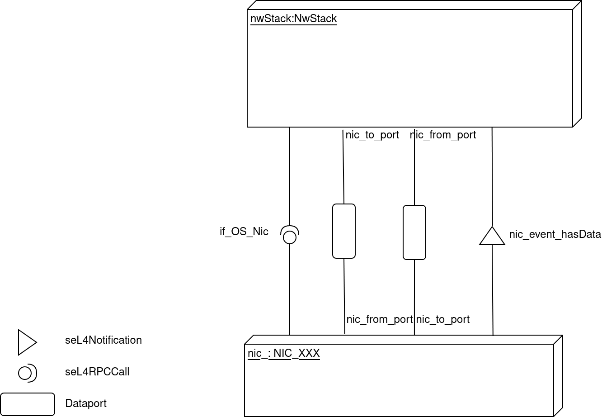

# NIC Interface

## Overview

The TRENTOS NIC interface defines, how a network stack component
connects to a NIC component. The interface is **provided** by a
NIC component that implements it and gets **used** by a network stack
component.

The interface consists of:

- RPC functions to be called by the user of the interface,
- one shared memory for transmission of data from the user component
    of the interface to the NIC component (interface provider),
- one shared memory for transmission of data from the NIC component to
    the user component,
- one event emitted by the NIC component to the user component, to
    signal available data.

A user of the SDK will need to use the **`if_OS_Nic`** interface
normally only in the following situations:

1. During the development of a new NIC driver component, likely as part
    of a platform porting effort.
2. Integrating a new network stack component or creating a raw ethernet
    handling component.

The NIC interface with its functions is fully documented in
**`sdk/os_core_api/camkes/if_OS_Nic.camkes`**. This CAmkES file defines
the macros that facilitate the declaration of all the needed CAmkES
connectors for both sides of the interface - the interface provider
(NIC) and the interface user (network stack).

A NIC driver component will use the following macros:

- **`IF_OS_NIC_PROVIDE()`** as part of its component definition.

A network stack component will use the following macros:

- **`IF_OS_NIC_USE()`** as part of the component definition
- or **`IF_OS_NIC_USE_WITHOUT_EVENT()`** when the event is a shared
    sink for multiple event sources. In this case, the event is supposed
    to be declared separately
    (with: **`consumes EventDataAvailable <eventName>`**) from the macro
    invocation.

A TRENTOS based system will use the following macros:

- **`IF_OS_NIC_CONNECT()`** to connect the network stack to the NIC
    driver in the **`assembly{}`** section defining the CAmkES system.
    This macro is typically wrapped by a network stack component as can
    be seen in the usage examples below.

## Architecture




## Usage Example

### Network Stack (Interface User Component)

The following example is taken from the
**`NetworkStack_PicoTcp.camkes`** file of the
[NetworkStack_PicoTcp](../components/network-stack_pico-tcp.md) component. This
component makes use of the NIC interface by including the
**`IF_OS_NIC_USE_WITHOUT_EVENT()`** macro in its component definition.

```c
...
#include <if_OS_Nic.camkes>
...
#define NetworkStack_PicoTcp_COMPONENT_DEFINE( \
    name, \
    nic_port_size, \
    other_interfaces) \
    \
    component name \
    { \
        control; \
        \
        ...
        \
        /*------------------------------------------------------------------*/ \
        /* if_OS_Nic without a dedicated event, because our interface */ \
        /* 'event_tick_or_data' is a shared sink for multiple event sources */ \
        IF_OS_NIC_USE_WITHOUT_EVENT(nic, nic_port_size) \

        ...
    }
```

And in addition, the macro **`NetworkStack_PicoTcp_INSTANCE_CONNECT()`**
that is also found in the file mentioned earlier wraps around the
**`IF_OS_NIC_CONNECT()`** macro provided by the NIC interface to connect a
NIC driver component instance to the network stack component.

```c
#define NetworkStack_PicoTcp_INSTANCE_CONNECT( \
    inst, \
    nic_inst) \
    \
    IF_OS_NIC_CONNECT(\
        nic_inst, \
        nic, \
        inst, \
        nic, \
        event_tick_or_data)
```

### NIC Driver (Interface Provider Component)

The following example is taken from the NIC_ChanMux component. NIC_ChanMux
provides its own user macros for easy component declaration and initialization.
As part of these macros, the **`if_OS_Nic`** declaration macros are used to
provide the **`if_OS_Nic`** interface.

```c
...

#include <if_OS_Nic.camkes>

...

//------------------------------------------------------------------------------
#define NIC_ChanMux_COMPONENT_DEFINE( \
    _name_, \
    _ringbuffer_size_) \
    \
    component _name_ { \
        control; \
        \
        has mutex mutex_ctrl_channel; \
        \
        /* lower interface to ChanMux ------------------------------------- */ \
        ChanMux_CLIENT_DECLARE_INTERFACE(chanMux) \
        ChanMux_CLIENT_DECLARE_CHANNEL_CONNECTOR(chanMux, ctrl) \
        ChanMux_CLIENT_DECLARE_CHANNEL_CONNECTOR(chanMux, data) \
        \
        /* upper interface as NIC Driver ---------------------------------- */ \
        IF_OS_NIC_PROVIDE(nic, _ringbuffer_size_) \
        \
        /* usage of LogServer is optional ----------------------------------*/ \
        maybe uses      if_OS_Logger  logServer_rpc; \
        maybe dataport  Buf           logServer_port; \
    }

...

```
