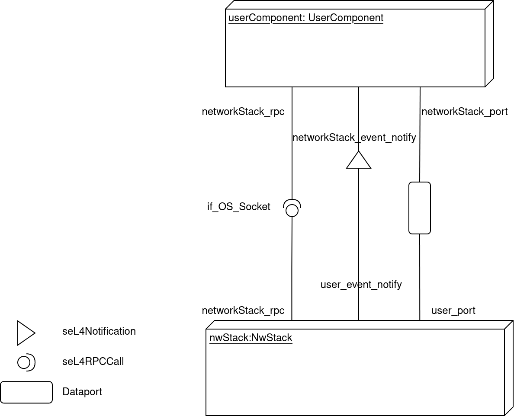

# Socket Interface

## Overview

The TRENTOS Socket interface defines, how an application component that
requires networking functionality connects to a network stack component
in a TRENTOS system. The interface is **provided** by a network stack
component that implements it and gets **used** by any component
connected to it.

The interface consists of:

- RPC functions to be called by the user of the interface,
- one shared memory region for the exchange of data between the
    network stack component and the user component,
- one event emitted by the network stack component to the user
    component, to signal that there are pending socket events that the
    user needs to process.
- one mutex that is required on the side of the user component to
    protect the shared resources from concurrent access.

A user of the SDK will need to use the **`if_OS_Socket`** interface in
the following situations:

1. During the development of a new application component that requires
    networking functionalities and therefore needs to connect to a
    provider of the Socket interface.
2. Integrating a new network stack component that should provide the
    Socket interface.

The Socket interface is fully documented in
**`sdk/os_core_api/camkes/if_OS_Socket.camkes`**. This CAmkES file defines the
macros that facilitate the declaration of all the needed CAmkES connectors for
both sides of the interface - the interface provider (network stack) and the
interface user (user application).

A network stack component will use the following macros:

- **`IF_OS_SOCKET_PROVIDE()`** as part of its component definition.

A user component will use the following macros:

- **`IF_OS_SOCKET_USE()`** as part of the component definition.

A TRENTOS based system will use the following macros:

- **`IF_OS_SOCKET_CONNECT()`** to connect a client component to a
    network stack in the **`assembly{}`** section defining the CAmkES
    system. In the case of the
    [NetworkStack_Picotcp](../components/network-stack_pico-tcp.md) component,
    this macro is wrapped in the macro this component provides to connect
    clients to the stack (see the documentation of this component for further
    details on the usage and the macro).

## Architecture




## Usage Example

### User application (Interface User Component)

In the example below, the user application includes the
**`if_OS_Socket.camkes`** interface file and makes use of the
**`IF_OS_SOCKET_USE()`** macro in the composition section of the
component to define all relevant CAmkES connectors to be able to connect
to a Socket interface provider.

```c
#pragma once

#include "if_OS_Socket.camkes"

component UserApp {
    // Networking
    IF_OS_SOCKET_USE(networkStack)
}
```

### Network Stack (Interface Provider Component)

The following example is taken from the
**`NetworkStack_PicoTcp.camkes`** file of the
[NetworkStack_PicoTcp](../components/network-stack_pico-tcp.md) component. This
component provides the Socket interface by including the
**`IF_OS_SOCKET_PROVIDE()`** macro in its component definition.

```c
...

#include <if_OS_Socket.camkes>

....

#define NetworkStack_PicoTcp_COMPONENT_DEFINE( \
    name, \
    nic_port_size, \
    other_interfaces) \
    \
    component name \
    { \
        control; \
        \
        ...
        \
        /*------------------------------------------------------------------*/ \
        /* interface to application */ \
        provides if_NetworkStack_PicoTcp_Config if_config_rpc; \
        IF_OS_SOCKET_PROVIDE(networkStack) \
        \
        ...
    }

    ...

```

And in addition, the macro
**`NetworkStack_PicoTcp_INSTANCE_CONNECT_CLIENTS()`** that is also found in the
file mentioned earlier wraps around the **`IF_OS_SOCKET_CONNECT()`** macro
provided by the Socket interface to connect client components to the network
stack component.

```c
# define NetworkStack_PicoTcp_INSTANCE_CONNECT_CLIENTS( \
    inst, \
    ...) \
    \
    FOR_EACH_2P(IF_OS_SOCKET_CONNECT, \
                inst, \
                networkStack, \
                **VA_ARGS**)
```
