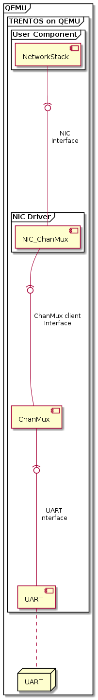

# NIC_ChanMux

## Overview

The NIC_ChanMux driver wraps a ChanMux NIC Channel (which actually is pair of a
"ctrl" and a "data" channel) and provides a **`if_OS_Nic`** interface at the top.
This **`if_OS_Nic`** interface can be used by a network stack component.

### Architecture



## Usage

This is how the component can be instantiated in the system.

### Declaration of the Component in CMake

A NIC_ChanMux component is defined as:

```CMake
NIC_ChanMux_DeclareCAmkESComponent(
    <NameOfComponent>,
    <CtrlChannelNum>,
    <DataChannelNum>
)
```

Here the respective channel numbers have to be assigned according to the
ChanMux's channel IDs.

### Instantiation and Configuration in CAmkES

Here we show how to instantiate the NIC_ChanMux component.

**Info:** NIC_ChanMux is connected directly to ChanMux, so ChanMux must
be instantiated as well. This will be demonstrated as part of the
example. In this section, we show only the macros specific to
the NIC_ChanMux component.

### Declaring the Component

The NIC_ChanMux can be declared as follows:

```c
#include "NIC_ChanMux/NIC_ChanMux.camkes"
NIC_ChanMux_COMPONENT_DEFINE(<NameOfComponent>)
```

### Instantiating and Connecting the Component

In the following macro, the NIC_ChanMux is instantiated and connected
to the LogServer -- which is optional:

```c
component <NameOfComponent>   <nameOfInstance>;

NIC_ChanMux_INSTANCE_CONNECT_OPTIONAL_LOGGER(
    <nameOfInstance>,
    <logServer>.<log_rpc>, <logServer>.<log_port>
)
```

A network stack running on top of the network driver has to use the
**`if_OS_Nic`** interface and provide an input/output buffer. It also
has to connect to an event that signals the reception of new data by the
network driver. This can be done either by making use of the macros
provided by the **`if_OS_Nic`** interface (see the
[if_OS_Nic](../component-interfaces/nic-interface.md) interface documentation
for more information) or by using the respective macros provided by the
component the driver should be connected to (see for example the documentation
of the [NetworkStack_PicoTcp](network-stack_pico-tcp.md) component).

## Example

The following will demonstrate how to use the NIC_ChanMux driver.
Usually, it would be connected to the [Socket API](../api/socket_api.md) through
a network stack component.

### Instantiation and Configuration in CAmkES

The following example shows how to set up the NIC_ChanMux with
a [ChanMux](chan-mux.md) UART component and additionally how it can be connected
to a network stack component:

```c
...

#include "ChanMux/ChanMux_UART.camkes"
ChanMux_UART_COMPONENT_DEFINE(
    ChanMux_UART,
    nic_ChanMux, ctrl, data
)
#include "NIC_ChanMux/NIC_ChanMux.camkes"
NIC_ChanMux_COMPONENT_DEFINE(
    NIC_ChanMux
)

...

assembly {
    composition {
        // Instantiate ChanMux_UART + UART_0 (e.g., for Raspberry Pi)
        component ChanMux_UART  chanMux_UART;
        component UART_0        uart;
        // Instantiate NIC_ChanMux
        component NIC_ChanMux   nic_ChanMux;
        // Instantiate a network stack component
        component NwStack nwStack;

        // Connect ChanMux to UART
        ChanMux_UART_INSTANCE_CONNECT(
            chanMux_UART,
            uart
        )
        // Connect NIC_ChanMux to ChanMux_UART instance with both channels
        ChanMux_UART_INSTANCE_CONNECT_CLIENT(
            chanMux_UART,
            nic_ChanMux, ctrl, data
        )
        // Connect interface PROVIDED by driver via the if_OS_Nic
        // interface macros to the network stack instance
        IF_OS_NIC_CONNECT(
            nic_ChanMux,
            nic,
            nwStack,
            nic,
            event_tick_or_data)
        }
    configuration {
        // Assign badge to nic_ChanMux's RPC endpoint with ChanMux_UART
        ChanMux_UART_CLIENT_ASSIGN_BADGES(
            nic_ChanMux.chanMux_Rpc
        )
    }
}
```

Please note that currently the NIC_ChanMux's RPC endpoint is called
**`chanMux_Rpc`** and this cannot be changed.

### Using the Component's Interfaces in C

Below are the parts of an example network stack component that uses the
NIC_ChanMux component:

```c
...

// For CAmkES generated interface
#include <camkes.h>

static NetworkStack_CamkesConfig_t camkes_cfg =
{
    .wait_loop_event = event_tick_or_data_wait,

    ...

    .drv_nic =
    {
        // NIC -> Stack
        .from = OS_DATAPORT_ASSIGN_SIZE(nic_from_port, NIC_DRIVER_RINGBUFFER_NUMBER_ELEMENTS),
        // Stack -> NIC
        .to = OS_DATAPORT_ASSIGN(nic_to_port),

        .rpc =
        {
            .dev_read = nic_rpc_rx_data,
            .dev_write = nic_rpc_tx_data,
            .get_mac = nic_rpc_get_mac_address,
        }
    },

    ....
};

...

int run()
{
    ...
    NetworkStack_run(&camkes_cfg, ...);
    ...
}
```
