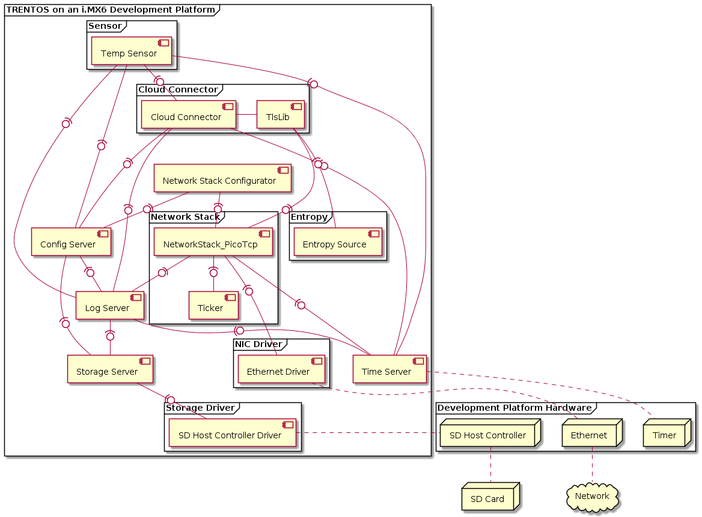
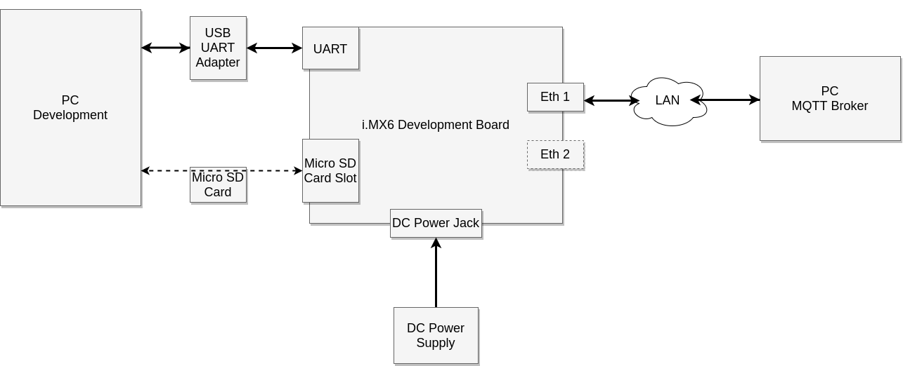
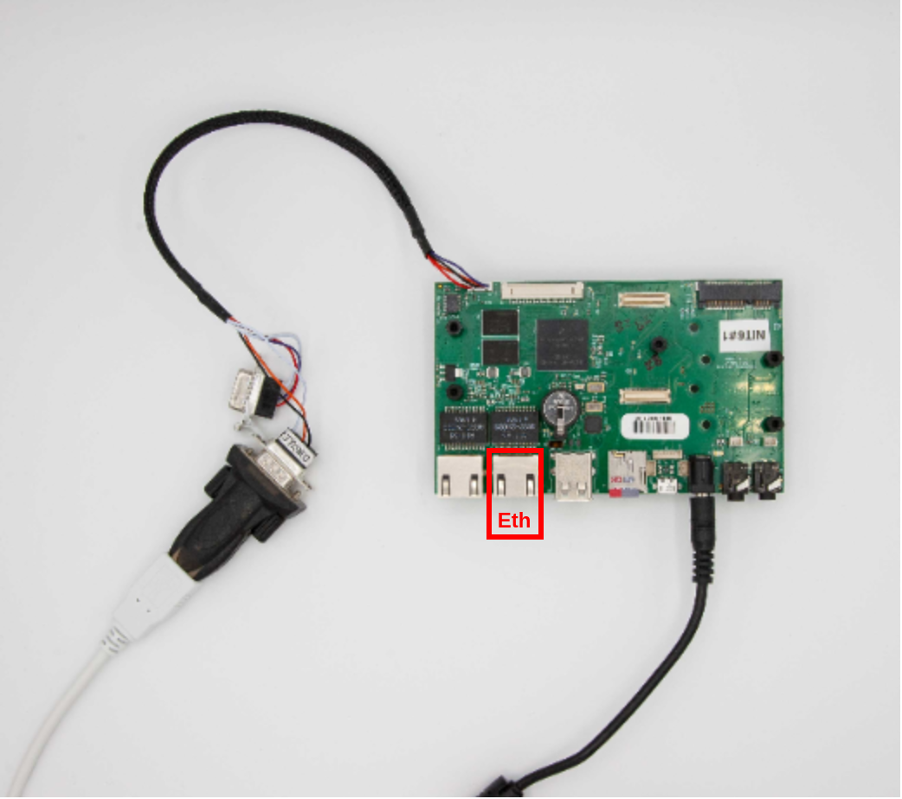
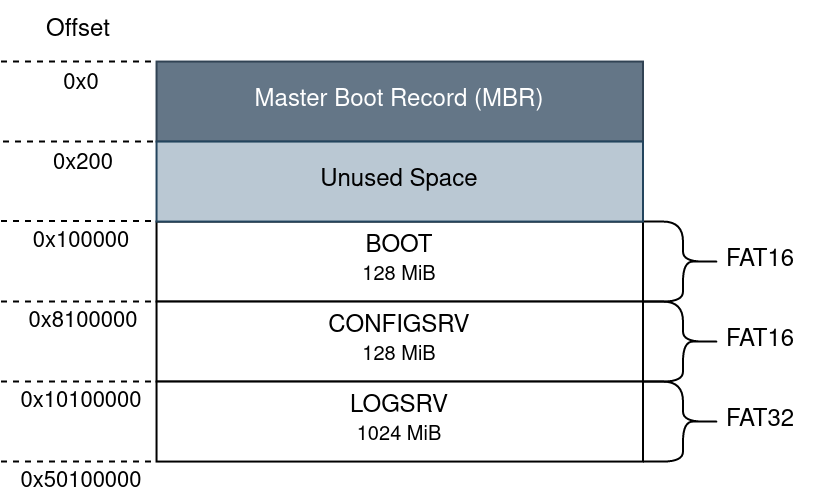

# IoT Demo App for i.MX6

## General

This demo showcases the [IoT Demo App for QEMU](demo-iot_qemu.md) running on i.MX6
based development platforms. It has been verified to work on the
[Nitrogen6_SoloX](../platform-support/nitrogen6-solo-x/platform.md) and
[BD-SL-i.MX6](../platform-support/bd-sl-i.mx6/platform.md) boards.
The main differentiating factor between this version of the demo and the
[IoT Demo App for QEMU](demo-iot_qemu.md) running on QEMU are the components the
system is comprised of. Since this demo is running on real hardware, the system
can directly interface with the specific peripherals through the respective
driver components.
This eliminates the need of employing the [ChanMux](../components/chan-mux.md)
component to multiplex storage and networking calls out through the
[UART](../components/uart.md) component to the
[Proxy Application](../tools/proxy-application.md) running on the QEMU host.

In addition, the demo showcases how SD cards can be statically
partitioned, so they can be used with a TRENTOS system utilizing a
[StorageServer](../components/storage-server.md) component to manage access to
the different memory slices on the card. In the case of the IoT App, this
results in the Config Server and the Log Server component accessing their own
designated partitions on the SD card to retrieve prepared configuration files
from it and write log files to it. These files can be easily exchanged between a
development PC and the development board.

## CAmkES Component Architecture



## Hardware Setup

The IoT demo is supposed to run standalone on an i.MX6 based development
platform, without using the **trentos_test** docker container, QEMU, ChanMux, or
the Proxy Application.

In order to run the demo, the following is required:

- Either a Nitrogen6_SoloX or BD-SL-i.MX6 development board incl. power supply
- USB-to-RS232 cable for console and logs
- A micro SD-Card
- Ethernet Switch
- Ethernet Cables
- PC running MQTT Broker

If the utilized development board has not already been prepared with the
required U-Boot image during the steps outlined in the
[Getting Started](../introduction/getting-started.md) document, it will still
need to be prepared with the specific image to successfully boot the kernel and
the demo application. Follow the detailed description of how to install the
required U-Boot version in the board's internal NOR flash in the platform
support chapter [Nitrogen6_SoloX](../platform-support/nitrogen6-solo-x/platform.md)
or [BD-SL-i.MX6](../platform-support/bd-sl-i.mx6/platform.md) before continuing
with the steps outlined below.

Before building or executing the demo it is necessary to first properly
connect all the hardware components:

- connect the USB-to-RS232 cable to the board as described in more
    detail in the platform support chapter (either for the
    [Nitrogen6_SoloX](../platform-support/nitrogen6-solo-x/platform.md)
    or the
    [BD-SL-i.MX6](../platform-support/bd-sl-i.mx6/platform.md).
- connect the development board and your PC to the same network using
    ethernet cables and an ethernet switch (on the
    [Nitrogen6_SoloX](../platform-support/nitrogen6-solo-x/platform.md), connect
    it to the inner ethernet port directly next to the USB port).
- connect the USB-to-RS232 adapter to your PC.
- connect the development board to the power supply.

The following diagram shows the hardware setup:



Nitrogen6_SoloX



BD-SL-i.MX6


## Building the Demo

For building the IoT demo, the **`build-system.sh`** script has to be
used and executed within the **trentos_build** docker container. The
following command will invoke this custom build script from inside
the **trentos_build** docker container. The container will bind the
current working folder to a volume mounted under **`/host`** , execute
the script and then self remove.

**Info:** The following example build instructions demonstrate how the build
script would need to be called when building for the Nitrogen6_SoloX. To build
the demo for the additionally supported BD-SL-i.MX6, the build platform
**`nitrogen6sx`** would need to be replaced with **`sabre`** and the folder name
where the build output will be created should be renamed to
**`build-sabre-Debug-demo_iot_app_imx6`**.

```shell
# Entering the SDK root directory
cd <sdk_root_directory>

# Building the demo for the Nitrogen6_SoloX
sdk/scripts/open_trentos_build_env.sh \
    sdk/build-system.sh \
    sdk/demos/demo_iot_app_imx6 \
    nitrogen6sx \
    build-nitrogen6sx-Debug-demo_iot_app_imx6 \
    -DCMAKE_BUILD_TYPE=Debug
```

As a result, the folder **`build-nitrogen6sx-Debug-demo_iot_app_imx6`** is
created, containing all the build artifacts.

The TRENTOS system image is
**`build-nitrogen6sx-Debug-demo_iot_app_imx6/images/os_image.elf`**.

For an in-depth discussion about building TRENTOS systems, different possible
configurations and parameters, please refer to the
[Buildsystem](../development/buildsystem.md) section.

## Preparing the Demo

### Setup the Eclipse Mosquitto Docker Container

The demo connects to an MQTT, where the connection is secured by TLS.
Thus, besides setting up the broker itself, a proper TLS configuration
must be in place, too. The following steps describe how to easily set up
an MQTT broker instance on a local machine and pass it the correct
configuration settings that allow establishing a secure TLS connection
from the system running on the Nitrogen6_SoloX (BD-SL-i.MX6).

Download the official **eclipse-mosquitto** docker image version 1.6.12
from the docker hub. More detailed information on this image can be
found at <https://hub.docker.com/_/eclipse-mosquitto>.

```shell
docker pull eclipse-mosquitto:1.6.12
```

When starting a container from this image, a broker configuration folder
must be provided, which is mounted into the container. Docker requires
all mounts to use absolute paths, but assuming that the current
directory is still the SDK root directory, prefixing the path with
\"**`$(pwd)`**\" is sufficient. The prepared configuration includes the
certificates, the password, and username settings that match the default
settings of the demo. For the TLS connection, we also need to expose the
port 8883 from the container on the host, which is the port
conventionally used for encrypted MQTT connections. For the purpose of
this demo, there is no need to persist the container's file system after
the container exits, which is why the respective clean-up flag
\"**`--rm`**\" can be used (see
<https://docs.docker.com/engine/reference/run/#clean-up---rm> for more
background information). In addition to that, it is recommended to not
run the container as root user, because this makes the entry point
script change the configuration folder owner to the \"mosquitto\" user
with the ID 1883 (see
<https://github.com/eclipse/mosquitto/blob/367a282c61460a1f021df086887ad195e26fc968/docker/local/docker-entrypoint.sh>).
Since we are mounting a folder from the host here, this also changes the
ownership on the host - and your current user can\'t access the files
there any longer. With  \"**`--user $(id -u):$(id -g)`**\" the current user
is used instead, and the ownership of the configuration folder is not
changed.

Run the following command as-is from the SDK root directory to start the
container.

```shell
HOSTSRC="$(pwd)/sdk/demos/demo_iot_app_imx6/mosquitto_configuration"

docker run \
    -it --rm --user $(id -u):$(id -g) -p 8883:8883 \
    -v $HOSTSRC":/mosquitto/config" \
    eclipse-mosquitto:1.6.12
```

The broker is now running in the docker container and listening on port
8883 of the host machine.

### Set a Static IP Address for the Networking Interface

The last remaining step is to configure the Ethernet networking
interface of your development machine with a static IP address, so the
demo running the default configuration on the board can find it in the
local network. Go to the network settings of your development machine,
select the Ethernet connection and change the IP settings from automatic
(DHCP) to manual and apply the following configuration:

| Address  | Netmask       | Gateway |
|----------|---------------|---------|
| 10.0.0.1 | 255.255.255.0 | -       |

It is important to choose an IP address value that is valid inside your
local network. If you wish to deviate from the provided default
configuration for your network interface, you will also need to adapt
the demo configuration in the following steps. To adapt the demo, open
**`sdk/demos/demo_iot_app_imx6/configuration/config.xml`** and change
the parameter value of **`CloudServiceIP`** to the desired IP address
(default: 10.0.0.1) you statically set your development machine to.

```xml
<param_name>CloudServiceIP</param_name>
    <type>string</type>
    <access_policy>
        <read>true</read>
        <write>false</write>
    </access_policy>
    <value>LOCAL_IP_ADDRESS_VALUE_PC</value>
```

Also, it is necessary to change the network parameters of the device
according to your network. First, set the **`ETH_ADDR`** parameter (IP
address of the development board) to an IP value valid in your local
network (default: 10.0.0.2).

```xml
<param_name>ETH_ADDR</param_name>
    <type>string</type>
    <access_policy>
        <read>true</read>
        <write>false</write>
    <access_policy>
    <value>LOCAL_IP_ADDRESS_VALUE_BOARD</value>
```

Finally, change the **`ETH_GATEWAY_ADDR`** to match the IP address of
the gateway the development board is connected to (default: 10.0.0.1).

```xml
<param_name>ETH_GATEWAY_ADDR</param_name>
    <type>string</type>
    <access_policy>
        <read>true</read>
        <write>false</write>
    <access_policy>
    <value>GATEWAY_ADDRESS</value>
```

### Prepare the Board

The following steps will describe how to prepare the board to run the demo.

#### Get into the SDK Root Directory

```shell
cd <sdk_root_directory>
```

#### Partition the SD Card

As visualized in the CAmkES component architecture diagram above, the
Log Server and the Config Server component need access to the storage
provided by an SD card placed in the microSD slot of the board. In
addition to the two partitions needed for these components, a third
partition needs to be created containing a boot script and a system
image for the board to boot from:



**Warning:** The following step will create a new partition table on the
device passed to the script and additionally format the new partitions
to FAT filesystems. Make sure the SD card does not contain any still
required data, as the performed operations will most likely result in a
loss of this preexisting data. In addition to that, the used SD card
should offer at least enough storage to match the described partition
table layout.

The demo contains a script that will partition an SD card to the partition
layout required by the demo application. Connect an SD card to your PC and find
out the correct path to the SD card device(e.g. **`/dev/sda`**) for example
with the GNOME utility Disks. Run the script with the path to the SD card
device:

```shell
sudo sdk/demos/demo_iot_app_imx6/prepare_sd_card.sh <path-to-device>
```

Once the script has successfully executed, the card should hold the
required partition table layout for the demo. It might be necessary to
remove and reinsert the card again for all the changes to take effect.

Note that the partition layout described in the script matches with the
settings of the demo system as defined in the **`system_config.h`**:

```c
//-----------------------------------------------------------------------------
// StorageServer
//-----------------------------------------------------------------------------
// 129 MiB reserved for MBR and BOOT partition
#define MBR_STORAGE_SIZE            (1*1024*1024)
#define BOOT_STORAGE_SIZE           (128*1024*1024)

// 128 MiB
#define CONFIGSERVER_STORAGE_OFFSET (MBR_STORAGE_SIZE + BOOT_STORAGE_SIZE)
#define CONFIGSERVER_STORAGE_SIZE   (128*1024*1024)

// 1 GiB
#define LOGSERVER_STORAGE_OFFSET    (CONFIGSERVER_STORAGE_OFFSET + CONFIGSERVER_STORAGE_SIZE)
#define LOGSERVER_STORAGE_SIZE      (1024*1024*1024)
```

#### Create the Configuration Provisioned Binary Files

The source folder of the demo already contains a prepared configuration
setup that the demo needs to be provisioned with so that it can
successfully establish a secure connection with the MQTT broker. The
configuration parameters listed and partly stored in the
**`sdk/demos/demo_iot_app_imx6/configuration/config.xml`** file and the
accompanying files need to be converted to the binary files required by
the Config Server component.  To create these binary files, run the
[Configuration Provisioning Tool](../tools/configuration-provisioning-tool.md)
with the path to the provided XML file containing the demo
configuration:

```shell
sdk/bin/cpt -i sdk/demos/demo_iot_app_imx6/configuration/config.xml
```

This will create the required configuration files  **`BLOB.BIN`** ,
**`DOMAIN.BIN`** , **`PARAM.BIN`** and **`STRING.BIN`** in the current
directory.

## Running the Demo

To boot the board from the SD card, a suitable boot script has to be
placed in the \"BOOT\" partition of the SD card. The boot files for the
used platform can be found in
**`sdk/resources/nitrogen6sx_sd_card/`** (Nitrogen6_SoloX) or in
**`sdk/resources/sabre_sd_card/`** (BD-SL-i.MX6).

For the Nitrogen6_SoloX:

```shell
# copy Nitrogen6_SoloX bootfiles to SD Card BOOT partition
cp sdk/resources/nitrogen6sx_sd_card/* <sd_card_mount_point_BOOT>/
```

And the BD-SL-i.MX6:

```shell
# copy BD-SL-i.MX6 bootfiles to SD Card BOOT partition
cp sdk/resources/sabre_sd_card/* <sd_card_mount_point_BOOT>/
```

The previously built TRENTOS system image needs to be placed in the "BOOT"
partition of the SD card along with the boot script. The system image
**`os_image.elf`** has been created in the
**`build-nitrogen6sx-Debug-demo_iot_app_imx6/images/`**.
In addition, the configuration files previously prepared in the current
directory have to be copied to the "CONFIGSRV" partition of the SD card.

```shell
# copy TRENTOS system image (the IoT demo application) to SD Card BOOT parition
cp build-nitrogen6sx-Debug-demo_iot_app_imx6/images/os_image.elf <sd_card_mount_point_BOOT>/

# copy configuration files to SD Card CONFIGSRV partition
cp BLOB.BIN DOMAIN.BIN PARAM.BIN STRING.BIN <sd_card_mount_point_CONFIGSRV>/

# ensure files are written to the SD Card
sync
umount <sd_card_mount_point_BOOT> <sd_card_mount_point_CONFIGSRV> <sd_card_mount_point_LOGSRV>
```

Start a serial monitor that shows the traffic received from the
UART-to-USB adapter. One way of doing this is to use the **`picocom`** utility
with the following command.

```shell
sudo picocom -b 115200 /dev/<ttyUSBX>
```

Hereby, **`<ttyUSBX>`** acts as a placeholder for the specific
device representing the USB-to-UART adapter, e.g. **`ttyUSB0`**. Note
that using **`sudo`** may not be required, this depends on your Linux
group membership giving your account access to **`/dev/<ttyUSBX>`**.

Place the prepared SD card in the board and restart the board with a power
cycle. Once the demo has set up it will start contacting the Mosquitto broker
running in the container.

Expected output from the serial monitor:

```console
# Repetitive prints of the following messages
0000000020 CLOUDCONNECTO 00:00:43   6   5    INFO: /host/sdk/demos/demo_iot_app_rpi3/components/CloudConnector/src/CloudConnector.c:481: New message received from client
0000000020 CLOUDCONNECTO 00:00:43   6   5    INFO: /host/sdk/demos/demo_iot_app_rpi3/components/CloudConnector/src/MQTT_client.c:415: checkPublishQos(): got PUBACK
0000000020 CLOUDCONNECTO 00:00:43   6   5    INFO: /host/sdk/demos/demo_iot_app_rpi3/components/CloudConnector/src/CloudConnector.c:382: MQTT publish on WAN successful
0000000020 CLOUDCONNECTO 00:00:43   6   5    INFO: /host/sdk/demos/demo_iot_app_rpi3/components/CloudConnector/src/CloudConnector.c:613: Waiting for new message from client...
```

Expected output from the Mosquitto broker:

```console
1595534326: New connection from 10.0.0.2 on port 8883.
1595534333: New client connected from 10.0.0.2 as TempSensor_01 (p2, c1, k0, u'TRENTOS').
1595534333: No will message specified.
1595534333: Sending CONNACK to TempSensor_01 (0, 0)
1595534334: Received PUBLISH from TempSensor_01 (d0, q1, r0, m2, 'devices/tempsensor/messages/events/', ... (26 bytes))
1595534334: Sending PUBACK to TempSensor_01 (m2, rc0)
1595534340: Received PUBLISH from TempSensor_01 (d0, q1, r0, m3, 'devices/tempsensor/messages/events/', ... (26 bytes))
1595534340: Sending PUBACK to TempSensor_01 (m3, rc0)
1595534346: Received PUBLISH from TempSensor_01 (d0, q1, r0, m4, 'devices/tempsensor/messages/events/', ... (26 bytes))
1595534346: Sending PUBACK to TempSensor_01 (m4, rc0)
1595534352: Received PUBLISH from TempSensor_01 (d0, q1, r0, m5, 'devices/tempsensor/messages/events/', ... (26 bytes))
1595534352: Sending PUBACK to TempSensor_01 (m5, rc0)
```
