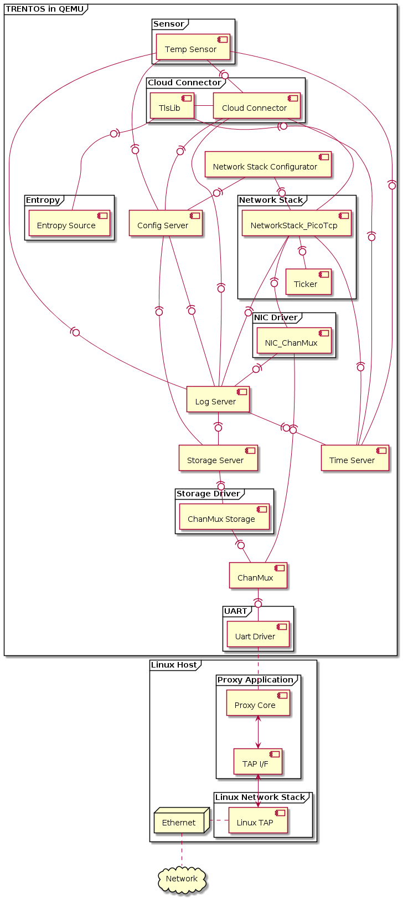

# IoT Demo App for QEMU

## General

This demo application showcases a rather typical IoT use case. A Sensor
component cyclically publishes a temperature update via MQTT to a Cloud
Connector component. This component is securely communicating with an
MQTT broker (IoT Hub in case of the Microsoft Azure Cloud) using a TLS
connection and, in turn, forwards the MQTT message from the sensor to
the broker. The configuration for the Network Stack Configurator, the
Sensor, and the Cloud Connector components can be set in an XML
formatted configuration file, which is processed by the
[Configuration Provisioning Tool](../tools/configuration-provisioning-tool.md)
before the demo starts up.

When the demo is run, the Config Server component will mount the
provisioned storage partition with the configuration parameters and make
them available to the connected clients. The Network Stack Configurator,
the Sensor, and the Cloud Connector components will all contact the
Config Server and retrieve their required configuration parameters
through it. Once all components are initialized, the Sensor will proceed
to contact the Cloud Connector every few seconds to send its data string
to the configured cloud service. In the delivered initial configuration,
the demo is set to connect to a Mosquitto MQTT broker running inside the
test container of the SDK but, as explained below, these settings can
easily be reconfigured to connect to an external MQTT broker such as
Microsoft's Azure IoT-Hub.

## CAmkES Component Architecture



## Building the Demo

For building the IoT demo, the **`build-system.sh`** script has to be
used and executed within the **trentos_build** docker container. The
following command will invoke this build script from inside the
**trentos_build** docker container. The container will bind the current
working folder to a volume mounted under **`/host`**, execute the script
and then self remove.

```shell
# Entering the SDK root directory
cd <sdk_root_directory>

# Building the demo
sdk/scripts/open_trentos_build_env.sh \
    sdk/build-system.sh \
    sdk/demos/demo_iot_app \
    zynq7000 \
    build-zynq7000-Debug-demo_iot_app \
    -DCMAKE_BUILD_TYPE=Debug
```

As a result, the folder **`build-zynq7000-Debug-demo_iot_app`**  is
created, containing all the build artifacts.

For an in-depth discussion about building TRENTOS systems, different
possible configurations and parameters, please refer to the
[Buildsystem](../development/buildsystem.md) section.

## Running the Demo

Call the **`run_demo.sh`** script found in the root folder of the demo from
within the **trentos_test** docker container and pass it the relative paths of
the demo build directory (**`build-zynq7000-Debug-demo_iot_app`**) and the
**`sdk`** folder inside the SDK root directory.

```shell
# The run_demo.sh script takes in 2 arguments:
#   - the path to the build directory of the IoT demo
#   - the path to the sdk directory
sdk/scripts/open_trentos_test_env.sh \
    sdk/demos/demo_iot_app/run_demo.sh \
    build-zynq7000-Debug-demo_iot_app \
    sdk
```

This script will first run the provisioning tool and pick up the default
settings, which are stored in the
**`sdk/demos/demo_iot_app/configuration`** folder. The tool will create
a disk image with a partition containing the specified settings. The
script will then proceed to start up the Mosquitto MQTT Broker inside
the test container and run the image in QEMU together with the
[Proxy Application](../tools/proxy-application.md).
Also note, that in the folder from which you call the
**`open_trentos_test_env.sh`** script, the demo will create the following files:
**`nvm_06`**, **`qemu_stderr.txt`** and **`proxy_app.out`**.

If all went well, after the initial setup messages, the console should
be periodically printing the following messages notifying the user that
the MQTT messages are sent successfully.

```console
0000000020 CLOUDCONNECTO 00:01:05   6   5    INFO: /host/sdk/demos/demo_iot_app/components/CloudConnector/src/CloudConnector.c:382: MQTT publish on WAN successful
0000000020 CLOUDCONNECTO 00:01:05   6   5    INFO: /host/sdk/demos/demo_iot_app/components/CloudConnector/src/CloudConnector.c:613: Waiting for new message from client...
0000000020 CLOUDCONNECTO 00:01:10   6   5    INFO: /host/sdk/demos/demo_iot_app/components/CloudConnector/src/CloudConnector.c:481: New message received from client
0000000020 CLOUDCONNECTO 00:01:10   6   5    INFO: /host/sdk/demos/demo_iot_app/components/CloudConnector/src/MQTT_client.c:415: checkPublishQos(): got PUBACK
```

## Setting up the Demo to Connect to the Azure IoT Hub

As outlined in the general overview of the demo, the system is initially
configured with all relevant parameters and credentials to connect to a
Mosquitto MQTT broker running inside the **trentos_test** docker container. To
gain a better understanding of how TRENTOS systems can be configured using the
tools and components from the SDK ecosystem, the following section will provide
a guide on how to reconfigure this demo system to connect to an external broker,
which in this example will be the Microsoft\'s Azure IoT Hub. It should
be mentioned that setting up an Azure account and creating an IoT Hub
instance with at least one IoT device is not within the scope of this
guide, as there are already helpful guides available e.g.
<https://docs.microsoft.com/en-us/azure/iot-hub/iot-hub-create-through-portal>.

Therefore at this point, it is assumed that you:

- have access to a Microsoft Azure Account,
- have set up an Azure IoT Hub,
- have at least created one device in the Hub so that the demo can use
    this device ID and the shared access signature to authenticate
    against the Azure IoT Hub.

To provide a somewhat more concrete example setup throughout this guide,
we will assume that the created IoT Hub instance has the following
properties:

| Attribute         | Value                         |
|-------------------|-------------------------------|
| IoT Hub Host Name | TRENTOS-HUB.azure-devices.net |
| Device ID         | TempSensor_01                 |

### Sensor Configuration

### Set the Payload and the MQTT Topic

In the configuration folder of the demo, you will find two files (both
prefixed with **`sensor_`** ) that can be used to configure the Sensor
component. As their names already indicate, the
**`sensor_mqtt_payload`** can be used to set the payload the sensor
should be sending to the Cloud Connector component and the
**`sensor_mqtt_topic`** file can be used to set the MQTT topic.

While the payload can basically be any input string (in the demo it is
only constrained by the arbitrary maximum payload size of 128 bytes set
in the Sensor component), the MQTT topic needs to match a certain
expected pattern based on the device ID that was set in the IoT Hub
device setup. For our example which has an IoT Hub with the earlier mentioned
device with an ID **TempSensor_01**, the required topic would result in:

```console
devices/TempSensor_01/messages/events/
```

### Cloud Connector Configuration

#### Set the Correct IP Address of the IoT Hub Instance

As the main purpose of the Cloud Connector component is to relay the
messages received from the sensor to a server running an MQTT broker, we first
need to configure the IP address that this component should connect to.

In Linux, the IP of your IoT Hub can be retrieved by executing the following
command:

```shell
host TRENTOS-HUB.azure-devices.net
```

After obtaining the IP address of the Hub, set the corresponding value
in the  **`CloudServiceIP`** tag in the
**`sdk/demos/demo_iot_app/configuration/config.xml`** file. In this
example, we will just assume the address is **`51.144.118.31`**.

```xml
<param_name>CloudServiceIP</param_name>
   <type>string</type>
   <access_policy>
     <read>true</read>
     <write>false</write>
   </access_policy>
   <value>51.144.118.31</value>
```

We can store this setting directly in the configuration file of the
parameter type string as we do not expect the IP address to exceed the
possible maximum configuration string size of 32 bytes (including nul
terminator). Any setting that goes beyond this size needs to be stored
in a separate blob file. More background information on the different
parameter types, their defined sizes, and their usage examples can be
found in the chapters about the [ConfigService API](../api/config-service_api.md)
and the [Configuration Provisioning Tool](../tools/configuration-provisioning-tool.md)
of this handbook.

### Download the CA Certificate Used by the Server the Hub is Running on

Since the demo system will initiate a secure connection with the IoT
Hub, we need to make sure to provide the system with the required
certificate to verify the server\'s identity. The servers hosting the
IoT Hub instances typically either use the **Microsoft IT TLS CA 4** or
**Microsoft IT TLS CA 2** certificate. To verify which one is used by
your instance,  go to <https://www.ssllabs.com/ssltest/>, enter the IoT
Hub Host Name and check which issuer is listed for your IoT Hub server.
The site usually also provides a link to the certificate just below the
issuer\'s name. You can either follow this path to download the
certificate or head over to
<https://www.microsoft.com/pki/mscorp/cps/default.htm> where you should
also find all relevant certificates for this use case.

The certificates passed to the demo system are required to be PEM
formatted. On Linux, you can easily convert them with the following
command (in this example converting the **Microsoft IT TLS CA 2**):

```shell
openssl x509 -inform DER -outform PEM -in \
    Microsoft\ IT\ TLS\ CA\ 2.crt -out AzureCACert.pem
```

Place the certificate file in the configuration folder and make sure the
configuration file path in the
**`sdk/demos/demo_iot_app/configuration/config.xml`** file is updated
with the path to this new certificate:

```xml
<param_name>ServerCaCert</param_name>
   <type>blob</type>
   <access_policy>
     <read>true</read>
     <write>false</write>
   </access_policy>
   <value>/AzureCACert.pem</value>
```

### Set the ClientID, Username and Password

To connect to the public device endpoints that the Azure IoT Hub
provides, the necessary credentials have to be set in the demo
configuration. A helpful guide to better understand the required
parameters of the Hub can be found at
[https://docs.microsoft.com/en-us/azure/iot-hub/iot-hub-mqtt-support#using-the-mqtt-protocol-directly-as-a-device.](https://docs.microsoft.com/en-us/azure/iot-hub/iot-hub-mqtt-support#using-the-mqtt-protocol-directly-as-a-device)

As explained in this guide, we first need to adapt the device ID to
match the device ID that was set up for the device related to our Hub.
In our example setup with the **TempSensor_01** device, this will
result in modifying the IoT-Device parameter in the
**`sdk/demos/demo_iot_app/configuration/config.xml`** file as follows:

```xml
<param_name>IoT-Device</param_name>
   <type>string</type>
   <access_policy>
     <read>true</read>
     <write>false</write>
   </access_policy>
   <value>TempSensor_01</value>
```

Next, we need to adapt the username as specified in the guide. So for
our example IoT Hub instance, we would place the following string in
the  **`configuration/cloudConnector_cloudDomain`** file (should be
replaced with the actual value):

```console
TRENTOS-HUB.azure-devices.net/TempSensor_01/?api-version=2018-06-30
```

In the final configuration step, we need to set the required
SharedAccessSignature (SAS) token in the
**`cloudConnector_SharedAccessSignature`** file to authenticate our
device. Creating such a token can be either done directly from the
Visual Studio Code extension
(<https://docs.microsoft.com/en-us/azure/iot-hub/iot-hub-mqtt-support#for-azure-iot-tools>)
or the CLI extension
(<https://docs.microsoft.com/en-us/cli/azure/ext/azure-iot/iot/hub?view=azure-cli-latest#ext-azure-iot-az-iot-hub-generate-sas-token>).
For our example IoT Hub the generated token would result in something
like:

```console
SharedAccessSignature sr=TRENTOS-HUB.azure-devices.net%2Fdevices%2FTempSensor_01%2Fapi-version%3D2016-11-14&sig=vSgHBMUG.....Ntg%3d&se=1456481802
```

With all these settings adapted, the demo should now be ready to connect
to the Azure IoT Hub. Simply run the demo again with the provided script
as explained in the Running the Demo section. Once the demo is running
and successfully sending the MQTT messages to the Azure IoT Hub, you
will be able to see the string you set as the payload of the Sensor
component as the incoming message when monitoring the built-in event
endpoints
(<https://docs.microsoft.com/en-us/azure/iot-hub/iot-hub-devguide-endpoints>)
for the device in the Azure IoT Hub. Helpful information for setting up
monitoring of incoming messages can be found at
[https://devblogs.microsoft.com/iotdev/azure-iot-tools-make-it-easy-to-monitor-custom-event-hub-endpoints/.](https://devblogs.microsoft.com/iotdev/azure-iot-tools-make-it-easy-to-monitor-custom-event-hub-endpoints/)
Also, as was the case for running the demo with a local instance of the
MQTT broker, if everything goes correctly you should be able to see the
following messages repeatedly printed in the console:

```console
INFO: .../CloudConnector.c:387: MQTT publish on WAN successful
INFO: .../CloudConnector.c:621: Waiting for new message from client...
INFO: .../CloudConnector.c:489: New message received from client
INFO: .../MQTT_client.c:415: checkPublishQos(): got PUBACK
```
