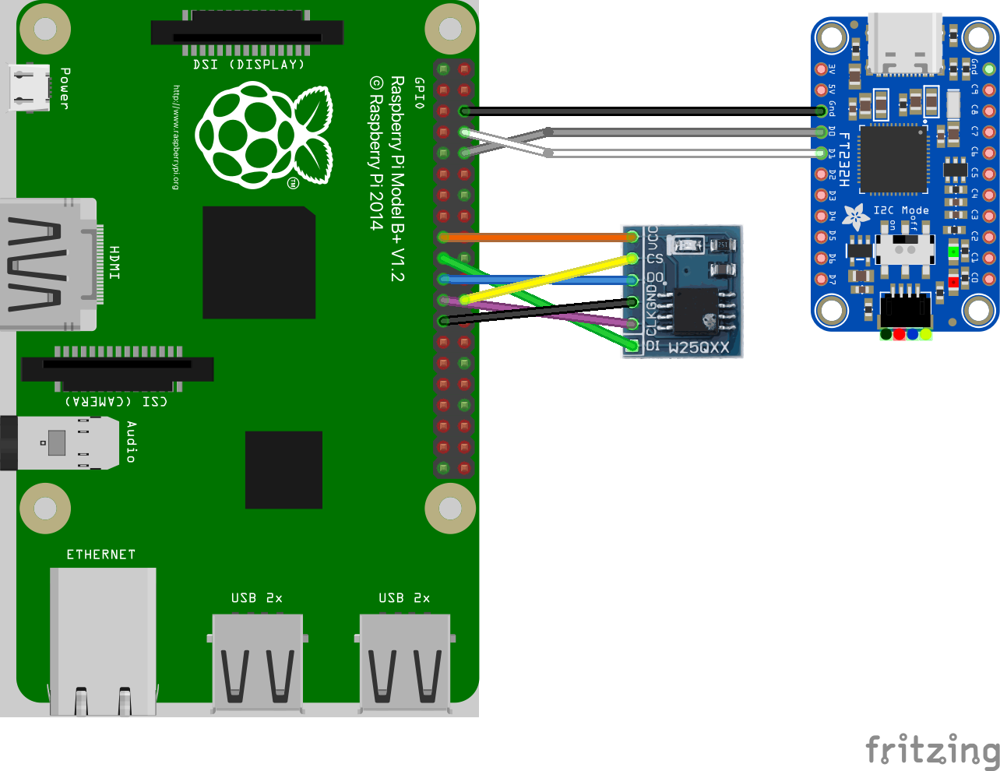

# IoT Demo App for RPi3B+

## General

This demo application showcases the [IoT Demo App for QEMU](demo-iot_qemu.md) running
on the Raspberry Pi 3 B+ (RPi3B+). A Sensor component cyclically
publishes a temperature update via MQTT to a Cloud Connector component.
This component is securely communicating with an MQTT broker (IoT Hub in
case of the Microsoft Azure Cloud) using TLS and in turn, forwards the
MQTT message from the Sensor to the broker. The configuration for the
network stack, the Sensor and the Cloud Connector component can be set
in an XML formatted configuration file, which is processed by the
[Configuration Provisioning Tool](../tools/configuration-provisioning-tool.md)
before the demo starts up.

When the demo is run, the Config Server component of the system will
mount the provisioned storage partition with the configuration
parameters and make them available to the connected clients. The Network
Stack Configurator, the Sensor, and the Cloud Connector components will
all contact the Config Server and retrieve their required configuration
parameters through it. Once all components are initialized, the Sensor
will proceed to contact the Cloud Connector about every five seconds to
send its data string to the configured cloud service. In the delivered
initial configuration, the demo is set to connect to a Mosquitto MQTT
broker running on the host PC, but, as explained below, these settings
can easily be reconfigured to connect to an external MQTT broker such as
Microsoft's Azure IoT-Hub.

## CAmkES Component Architecture


## Hardware Setup

This demo is supposed to run standalone on the RPi3B+ without using the
TRENTOS SDK test docker container, QEMU, ChanMux or the Proxy
Application.

In order to run the demo, the following is required:

- RPi3B+ incl. power supply,
- UART-to-USB adapter,
- microSD Card,
- NOR flash Winbond W25Q64 (incl. soldered-on pin header),
- connection cables to the flash module,
- ethernet switch,
- ethernet cables,
- PC running MQTT Broker.

Before building or executing the demo it is necessary to first properly
connect all the hardware components:

- connect the UART-to-USB adapter to the RPi3B+ board - see the
    Boot-up section for correct wiring,
- connect the SPI flash board to the RPi3B+ board - see the W25Q64
    Flash SPI interface section for correct wiring,
- connect the RPi3B+ board and your PC to the same network using
    ethernet cables,
- connect the UART-to-USB adapter to your PC,
- connect the RPi3B+ board to the power supply.

The following diagram shows the hardware setup:




## Building the Demo

For building the IoT demo, the **`build-system.sh`** script has to be
used and executed within the **trentos_build** docker container. The
following command will invoke this custom build script from inside the
build docker container. The container will bind the current working
folder to a volume mounted under **`/host`**, execute the script and
then self remove.

```shell
# Entering the SDK root directory
cd <sdk_root_directory>
# Building the demo
sdk/scripts/open_trentos_build_env.sh \
    sdk/build-system.sh \
    sdk/demos/demo_iot_app_rpi3 \
    rpi3 \
    build-rpi3-Debug-demo_iot_app_rpi3 \
    -DCMAKE_BUILD_TYPE=Debug
```

As a result, the folder **`build-rpi3-Debug-demo_iot_app_rpi3`** is
created, containing all the build artifacts. The TRENTOS system image
can be found
in **`build-rpi3-Debug-demo_iot_app_rpi3/images/os_image.elf`**.

For an in-depth discussion about building TRENTOS systems, different
possible configurations and parameters, please refer to the
[Buildsystem](../development/buildsystem.md) section.

## Preparing the Demo

### Setup the Eclipse Mosquitto Docker Container

The demo connects to an MQTT, where the connection is secured by TLS.
Thus, besides setting up the broker itself, a proper TLS configuration
must be in place, too. The following steps describe how to easily set up
an MQTT broker instance on a local machine and pass it the correct
configuration settings that allow establishing a secure TLS connection
from the system running on the RPi3B+.

Download the official **eclipse-mosquitto** docker image version 1.6.12
from the docker hub. More detailed information on this image can be
found at <https://hub.docker.com/_/eclipse-mosquitto>.

```shell
docker pull eclipse-mosquitto:1.6.12
```

When starting a container from this image, a broker configuration folder
must be provided, which is mounted into the container. Docker requires
all mounts to use absolute paths, but assuming that the current
directory is still the SDK root directory, prefixing the path with
\"**`$(pwd)`**\" is sufficient. The prepared configuration includes the
certificates, the password, and username settings that match the default
settings of the demo. For the TLS connection, we also need to expose the
port 8883 from the container on the host, which is the port
conventionally used for encrypted MQTT connections. For the purpose of
this demo, there is no need to persist the container's file system after
the container exits, which is why the respective clean-up flag
\"**`--rm`**\" can be used (see
<https://docs.docker.com/engine/reference/run/#clean-up---rm> for more
background information). In addition to that, it is recommended to not
run the container as root user, because this makes the entry point
script change the configuration folder owner to the \"mosquitto\" user
with the ID 1883 (see
<https://github.com/eclipse/mosquitto/blob/367a282c61460a1f021df086887ad195e26fc968/docker/local/docker-entrypoint.sh>).
Since we are mounting a folder from the host here, this also changes the
ownership on the host - and your current user can\'t access the files
there any longer. With  \"**`--user $(id -u):$(id -g)`**\" the current user
is used instead, and the ownership of the configuration folder is not
changed.

Run the following command as-is from the SDK root directory to start the
container.

```shell
HOSTSRC="$(pwd)/sdk/demos/demo_iot_app_rpi3/mosquitto_configuration"

docker run \
    -it --rm --user $(id -u):$(id -g) -p 8883:8883 \
    -v $HOSTSRC":/mosquitto/config" \
    eclipse-mosquitto:1.6.12
```

The broker is now running in the docker container and listening on port
8883 of the host machine.

### Set a Static IP Address for the Networking Interface

The last remaining step is to configure the Ethernet networking
interface of your development machine with a static IP address, so the
demo running the default configuration on the RPi3B+ can find it in the
local network. Go to the network settings of your development machine,
select the ethernet connection and change the IP settings from automatic
(DHCP) to manual and apply the following configuration:

| Address  | Netmask       | Gateway |
|----------|---------------|---------|
| 10.0.0.1 | 255.255.255.0 | -       |

It is important to choose an IP address value that is valid inside your
local network. If you wish to deviate from the provided default
configuration for your network interface, you will also need to adapt
the demo configuration in the following steps. To adapt the demo, open
**`sdk/demos/demo_iot_app_rpi3/configuration/config.xml`** and change
the parameter value of **`CloudServiceIP`** to the desired IP address
(default: 10.0.0.1) you statically set your development machine to.

```xml
<param_name>CloudServiceIP</param_name>
    <type>string</type>
    <access_policy>
        <read>true</read>
        <write>false</write>
    </access_policy>
    <value>LOCAL_IP_ADDRESS_VALUE_PC</value>
```

Also, it is necessary to change the network parameters of the device
according to your network. First, set the **`ETH_ADDR`** parameter (IP
address of the RPi3B+) to an IP value valid in your local
network (default: 10.0.0.2).

```xml
<param_name>ETH_ADDR</param_name>
    <type>string</type>
    <access_policy>
        <read>true</read>
        <write>false</write>
    <access_policy>
    <value>LOCAL_IP_ADDRESS_VALUE_BOARD</value>
```

Finally, change the **`ETH_GATEWAY_ADDR`** to match the IP address of
the gateway the RPi3B+ is connected to (default: 10.0.0.1).

```xml
<param_name>ETH_GATEWAY_ADDR</param_name>
    <type>string</type>
    <access_policy>
        <read>true</read>
        <write>false</write>
    <access_policy>
    <value>GATEWAY_ADDRESS</value>
```

### Store the Configuration in the SPI Flash

In order for this demo to run on the RPi3B+ board, it is necessary for
it to be connected to an SPI (NOR based) flash memory. The demo requires
a configuration to be already stored in the flash in order to run
successfully. The following steps will explain how to prepare the board
in this regard.

#### Get into the SDK Root Directory

```shell
cd <sdk_root_directory>
```

#### Create the Provisioned NVM Image with the Configuration

The source folder of the demo already contains a prepared configuration
setup that the demo needs to be provisioned with so that it can
successfully establish a secure connection with the MQTT broker. The
configuration parameters listed and partly stored in the
**`sdk/demos/demo_iot_app_rpi3/configuration/config.xml`**
file and the accompanying files need to be written to an image with the
[Configuration Provisioning Tool](../tools/configuration-provisioning-tool.md)
before they can be further processed and flashed to the memory device.
Since the demo makes use of the SPI flash file system, the tool also
needs to be set to SPIFFS.

```shell
sdk/bin/cpt -i \
    sdk/demos/demo_iot_app_rpi3/configuration/config.xml \
    -o nvm_image -t SPIFFS
```

After the execution of the above command, a file containing a file system image
is created in the SDK root directory called **`nvm_image`**.

#### Convert the Created NVM Image

In the next step, the created image is passed to the
[RamDisk Generator Tool](../tools/ram-disk-generator-tool.md),
which will convert the image into a file that can be linked into a
[RamDisk](../components/ram-disk.md) component of a TRENTOS system. The result
of this step is the **`flash.c`** file that will replace the already existing,
empty **`flash.c`** file in the source directory of the
[Flasher Tool for RPi3B+](../tools/flasher-tool-rpi3b+.md), which is a
preparatory step for the creation of the tool. The path of said output file is
passed as an argument to the **`rdgen`** tool alongside the name of the NVM
image.

```shell
sdk/bin/rdgen nvm_image sdk/tools/rpi3_flasher/flash.c
```

#### Build the Flasher Tool

The [Flasher Tool for RPi3B+](../tools/flasher-tool-rpi3b+.md) can now be built
with the converted **`flash.c`**. The resulting build output is a TRENTOS system
image, which, in the next step, will be placed together with all the required
RPi3B+ boot files (firmware, U-Boot) on the SD card.

```shell
sdk/scripts/open_trentos_build_env.sh \
    sdk/build-system.sh \
    sdk/tools/rpi3_flasher \
    rpi3 \
    build-rpi3-Debug-flasher \
    -DCMAKE_BUILD_TYPE=Debug
```

The output of this step is the **`build-rpi3-Debug-flasher`** directory in the
SDK root directory.

### Deploy the Flasher Tool on the RPi3B+

**Info:** The RPi3B+ requires SD cards to use an MBR partition table. If this is
not the case (e.g. partition table uses GPT format) the board will not boot at
all. Make sure to verify that the card used for the RPi3B+ is MBR (\"MS-DOS\")
formatted before continuing with the next instructions. More information on SD
card partitioning can be found in the
[Using an SD Card with a TRENTOS System](../platform-support/using-sd-card-with-trentos.md)
section in the TRENTOS Handbook.

The following steps will deploy the [Flasher Tool for RPi3B+](../tools/flasher-tool-rpi3b+.md)
on the RPi3B+.

- With the SD card of the RPi3B+ connected to your PC, copy data to
    the card, sync, and unmount it.

```shell
# copy bootfiles to SD Card
cp sdk/resources/rpi3_sd_card/* <sd_card_mount_point>/
# copy TRENTOS system image (the flasher application) to SD Card
cp build-rpi3-Debug-flasher/images/os_image.elf <sd_card_mount_point>/
# ensure files are written to the SD Card
sync
umount <sd_card_mount_point>
```

- Remove the SD card and place it in the RPi3B+.
- Start a serial monitor that shows the traffic received from the
    UART-to-USB adapter. One way of doing this is to use
    the **`picocom`** utility with the following command:

```shell
sudo picocom -b 115200 /dev/<ttyUSBX>
```

Hereby, **`<ttyUSBX>`** acts as a placeholder for the specific device representing
the USB-to-UART adapter, e.g. **`ttyUSB0`**. Note that using **`sudo`** may not be
required, this depends on your Linux group membership giving your account access
to **`/dev/<ttyUSBX>`**.

Restart the board with a power cycle. A successful execution should
output the following messages:

```console
U-Boot 2020.07-rc3-00002-g4b6f96a0a6 (May 26 2020 - 18:38:13 +0200)
...
Bootstrapping kernel
Booting all finished, dropped to user space
main@main.c:2114 Starting CapDL Loader...
main@main.c:2116 CapDL Loader done, suspending...
INFO: /host/sdk/components/RamDisk/RamDisk.c:278: RamDisk has size of 1048576 bytes
INFO: /host
INFO: /host/sdk/components/RPi_SPI_Flash/RPi_SPI_Flash.c:132:
BCM2837_SPI_Flash init
INFO: /host/sdk/compone/sdk/components/RamDisk/RamDisk.c:283: RamDisk is linked with
image of 15454 bytes
nts/RPi_SPI_Flash/RPi_SPI_Flash.c:197: BCM2837_SPI_Flash done
INFO: /host/sdk/components/RamDisk/RamDisk.c:294: RamDisk initialized with 131072 byte
from predefined image
Input storage reports size of 1048576 bytes
Output storage reports size of 8388608 bytes
Erasing: OK
Flashing: OK
Verifying
```

## Running the Demo

After the [Flasher Tool for RPi3B+](../tools/flasher-tool-rpi3b+.md) successfully
prepared the flash memory, the SD card can be removed from the board again. Now
the TRENTOS system image, which contains the actual IoT demo, is placed onto the
SD card, which will require the same steps as outlined above, with the only
difference, that the TRENTOS system image will be different now.

- Remove the SD card from the RPi3B+ and connect it to your PC.
- Copy data to the SD card, sync and unmount it.

```shell
# copy bootfiles to SD Card already done before

# copy TRENTOS system image (the IoT demo application) to SD Card
cp build-rpi3-Debug-demo_iot_app_rpi3/images/os_image.elf <sd_card_mount_point>/

# ensure files are written to the SD Card
sync
umount <sd_card_mount_point>
```

- Remove the SD card and place it back in the RPi3B+.
- Restart the board with a power cycle and take a look at the console
    output. The RPi3B+ is restarted and the IoT demo is executed
    successfully, as it can now access the required configuration data
    on the flash memory.

Expected output from the serial monitor:

```console
# Repetitive prints of the following messages
0000000020 CLOUDCONNECTO 00:00:43  6  5  INFO: /host/sdk/demos/demo_iot_app_rpi3/components/CloudConnector/src/CloudConnector.c:481: New message received from client
0000000020 CLOUDCONNECTO 00:00:43  6  5  INFO:/host/sdk/demos/demo_iot_app_rpi3/components/CloudConnector/src/MQTT_client.c:415: checkPublishQos(): got PUBACK
0000000020 CLOUDCONNECTO 00:00:43  6  5  INFO: /host/sdk/demos/demo_iot_app_rpi3/components/CloudConnector/src/CloudConnector.c:382: MQTT publish on WAN successful
0000000020 CLOUDCONNECTO 00:00:43  6  5  INFO: /host/sdk/demos/demo_iot_app_rpi3/components/CloudConnector/src/CloudConnector.c:613: Waiting for new message from client...
```

Expected output from the Mosquitto broker:

```console
1595534326: New connection from 10.0.0.2 on port 8883.
1595534333: New client connected from 10.0.0.2 as TempSensor_01 (p2, c1, k0, u'TRENTOS').
1595534333: No will message specified.
1595534333: Sending CONNACK to TempSensor_01 (0, 0)
1595534334: Received PUBLISH from TempSensor_01 (d0, q1, r0, m2,
'devices/tempsensor/messages/events/', ... (26 bytes))
1595534334: Sending PUBACK to TempSensor_01 (m2, rc0)
1595534340: Received PUBLISH from TempSensor_01 (d0, q1, r0, m3,
'devices/tempsensor/messages/events/', ... (26 bytes))
1595534340: Sending PUBACK to TempSensor_01 (m3, rc0)
1595534346: Received PUBLISH from TempSensor_01 (d0, q1, r0, m4,
'devices/tempsensor/messages/events/', ... (26 bytes))
1595534346: Sending PUBACK to TempSensor_01 (m4, rc0)
1595534352: Received PUBLISH from TempSensor_01 (d0, q1, r0, m5,
'devices/tempsensor/messages/events/', ... (26 bytes))
1595534352: Sending PUBACK to TempSensor_01 (m5, rc0)
```
