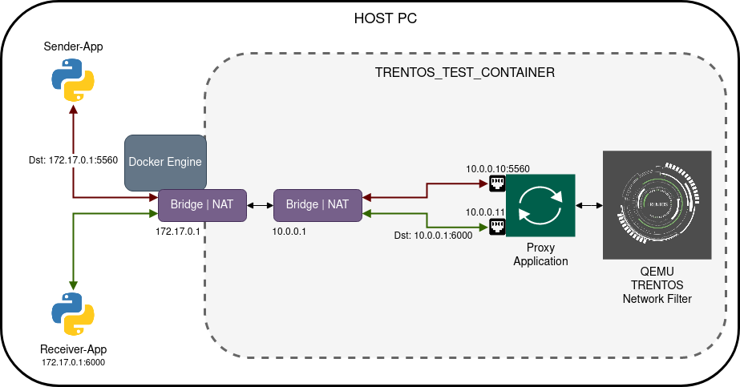
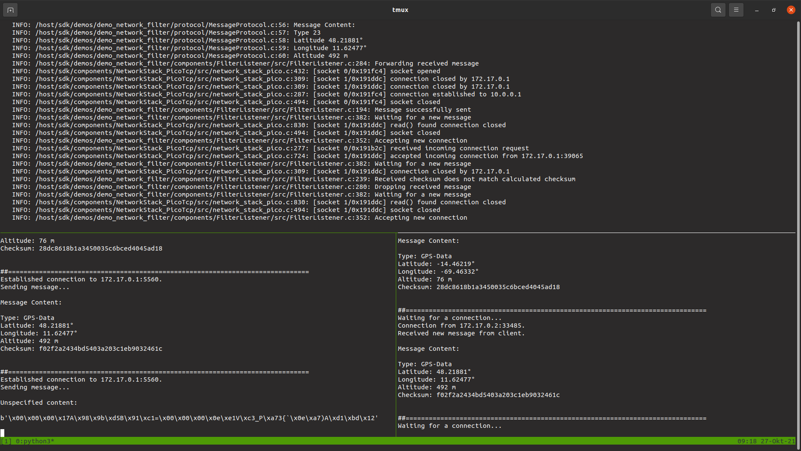

# Network Filter Demo for QEMU

## General

This demo application showcases a simple application-layer Network Filter
utilizing two Ethernet ports. It analyzes messages received on the first
Ethernet port sent by a Sender-App and applies a filtering algorithm based on a
specific binary message protocol. Valid messages are forwarded to a Receiver-App
connected to the second Ethernet port.

## CAmkES Component Architecture


## Message Protocol

The example Network Filter analyses and filters the received data based
on a specific message protocol. The message protocol for the demo use
case is comprised of decimal GPS coordinates (WGS84) and altitude
values. It is specified as follows:

| Offset<br>[bytes] | Size<br>[bytes]* | Name / Description                                                             | Type             | Values                                              |
|-------------------|------------------|--------------------------------------------------------------------------------|------------------|-----------------------------------------------------|
| 0                 | 4                | MessageType<br>Defines the type of the message                                 | unsigned int32   | 23 = WGS84 coordinates<br>all other values reserved |
| 4                 | 4                | Latitude<br>Defines the latitude of the coordinate in degrees.                 | Float (IEEE 754) | min: -90.0<br>max: 90.0                             |
| 8                 | 4                | Longitude<br>Defines the longitude of the coordinate in degrees.               | Float (IEEE 754) | min: -180.0<br>max: 180.0                           |
| 12                | 4                | Altitude<br>Defines the altitude of the coordinate in meters above the ground. | signed int32     | scale: 1<br>min: -1000<br>max: 10000                |
| 16                | 16               | Checksum<br>MD5 checksum calculated over Bytes 0 to 15 of the message.         | 128 bit data     |                                                     |

\*Sorted according to the network byte order (= big-endian).

## Message Input Data Required by the Sender-App

Based on the message protocol outlined above, the **`input_data.txt`**
file found in the **`/host_applications/data`** folder provided in the
sources of the demo contains both valid and invalid messages defined to
showcase the filtering functionality of the demo system.

A valid message found in this file adheres to the outlined message
protocol and contains valid data for all required fields, as defined in
the example below.

```python
# Valid messages.
Type: 23, Latitude: -14.46219, Longitude: -69.46332, Altitude: 76
Type: 23, Latitude: 48.21881, Longitude: 11.62477, Altitude: 492
```

An invalid message can be defined in various ways (from completely random data
to merely one value of the payload being out of the allowed range). The
following example shows a \"raw\" message containing an invalid checksum to an
otherwise valid payload. The \"0x\" prefix indicates to the parser that the
following characters in the string should be interpreted as hexadecimal digits.

```python
# Invalid "raw" message below is a hex string made up of valid message data
# with an added invalid checksum. Should get caught by the filter.
# The valid content of the message is:
# Type: 23 Latitude: 19.07609, Longitude: 72.87742, Altitude: 14
0x0000001741989bd54291c13d0000000ee156c35f50a7337b600ea72941d1bd12
```

If the \"0x\" prefix is not added, the script will interpret that line
as a string of unspecified random data as seen in the example below.

```python
# Unspecified random data. Should get caught by the filter.
Fwmuu5ORXo2mSrGIjE7ETrSw7U5BLvO77xsn88IcXkUNC6oE0MbgrvOHHmttymVMqRLlqAvhHPSP1vf5
```

When running the demo (see instructions below) this input file needs to
be passed to the Sender-App. The Sender-App will parse all the data from
the input file into messages that it will then send to the address of
the Network Filter demo system.

## QEMU Setup

The overview below visualizes how the required network environment is emulated
on the host machine running the Network Filter system in QEMU. The docker
container exposes port 5560 to which the Sender-App connects. Within the
container network, this port is forwarded to the address of the first network
stack contained in the demo system. Valid messages are sent using the second
network stack and forwarded to the Receiver-App running on the host.



## Building the Demo

For building the Network Filter demo, the **`build-system.sh`** script has to be
used and executed within the **trentos_build** docker container. The following
command will invoke this build script from inside the **trentos_build** docker
container. The container will bind the current working folder to a volume
mounted under **`/host`**, execute the script, and then self-remove.

```shell
# Entering the SDK root directory
cd <sdk_root_directory>

# Building the demo
sdk/scripts/open_trentos_build_env.sh \
    sdk/build-system.sh \
    sdk/demos/demo_network_filter \
    zynq7000 \
    build-zynq7000-Debug-demo_network_filter \
    -DCMAKE_BUILD_TYPE=Debug
```

As a result, the folder **`build-zynq7000-Debug-demo_network_filter`** is
created, containing all the build artifacts.

For an in-depth discussion about building TRENTOS systems, different possible
configurations, and parameters, please refer to the
[Buildsystem](../development/buildsystem.md) section.

## Running the Demo

The Network Filter demo essentially contains three different applications that
need to run to create the message chain starting from the Sender-App and ending
(in the case of valid messages) at the Receiver-App. To monitor the messages
traveling through the whole chain, it is recommended to place all three separate
terminal windows required to run the applications next to each other on
the screen. Terminal multiplexer tools such as **`tmux`** are additionally
recommended for this task. The example screenshot below shows a **`tmux`**
session with a single terminal window split into three separate panes
(top-center showing the output of the demo system in QEMU, lower-left pane
showing the output of the Sender-App, and the lower-right side showing the
output of the Receiver-App).



### Start the Python Receiver-App

Open a terminal window dedicated to view the incoming messages the
Receiver-App receives and run the Python script with the command
provided below.

```shell
sdk/demos/demo_network_filter/host_applications/filter_demo_receiver.py
```

On successful start-up, the script will indicate that it is ready to
receive an incoming connection.

```console
Starting Receiver-App on 172.17.0.1:6000...
##==============================================================================
Waiting for a connection...
```

### Start the TRENTOS Network Filter System

Open a new terminal window and call the **`run_demo.sh`** script found
in the root folder of the demo from within the **`trentos_test`** docker
container and pass it the relative paths of the demo build directory
(**`build-zynq7000-Debug-demo_network_filter`**) and the **`sdk`**
folder inside the SDK root directory. Since the demo requires the
container to expose port 5560 to the host and subsequent forwarding of
this port to the demo system running inside the container, the command
needs to be extended with parameters to set up this required
environment. The demo itself provides a **`docker`** folder containing a
demo specific **`entrypoint.sh`** script to set up the mentioned port forwarding
rules.

```shell
# The run_demo.sh script takes in 2 arguments:
#   - the path to the build directory of the Network Filter demo
#   - the path to the sdk directory
sdk/scripts/open_trentos_test_env.sh \
    -d "-p 5560:5560" \
    -d "-v $(pwd)/sdk/demos/demo_network_filter/docker:/docker" \
    -d "--entrypoint=/docker/entrypoint.sh" \
    sdk/demos/demo_network_filter/run_demo.sh \
    build-zynq7000-Debug-demo_network_filter \
    sdk
```

The **`run_demo.sh`** script will run QEMU with the system image of the
demo and additionally start up the proxy that provides the host\'s
networking capabilities to the system running in QEMU. After pressing
\<Enter\>, the system will booted up, and it should eventually stop with
the following output, indicating that it is ready to accept a new
incoming connection from the Sender-App.

```console
...

INFO: /host/sdk/components/NetworkStack_PicoTcp/src/network_stack_pico_nic.c:237: picoTCP Device created: trentos_nic_driver
INFO: /host/sdk/components/NetworkStack_PicoTcp/src/network_stack_pico.c:432: [socket 0/0x191b2c] socket opened
INFO: /host/sdk/components/NetworkStack_PicoTcp/src/network_stack_pico.c:563: [socket 0/0x191b2c] binding to port 5560
INFO: /host/sdk/demos/demo_network_filter/components/FilterListener/src/FilterListener.c:352: Accepting new connection
INFO: /host/sdk/components/NetworkStack_PicoTcp/src/network_stack_pico_nic.c:129: Falling back to legacy interface.
INFO: /host/sdk/components/NetworkStack_PicoTcp/src/network_stack_pico_nic.c:129: Falling back to legacy interface.

...
```

### Start the Python Sender-App

Once the Receiver-App and the Network Filter system are running, open a
third terminal to start the Sender-App and view its output. Since this
app relies on input data for the messages it should send, we need to
call to the script with the **`--input`** command line parameter
followed by the path to the input file.

```shell
sdk/demos/demo_network_filter/host_applications/filter_demo_sender.py \
    --input sdk/demos/demo_network_filter/host_applications/data/input_data.txt
```

As soon as the Sender-App is running and successfully connected to the Network
Filter system, it will proceed to send a message about every three seconds.

The snippet below shows the output generated by the Sender-App that in this
example has already sent three messages to the Network Filter system. Since the
second message shown here consists of unspecified data, this message will be
caught by the Network Filter and will not be seen in the output of the
Receiver-App. The other two messages shown below have both the valid structure
and a valid payload regarding the defined protocol. Therefore these two messages
will pass all the checks of the Network Filter and will be forwarded to the
Receiver-App.

```console
Sending all messages to 172.17.0.1:5560...

##==============================================================================
Established connection to 172.17.0.1:5560.
Sending message...

Message Content:

Type: GPS-Data
Latitude: 47.59760°
Longitude: 9.59707°
Altitude: 413 m
Checksum: 6a0c5f80de4afec6e905a17849248b69


##==============================================================================
Established connection to 172.17.0.1:5560.
Sending message...

Unspecified content:

b'jcIP0LCesok8CAoAqdanYeBPzEA2P7c1L6KhSxSbSa8gTqgCszDnIoGNrdUoOQyo9NCQjYUGvDad7ilA'


##==============================================================================
Established connection to 172.17.0.1:5560.
Sending message...

Message Content:

Type: GPS-Data
Latitude: -14.46219°
Longitude: -69.46332°
Altitude: 76 m
Checksum: 28dc8618b1a3450035c6bced4045ad18

...
```

## Closing the Demo

Eventually, all invalid and valid messages described in the
**`input_data.txt`** will have been sent by the Sender-App and it will
close with a final statement.

Final Output Sender-App:

```console
...

##==============================================================================
Established connection to 172.17.0.1:5560.
Sending message...

Message Content:

Type: GPS-Data
Latitude: 27.98805°
Longitude: 86.92527°
Altitude: 8849 m
Checksum: 1c5586e2c782bd38778f3862768d06af

All messages successfully transmitted.

...
```

Final Output Receiver-App:

```console
...

##==============================================================================
Waiting for a connection...
Connection from 172.17.0.3:3126.
Received new message from client.

Message Content:

Type: GPS-Data
Latitude: 27.98805°
Longitude: 86.92527°
Altitude: 8849 m
Checksum: 1c5586e2c782bd38778f3862768d06af


##==============================================================================
Waiting for a connection...

...
```

Final Execution Output:

```console
...

INFO: /host/sdk/demos/demo_network_filter/components/FilterListener/src/FilterListener.c:382: Waiting for a new message
INFO: /host/sdk/components/NetworkStack_PicoTcp/src/network_stack_pico.c:309: [socket 1/0x191ddc] connection closed by 172.17.0.1
INFO: /host/sdk/demos/demo_network_filter/protocol/MessageProtocol.c:56: Message Content:
INFO: /host/sdk/demos/demo_network_filter/protocol/MessageProtocol.c:57: Type 23
INFO: /host/sdk/demos/demo_network_filter/protocol/MessageProtocol.c:58: Latitude 27.98805°
INFO: /host/sdk/demos/demo_network_filter/protocol/MessageProtocol.c:59: Longitude 86.92527°
INFO: /host/sdk/demos/demo_network_filter/protocol/MessageProtocol.c:60: Altitude 8849 m
INFO: /host/sdk/demos/demo_network_filter/components/FilterListener/src/FilterListener.c:284: Forwarding received message
INFO: /host/sdk/components/NetworkStack_PicoTcp/src/network_stack_pico.c:432: [socket 0/0x191f34] socket opened
INFO: /host/sdk/components/NetworkStack_PicoTcp/src/network_stack_pico.c:309: [socket 1/0x191ddc] connection closed by 172.17.0.1
INFO: /host/sdk/components/NetworkStack_PicoTcp/src/network_stack_pico.c:309: [socket 1/0x191ddc] connection closed by 172.17.0.1
INFO: /host/sdk/components/NetworkStack_PicoTcp/src/network_stack_pico.c:287: [socket 0/0x191f34] connection established to 10.0.0.1
INFO: /host/sdk/components/NetworkStack_PicoTcp/src/network_stack_pico.c:494: [socket 0/0x191f34] socket closed
INFO: /host/sdk/demos/demo_network_filter/components/FilterListener/src/FilterListener.c:194: Message successfully sent
INFO: /host/sdk/demos/demo_network_filter/components/FilterListener/src/FilterListener.c:382: Waiting for a new message
INFO: /host/sdk/components/NetworkStack_PicoTcp/src/network_stack_pico.c:830: [socket 1/0x191ddc] read() found connection closed
INFO: /host/sdk/components/NetworkStack_PicoTcp/src/network_stack_pico.c:494: [socket 1/0x191ddc] socket closed
INFO: /host/sdk/demos/demo_network_filter/components/FilterListener/src/FilterListener.c:352: Accepting new connection

...
```

Other than the Sender-App the Receiver-App will not stop automatically
and can be quit by pressing \<Ctrl-C\>. If you wish to stop the
execution of the Sender-App at an earlier point, you can also quit it by
pressing \<Ctrl-C\>.

To exit the Network Filter system running in QEMU press \<Ctrl-A\> and
\<X\> followed by \<Ctrl-C\> to additionally close the proxy
application.
