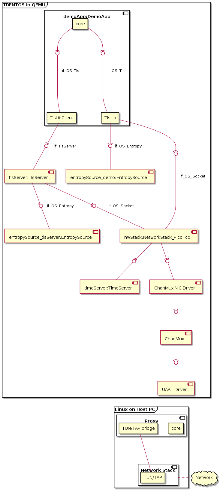
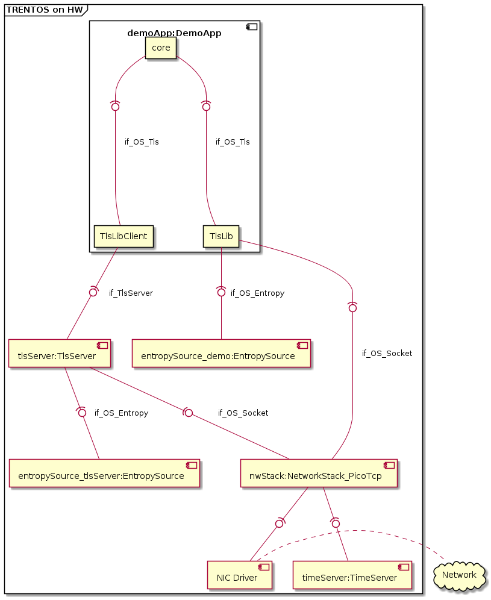
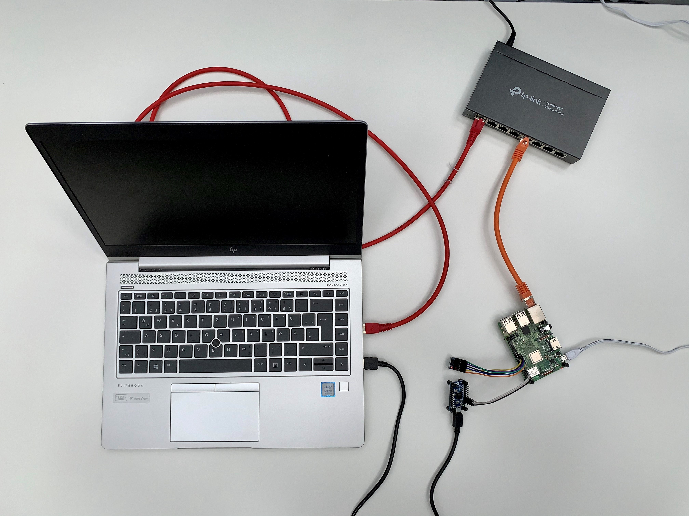
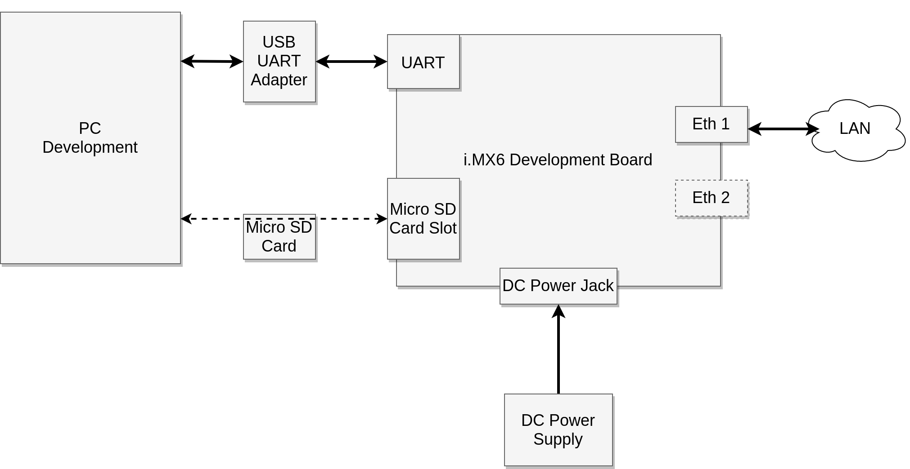
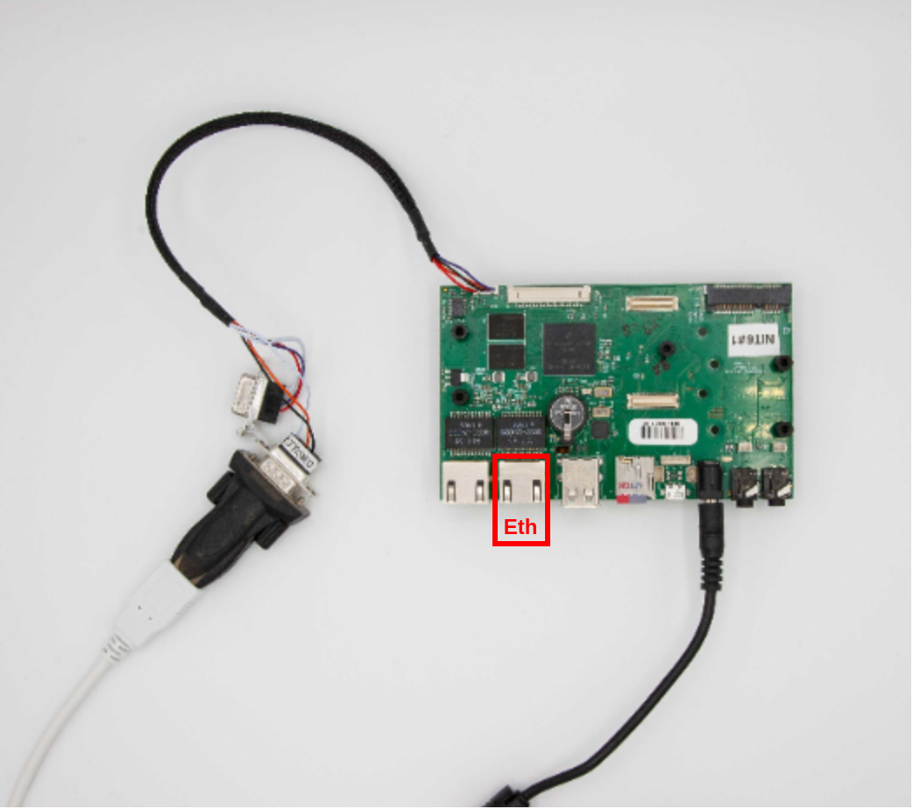

# TLS API Demo

## General

This demo application showcases how to use the [TLS API](../api/tls_api.md)
in order to retrieve a HTTPS web page.  The demo can be run within QEMU
and also on real hardware. Instructions for setup, build and execution
can be found below.

The demo performs the page retrieval in two different ways sequentially.
In both cases the application downloads the webpage of
[https://www.example.org](https://www.example.org/) and prints the html
content to the console.

- In the first case the component is using the [TLS API](../api/tls_api.md)
    is directly linking the **os_tls** library. Calls to the
    [TLS API](../api/tls_api.md) are directly resolved by library function calls.
- In the second case the **os_tls** library is used within
    the [TlsServer](../components/tls-server.md) component. The component using
    the [TLS API](../api/tls_api.md) is interfacing with the
    [TlsServer](../components/tls-server.md) component via the **`if_TlsServer`**
    interface. Calls to the [TLS API](../api/tls_api.md) result in RPC calls to
    the [TlsServer](../components/tls-server.md) component.

## CAmkES Component Architecture

The demo is designed to be run on real hardware as well as in QEMU. The
architecture differs slightly between these setups, as can be seen in
the diagrams below. The differences between hardware platforms are
limited to the specific NIC component to be used. The QEMU setup differs
more (when compared to a hardware platform setup) because the ethernet
NIC driver is realized by the ChanMux / Proxy setup.

The architecture shows how the application component DemoApp can use two
different implementations of the interface **`if_OS_Tls`**:

1. by using a library (TlsLib) that runs the TLS  protocol in the
    context of the caller and connects to the network stack component
    via **`if_OS_Socket`** and
2. by using another library (TlsLibClient) which is a wrapper for RPC
    calls on top of **`if_TlsServer`**. In this case the TLS protocol
    handling will be done by
    the [TlsServer](../components/tls-server.md) component, which itself
    connects to the network stack using the **`if_OS_Socket`** interface.

The following diagram shows the architecture in case of NIC driver
emulated via ChanMux in a QEMU context. The NIC driver is not directly
connected to any real HW but sends the requests via the ChanMux protocol
to the Linux Proxy application which will emulate a MAC interface by
using TUN/TAP bridging.



The following diagram shows the architecture in case one of the
supported hardware platforms is used. In this case a real NIC driver
component is used that provides ethernet access via a wired network
connection.



## Demo Setup

This chapter describes the setup used for the different target platforms
before the build and execution steps are described in the subsequent
chapters.

### QEMU

When using the QEMU setup no extra resources are required except those in the
SDK and an internet connection on the PC running the SDK.

### Raspberry Pi 3 Model B+

The TLS API demo is supposed to run standalone on an the Raspberry Pi 3
Model B+ development platform, without using the **trentos_test** docker
container, QEMU, ChanMux, or the Proxy Application.

In order to run the demo on the Raspberry Pi 3 Model B+, the following
is required:

- RPi3B+ incl. power supply,
- UART-to-USB adapter,
- microSD Card,
- Ethernet cable.

Before building or executing the demo it is necessary to first properly
connect all the hardware components:

- connect the UART-to-USB adapter to the RPi3B+ board - see the
    Boot-up section for correct wiring,
- connect the development board to the network using the Ethernet
    cable,
- connect the UART-to-USB adapter to your PC,
- connect the RPi3B+ board to the power supply.

The following diagram shows the hardware setup.




### i.MX6

The TLS API demo is supposed to run standalone on an i.MX6 based development
platform, without using the **trentos_test** docker container, QEMU, ChanMux, or
the Proxy Application.

In order to run the demo, the following is required:

- Either a Nitrogen6_SoloX or BD-SL-i.MX6 development board incl. power supply,
- USB-to-RS232 cable for console and logs,
- a micro SD-Card,
- Ethernet cable.

If the utilized development board has not already been prepared with the
required U-Boot image during the steps outlined in the
[Getting Started](../introduction/getting-started.md) document, it will still
need to be prepared with the specific image to successfully boot the kernel and
the demo application. Follow the detailed description of how to install the
required U-Boot version in the board's internal NOR flash either at
[Nitrogen6_SoloX](../platform-support/nitrogen6-solo-x/platform.md)
or
[BD-SL-i.MX6](../platform-support/bd-sl-i.mx6/platform.md) before continuing
with the steps outlined below.

Before building or executing the demo it is necessary to first properly
connect all the hardware components:

- connect the USB-to-RS232 cable to the board as described in more
    detail in the platform support chapter (either for the
    [Nitrogen6_SoloX](../platform-support/nitrogen6-solo-x/platform.md) or the
    [BD-SL-i.MX6](../platform-support/bd-sl-i.mx6/platform.md))
- connect the development board to the network using the Ethernet cable (on the
    [Nitrogen6_SoloX](../platform-support/nitrogen6-solo-x/platform.md),
    connect it to the inner Ethernet port directly next to the USB
    port),
- connect the USB-to-RS232 adapter to your PC,
- connect the development board to the power supply.

The following diagram shows the hardware setup:



The following images show example setups for Nitrogen6_SoloX and BD-SL-i.MX6:




## Building the Demo

For building the [TLS API](../api/tls_api.md) demo, the **`build-system.sh`** script has
to be used and executed within the **trentos_build** docker container. The
following command will invoke this custom build script from inside the
**trentos_build** docker container. The container will bind the current working
folder to a volume mounted under **`/host`**, execute the script and then self
remove.

Before the build it is important to check the static IP address configuration in
**`sdk/demos/demo_tls_api/config/SystemConfig.h`**. Make sure that
**`ETH_1_ADDR`**, **`ETH_1_GATEWAY_ADDR`** and **`ETH_1_SUBNET_MASK`** are set
consistently to the setup of network to which the board will be connected.

The demo can be built for the following platforms (the following terms shall
replace the placeholder **`<platform>`** in the following code/script boxes):

- **`zynq7000`** (suitable for running on QEMU)
- **`rpi3`**
- **`sabre`**
- **`nitrogen6sx`**

```shell
# Entering the SDK root directory
cd <sdk_root_directory>

# Building the demo
sdk/scripts/open_trentos_build_env.sh \
    sdk/build-system.sh \
    sdk/demos/demo_tls_api \
    <platform> \
    build-<platform>-Debug-demo_tls_api \
    -DCMAKE_BUILD_TYPE=Debug
```

As a result, the folder **`build-<platform>-Debug-demo_tls_api`** is created,
containing all the build artifacts.

For an in-depth discussion about building TRENTOS systems, different possible
configurations and parameters, please refer to the
[Buildsystem](../development/buildsystem.md) section.

## Running the Demo

### Expected Output

This section will describe the expected output of the demo. The following
chapters will explain how the demo can be run on the supported platforms. The
output will be similar to the following except for boot output (which is not
shown here and is platform dependent).

A successful demo execution will print twice a sequence that ends up with the
html page dump like in the following example.

```console
INFO: /host/sdk/demos/demo_tls_api/components/DemoApp/src/DemoApp.c:325: Socket successfully connected
INFO: /host/sdk/demos/demo_tls_api/components/DemoApp/src/DemoApp.c:201: TLS Library successfully initialized
INFO: /host/sdk/demos/demo_tls_api/components/DemoApp/src/DemoApp.c:215: TLS handshake succeeded
INFO: /host/sdk/demos/demo_tls_api/components/DemoApp/src/DemoApp.c:231: HTTP request successfully sent
INFO: /host/sdk/components/NetworkStack_PicoTcp/src/network_stack_pico.c:309: [socket 0/0x191e4c] connection closed by 93.184.216.34
INFO: /host/sdk/components/NetworkStack_PicoTcp/src/network_stack_pico.c:309: [socket 0/0x191e4c] connection closed by 93.184.216.34
INFO: /host/sdk/demos/demo_tls_api/components/DemoApp/src/DemoApp.c:246: OS_Tls_read() - bytes read: 354, err: 0
INFO: /host/sdk/components/NetworkStack_PicoTcp/src/network_stack_pico.c:309: [socket 0/0x191e4c] connection closed by 93.184.216.34
INFO: /host/sdk/components/NetworkStack_PicoTcp/src/network_stack_pico.c:309: [socket 0/0x191e4c] connection closed by 93.184.216.34
INFO: /host/sdk/demos/demo_tls_api/components/DemoApp/src/DemoApp.c:246: OS_Tls_read() - bytes read: 1256, err: 0
INFO: /host/sdk/components/NetworkStack_PicoTcp/src/network_stack_pico.c:309: [socket 0/0x191e4c] connection closed by 93.184.216.34
INFO: /host/sdk/components/NetworkStack_PicoTcp/src/network_stack_pico.c:309: [socket 0/0x191e4c] connection closed by 93.184.216.34
INFO: /host/sdk/libs/os_tls/src/lib/TlsLib.c:634: host has signaled that connection will be closed
INFO: /host/sdk/demos/demo_tls_api/components/DemoApp/src/DemoApp.c:246: OS_Tls_read() - bytes read: 2486, err: -15
WARNING: /host/sdk/demos/demo_tls_api/components/DemoApp/src/DemoApp.c:255: connection closed by network stack
INFO: /host/sdk/demos/demo_tls_api/components/DemoApp/src/DemoApp.c:273: Got HTTP
Page:
HTTP/1.0 200 OK
Age: 600216
Cache-Control: max-age=604800
Content-Type: text/html; charset=UTF-8
Date: Wed, 03 Nov 2021 14:40:19 GMT
Etag: "3147526947+ident"
Expires: Wed, 10 Nov 2021 14:40:19 GMT
Last-Modified: Thu, 17 Oct 2019 07:18:26 GMT
Server: ECS (dcb/7EC8)
Vary: Accept-Encoding
X-Cache: HIT
Content-Length: 1256
Connection: close
<!doctype html>
<html>
<head>
    <title>Example Domain</title>

    <meta charset="utf-8" />
    <meta http-equiv="Content-type" content="text/html; charset=utf-8" />
    <meta name="viewport" content="width=device-width, initial-scale=1" />
    <style type="text/css">
    body {
        background-color: #f0f0f2;
        margin: 0;
        padding: 0;
        font-family: -apple-system, system-ui, BlinkMacSystemFont, "Segoe UI", "Open Sans", "Helvetica Neue", Helvetica, Arial, sans-serif;
    }
    div {
        width: 600px;
        margin: 5em auto;
        padding: 2em;
        background-color: #fdfdff;
        border-radius: 0.5em;
        box-shadow: 2px 3px 7px 2px rgba(0,0,0,0.02);
    }
    a:link, a:visited {
        color: #38488f;
        text-decoration: none;
    }
    @media (max-width: 700px) {
        div {
            margin: 0 auto;
            width: auto;
        }
    }
    </style>
</head>

<body>
<div>
    <h1>Example Domain</h1>
    <p>This domain is for use in illustrative examples in documents. You may use this
    domain in literature without prior coordination or asking for permission.</p>
    <p><a href="https://www.iana.org/domains/example">More information...</a></p>
</div>
</body>
</html>

INFO: /host/sdk/components/NetworkStack_PicoTcp/src/network_stack_pico.c:494: [socket 0/0x191e4c] socket closed
INFO: /host/sdk/demos/demo_tls_api/components/DemoApp/src/DemoApp.c:347: Crypto Library for TLS Library successfully freed
INFO: /host/sdk/demos/demo_tls_api/components/DemoApp/src/DemoApp.c:421: Demo TLS API in 'library' mode completed, now running TLS API in 'component' mode
INFO: /host/sdk/components/NetworkStack_PicoTcp/src/network_stack_pico.c:432: [socket 0/0x192404] socket opened
INFO: /host/sdk/components/NetworkStack_PicoTcp/src/network_stack_pico.c:287: [socket 0/0x192404] connection established to 93.184.216.34
INFO: /host/sdk/demos/demo_tls_api/components/DemoApp/src/DemoApp.c:381: TLS Socket successfully connected
INFO: /host/sdk/demos/demo_tls_api/components/DemoApp/src/DemoApp.c:201: TLS Library successfully initialized
INFO: /host/sdk/demos/demo_tls_api/components/DemoApp/src/DemoApp.c:215: TLS handshake succeeded
INFO: /host/sdk/demos/demo_tls_api/components/DemoApp/src/DemoApp.c:231: HTTP request successfully sent
INFO: /host/sdk/components/NetworkStack_PicoTcp/src/network_stack_pico.c:309: [socket 0/0x192404] connection closed by 93.184.216.34
INFO: /host/sdk/components/NetworkStack_PicoTcp/src/network_stack_pico.c:309: [socket 0/0x192404] connection closed by 93.184.216.34
INFO: /host/sdk/demos/demo_tls_api/components/DemoApp/src/DemoApp.c:246: OS_Tls_read() - bytes read: 359, err: 0
INFO: /host/sdk/components/NetworkStack_PicoTcp/src/network_stack_pico.c:309: [socket 0/0x192404] connection closed by 93.184.216.34
INFO: /host/sdk/components/NetworkStack_PicoTcp/src/network_stack_pico.c:309: [socket 0/0x192404] connection closed by 93.184.216.34
INFO: /host/sdk/demos/demo_tls_api/components/DemoApp/src/DemoApp.c:246: OS_Tls_read() - bytes read: 1256, err: 0
INFO: /host/sdk/components/NetworkStack_PicoTcp/src/network_stack_pico.c:309: [socket 0/0x192404] connection closed by 93.184.216.34
INFO: /host/sdk/components/NetworkStack_PicoTcp/src/network_stack_pico.c:309: [socket 0/0x192404] connection closed by 93.184.216.34
INFO: /host/sdk/libs/os_tls/src/lib/TlsLib.c:634: host has signaled that connection will be closed
INFO: /host/sdk/demos/demo_tls_api/components/DemoApp/src/DemoApp.c:246: OS_Tls_read() - bytes read: 2481, err: -15
WARNING: /host/sdk/demos/demo_tls_api/components/DemoApp/src/DemoApp.c:255: connection closed by network stack
INFO: /host/sdk/demos/demo_tls_api/components/DemoApp/src/DemoApp.c:273: Got HTTP
Page:
...
<HTTP Page dump>
...
INFO: /host/sdk/components/NetworkStack_PicoTcp/src/network_stack_pico.c:494: [socket 0/0x192404] socket closed
INFO: /host/sdk/demos/demo_tls_api/components/DemoApp/src/DemoApp.c:400: TLS Socket successfully closed
INFO: /host/sdk/demos/demo_tls_api/components/DemoApp/src/DemoApp.c:429: Demo completed successfully.
```

If everything runs correctly and the page gets successfully retrieved in
both cases then the final printout will be like in the following
example.

```console
INFO: /host/sdk/demos/demo_tls_api/components/DemoApp/src/DemoApp.c:429: Demo completed successfully.
```

### Running on QEMU

Call the **`run_demo.sh`** script found in the root folder of the demo from
within the **trentos_test** docker container (see
[Getting Started](../introduction/getting-started.md) document for more
information on how to test a TRENTOS system) and pass it the build directory
(e.g. **`build-zynq7000-Debug-demo_tls_api`**) of the demo.

```shell
# The run_demo.sh script takes in 2 arguments:
#   - the path to the build directory of the TLS API demo
#   - the path to the proxy app directory
sdk/scripts/open_trentos_test_env.sh \
    sdk/demos/demo_tls_api/run_demo.sh \
    build-zynq7000-Debug-demo_tls_api \
    sdk/bin
```

This script will start the system (in QEMU) and, after pressing the
\<Enter\> key, the demo is executed successfully (see Expected Output
section above).

You can stop QEMU with \<Ctrl-A\> and \<X\>, then you can stop the proxy app
with \<Ctrl-C\>.

### Running on HW Platforms

Start a serial monitor that shows the traffic received from the
UART-to-USB adapter. One way of doing this is to use
the **`picocom`** utility with the following command:

```shell
sudo picocom -b 115200 /dev/<ttyUSBX>
```

Hereby, **`<ttyUSBX>`** acts as a placeholder for the specific device
representing the USB-to-UART adapter, e.g. **`ttyUSB0`**. Note that
using **`sudo`** may not be required, this depends on your Linux group
membership giving your account access to **`/dev/<ttyUSBX>`**.

#### Raspberry Pi 3 Model B+

To boot the board from the SD card, a suitable boot script and firmware has to
be placed in the 1st primary partition of the SD card. The boot files for the
used platform can be found in **`sdk/resources/rpi3_sd_card/`**.

Copy the firmware data and the built demo_tls_api system image to the SD card,
sync and unmount it.

```shell
# copy bootfiles to SD Card
cp sdk/resources/rpi3_sd_card/* <sd_card_mount_point>/

# copy TRENTOS system image (the TLS API demo application) to SD Card
cp build-rpi3-Debug-demo_tls_api/images/os_image.elf <sd_card_mount_point>/

# ensure files are written to the SD Card
sync
umount <sd_card_mount_point>
```

Remove the SD card and place it back in the RPi3B+.

Restart the board with a power cycle and take a look at the console output. The
RPi3B+ is restarted and the demo is executed successfully (see Expected Output
section above).

### Nitrogen6_SoloX

To boot the board from the SD card, a suitable boot script has to be
placed in the 1st primary partition of the SD card. The boot files for
the used platform can be found in **`sdk/resources/nitrogen6sx_sd_card/`**.

Copy the firmware data and the built demo_tls_api system image to the SD card,
sync and unmount it.

```shell
# copy Nitrogen6_SoloX bootfiles to SD Card
cp sdk/resources/nitrogen6sx_sd_card/* <sd_card_mount_point>/

# copy TRENTOS system image (the TLS API demo application) to SD Card
cp build-nitrogen6sx-Debug-demo_tls_api/images/os_image.elf <sd_card_mount_point>/

# ensure files are written to the SD Card
sync
umount <sd_card_mount_point>
```

Remove the SD card and place it back in the Nitrogen6_SoloX board.

Restart the board with a power cycle and take a look at the console output. The
Nitrogen6_SoloX is restarted and the demo is executed successfully (see Expected
Output section above).

### BD-SL-i.MX6

To boot the board from the SD card, a suitable boot script has to be
placed in the 1st primary partition of the SD card. The boot files for
the used platform can be found in **`sdk/resources/sabre_sd_card/`**.

Copy the firmware data and the built demo_tls_api system image to the SD card,
sync and unmount it.

```shell
# copy BD-SL-i.MX6 bootfiles to SD Card
cp sdk/resources/sabre_sd_card/* <sd_card_mount_point>/

# copy TRENTOS system image (the TLS API demo application) to SD Card
cp build-sabre-Debug-demo_tls_api/images/os_image.elf <sd_card_mount_point>/

# ensure files are written to the SD Card
sync
umount <sd_card_mount_point>
```

Remove the SD card and place it back in the BD-SL-i.MX6 board.

Restart the board with a power cycle and take a look at the console
output. The BD-SL-i.MX6 is restarted and the demo is executed
successfully (see Expected Output section above).
