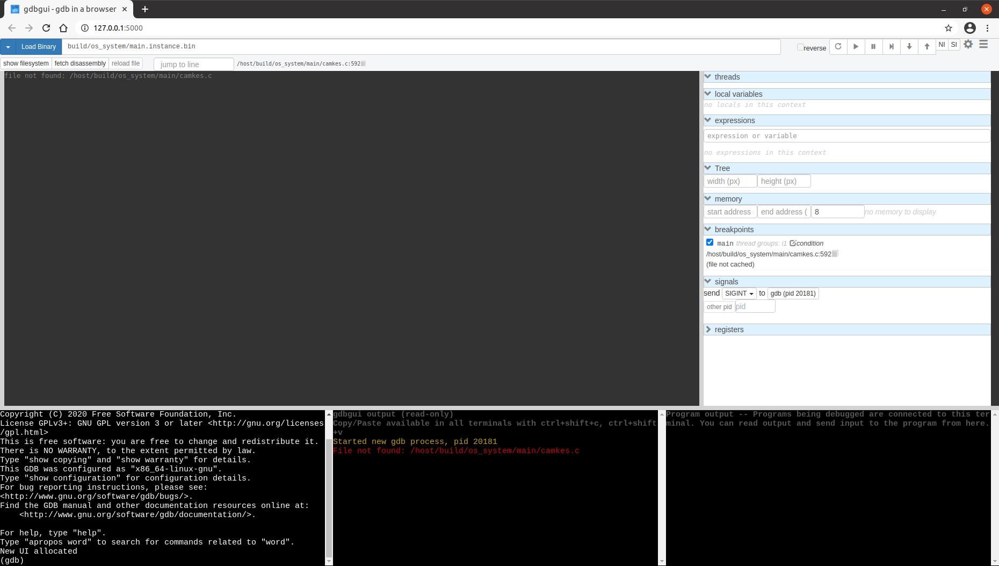
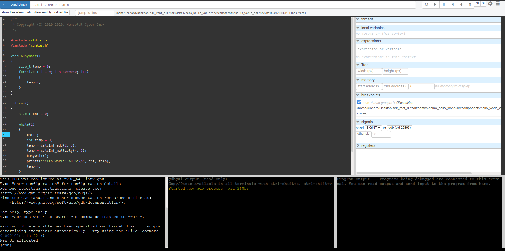
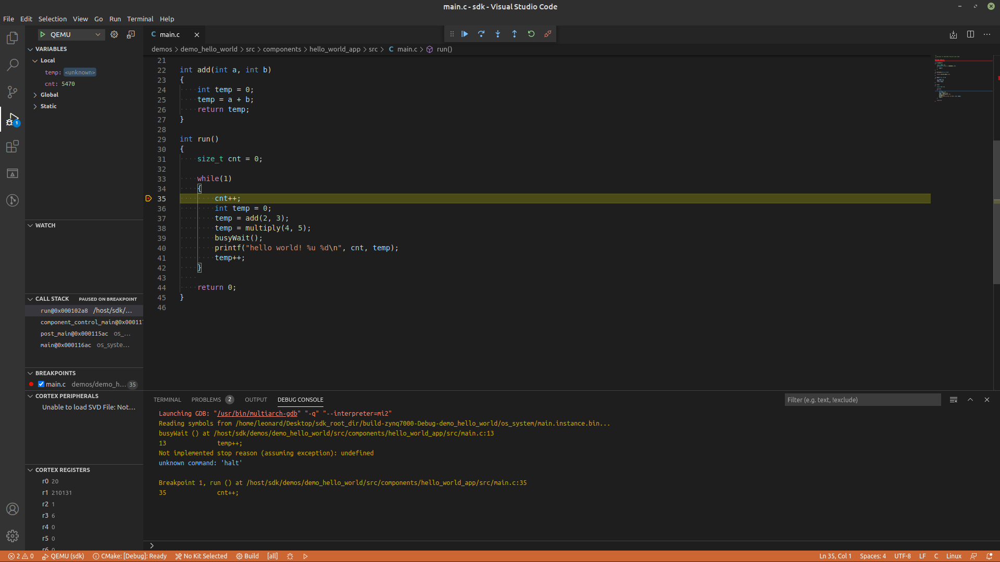

# Debugging HW Platforms Using OpenOCD

## Prerequisites

### Install gdbgui

The prerequisites for debugging TRENTOS applications is the **`gdb`**
debugger
([https://www.gnu.org/software/gdb](https://www.gnu.org/software/gdb/)).
In addition, we will use **`gdbgui`**
([https://www.gdbgui.com](https://www.gdbgui.com/)), a browser-based
**`gdb`** front-end written in Python, which provides some convenience
features compared to the puristic **`gdb`** command line.

First, install the **`gdb-multiarch`** package:

```shell
sudo apt install gdb-multiarch
```

Then, install the **`gdbgui`** tool:

```shell
python3 -m pip install --user pipx
python3 -m userpath append ~/.local/bin

# Restart the console to make sure the userpath is updated.
pipx install gdbgui
pipx upgrade gdbgui
```

### Install OpenOCD

Please refer to <https://openocd.org/pages/getting-openocd.html> for
detailed instructions.

Before installing the tool it is necessary to install the library
prerequisites.

```shell
sudo apt install libtool
```

Clone the OpenOCD repository.

The official repo is <https://sourceforge.net/p/openocd/code> but the
bandwidth seems to be limited. Hence, the unofficial GitHub mirror of an
OpenOCD main developer can also be used at
<https://github.com/ntfreak/openocd.git>:

```shell
git clone https://github.com/ntfreak/openocd.git
```

Switch to the folder and run the bootstrapper.

```shell
cd openocd
./bootstrap
```

Configure and build OpenOCD.

```shell
./configure
make
sudo make install
```

## Debugging Process

### HW Setup

Detailed instructions on how to connect the FT232H adapter to the individual
platforms can be found in:

- [RPi3B+ Debugging with JTAG](../../platform-support/rpi-3-model-b+/debugging_jtag.md)
- [Nitrogen6_SoloX Debugging with JTAG](../../platform-support/nitrogen6-solo-x/debugging_jtag.md)
- [BD-SL-i.MX6 Debugging with JTAG](../../platform-support/bd-sl-i.mx6/debugging_jtag.md)

Once the platform setup is completed and the system can be run, power on
the board.

**Note:** The board has to be powered on for the OpenOCD connection to
be established which needs to happen before starting **`gdbgui`**. Also,
**`gdbgui`** should not be started before the TRENTOS system has started
execution (more specifically, the component that you wish to debug)
because this results in an unstable connection (breakpoints are ignored,
single-stepping is not working etc.).

This means that the proper workflow should be (details on steps 2. and
3. are given in chapters below):

1. Power on the board
2. Start OpenOCD
3. After OpenOCD has successfully connected to the board and
    the TRENTOS system has started execution, start **`gdbgui`**

Finally, if a system finishes execution and the main thread halts (e.g.
demo_hello_world after the message has been printed), using **`gdbgui`**
will not be possible anymore and steps 1.-3. need to be performed again.

### Start OpenOCD

OpenOCD is started with two configuration files, one for the JTAG
adapter and one for the platform.

The configuration files for the Adafruit FT232H adapter (which is
generic irrespective of the board used) as well as for all platforms can
be found in **`sdk/resources/openocd_cfgs`** inside the SDK root directory.

Once both configuration files are available, OpenOCD is started via the
following command. Using **`sudo`** might not be necessary if the current user
has all access rights.

```shell
sudo openocd \
    -f <path_to_the_ft232h.cfg_file> \
    -f <path_to_the_platform_specific.cfg_file>
```

### Start gdbgui

Once OpenOCD has successfully started, open another terminal window and start
**`gdbgui`**.

**Info:** TRENTOS systems are usually comprised of multiple components
(the seL4 microkernel, drivers, services and applications).
Unfortunately, **`gdb`** has no multitasking awareness by default and can only
work with one single binary/symbol table. Thus single-stepping across context
switches is not possible and debugging is limited to following the execution of
a single address space.

In a new terminal window, run the command shown below and replace the
**`<path/to/elf>`** argument with the path to the elf file that contains
the application you want to debug (e.g.
**`<system-build-directory>/os_system/<component-name>.instance.bin`**)

This will start the **`gdbgui`** tool and opens a **`gdb`** interface in
the default browser:

```shell
gdbgui --gdb gdb-multiarch --args <path/to/elf>
```

The following workspace shall now be opened in the browser:



Before connecting to the TCP port opened by OpenOCD we should address
the error message shown in the middle terminal in the image above. The
reason **`gdb`** can't find the source files based on the data in the
provided elf file is that the project was built using the **trentos_build**
container and the paths are set relative to the root of the container. To fix
this it is necessary to execute the following command in the **`gdb`** terminal
(see lower-left sub-window of the **`gdbgui`**).

```shell
(gdb) set substitute-path /host <ABSOLUTE_PATH_OF_THE_SDK_ROOT_DIRECTORY>
```

This command replaces the **`/host`** part of the path for the source files
with their actual location on the host machine - in this case inside the
SDK root directory. After the command has been executed, clicking on the
**`show filesystem`** → **`Fetch source files`** buttons in the top left
corner of the window will refresh the file locations and make them
available for visualization of the program execution.

The next step is to connect to the TCP port opened by OpenOCD using
the **`gdb`** terminal.

```shell
(gdb) target extended-remote :3333
```

After a successful connection to OpenOCD is established, it is possible
to use the standard **`gdb`** tools like setting breakpoints,
watchpoints, single stepping, inspecting variables, etc.

An example of this is setting the breakpoint on the desired line in a
source file contained in the system that is being debugged.

```shell
(gdb) break <source-file>.c:<line-number>
```

This is also possible to achieve by simply clicking the desired line
number, provided the source file is opened in the central window of the
**`gdbgui`** interface.

After setting the breakpoint it should be visible on the right side of
the **`gdbgui`** interface (by default, the tool sets a breakpoint on
main, which is usually not the primary entry point in the case of
TRENTOS systems, so in order to avoid unnecessary breaks this breakpoint
can be disabled by unchecking it). After pressing the continue button in
the taskbar, the program starts and halts at the breakpoint and after
pressing the continue button once more, the system execution should
continue.

In order to debug different parts of the system, it is possible to load
different elf files without closing the **`gdbgui`** tool. Simply write
the path to the ELF file you want to switch to in the top input bar and
press "Load Binary", after which the symbols contained in this part of
the system will become available. It is worth pointing out
that **`gdb`** offers auto-complete functionality for entering debug
symbols when, for example, adding a breakpoint or a watchpoint, by
simply pressing tab.



**Note:** In case the debugged program contains empty loops (e.g. a delay loop)
stepping over these lines might cause **`gdb`** to halt and stop being usable
which would require a restart of the debug session. This is a known issue
(discussed here: <https://sourceware.org/bugzilla/show_bug.cgi?id=21221>) and
does not result from the presented setup. If you encounter this case, it is
enough to place a dummy operation in the body of the loop to remove the issue.

## Ease of Use

Since during a single debug session it can happen that it is necessary
to start **`gdbgui`** multiple times, it is possible to make some
adjustments that will make this process easier by automating parts of
it. Instead of manually typing in the commands to substitute the path
and connect to the target platform, it is possible to place them in a
**`~/.gdbinit`** script inside your home directory. This will cause the
**`gdbgui`** to execute them upon every start-up which means that the source
files will be automatically loaded correctly and **`gdbgui`** will be
connected to the running target platform and ready for debugging.

```shell
set substitute-path /host <ABSOLUTE_PATH_OF_THE_SDK_ROOT_DIRECTORY>
target extended-remote :<TCP_PORT>
```

## VS Code Plugin

In addition to **`gdbgui`**, it is possible to use the VS Code text editor
to debug the applications running on the HW platform. This is possible
after installing the necessary extensions and configuring the editor as
required.

Necessary extensions:

- C/C++                → **`ext install ms-vscode.cpptools\`**
- Cortex-Debug → **`ext install marus25.cortex-debug\`**

After the extensions have been installed, it is necessary to configure
the debug environment of VS Code. In order to do so, follow these steps:

- Open the folder **`<sdk_root_folder>/sdk`**
- Press **`Run → Add Configuration ...`**
- Select any shown environment
  - In case this is the first time **`Add Configuration ...`** is
        performed, this will create and open a **`launch.json`** file
        with template content.
  - If you have already have a **`launch.json`** file, this will
        open it and add another configuration entry from a template
- Delete the content of the new template configuration and paste the
    following configuration into it. Be sure to:
  - Replace the \<PATH_TO_COMPONENT_ELF_FILE\> with the absolute
        path to the component elf file you wish to debug,
        e.g. **`~/sdk_root_directory/<system-build-directory>/os_system/<component-name>.instance.bin`**
  - Replace the \<TCP_PORT\> with the actual TCP port opened by
        OpenOCD - see the previous section

```json
{
    "version": "0.2.0",
    "configurations": [
    {
        "type": "cortex-debug",
        "request": "attach",
        "name": "HW platform",
        "cwd": "${workspaceRoot}",
        "executable": "<PATH_TO_COMPONENT_ELF_FILE>",
        "armToolchainPath": "/usr/bin/",
        "servertype": "external",
        "gdbTarget": "localhost:<TCP_PORT>",
        "preLaunchTask": "Start-OpenOCD",
        "postDebugTask": "Stop-OpenOCD"
    }
    ]
}
```

- Save the file **`launch.json`**
- After completing the **`launch.json`** configuration file it is
    necessary to specify the \"Start-OpenOCD\" and \"Stop-OpenOCD\"
    tasks which perform the lower level connection/disconnection to the
    platform using OpenOCD. To do so:
  - Press **`Terminal → Configure Tasks ...`**
  - Select any shown task template (this will create and open a
        **`tasks.json`** file)
  - Delete the content of the opened file and paste the following
        configuration into it. Be sure to:
    - Replace the \<ABSOLUTE_PATH_TO_FT232H_CONFIG\>
            and \<ABSOLUTE_PATH_TO_PLATFORM_CONFIG\> with the
            absolute paths to the OpenOCD configuration files located in
            **`sdk_root_directory/sdk/resources/openocd_cfgs/`**

```json
{
    "tasks": [
        {
            "type": "shell",
            "label": "Start-OpenOCD",
            "command": "openocd",
            "args": [
              "-f", "<ABSOLUTE_PATH_TO_FT232H_CONFIG>",
              "-f", "<ABSOLUTE_PATH_TO_PLATFORM_CONFIG>"
            ],
            "problemMatcher": {
              "pattern": {
                "regexp": "^(Info |Warn |Error):(.*)$",
                "severity": 1,
                "message": 2
              },
              "background": {
                 "activeOnStart": true,
                 "beginsPattern": "^Open On-Chip Debugger.*",
                 "endsPattern": ".*watchpoints.*"
                }
              },
              "presentation": {
                "reveal":"always"
              },
              "isBackground": true,
        },
        {
            "type": "shell",
            "label": "Stop-OpenOCD",
            "command": "kill -9 `pidof openocd`",
            "isBackground": true,
        }
    ],
    "version": "2.0.0"
}
```

- Save the file **`tasks.json`**
- Make OpenOCD usable without running it as **`root`** by performing the
    steps described in the tutorial here:
    <https://elinux.org/Accessing_Devices_without_Sudo>
- Go to
    **`Extensions → Cortex-Debug → Settings → Cortex-debug: Gdb Path → Edit in settings.json`**
    and add the following member to the JSON object:

```json
"cortex-debug.gdbPath": "/usr/bin/gdb-multiarch",
```

- Save the file **`settings.json`**
- In order for this setup to work, it is necessary to remove the
    following line from the **`~/.gdbinit`** file added for ease of use with
    **`gdbgui`** in the previous section:

```shell
target extended-remote :3333
```

After the setup is finished, the HW setup is completed based on the
instructions in previous sections depending on which platform is used,
and the board is powered on, it is possible to attach to the program
execution by pressing F5 or **`Run → Start Debugging`** in VS Code.
After the connection is successfully established, normal debugging
functions are available similar to **`gdbgui`** (this setup can be more
convenient if VS Code is used as the primary source editor).


