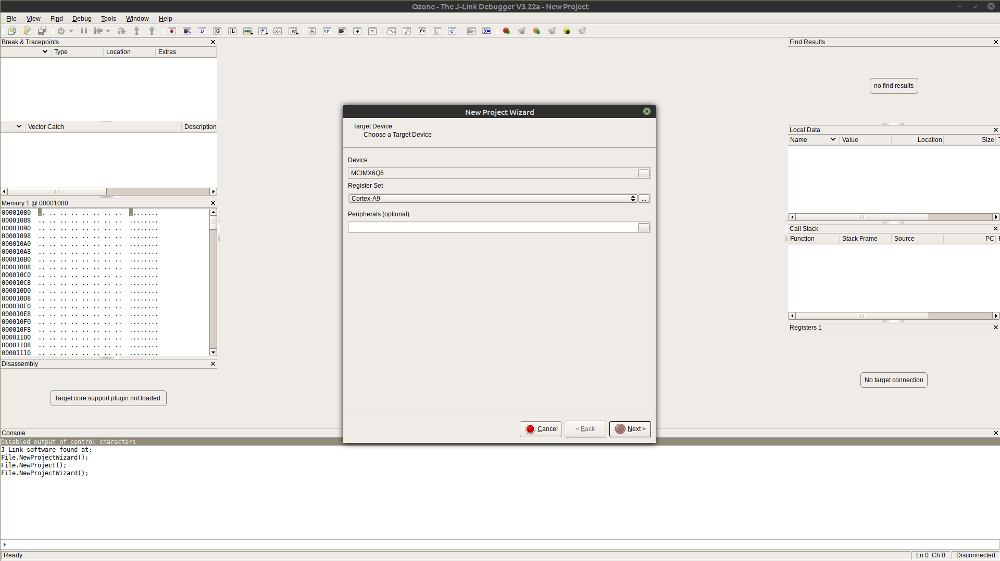
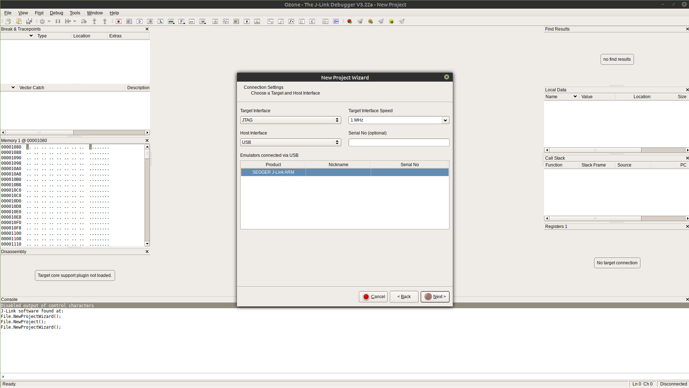
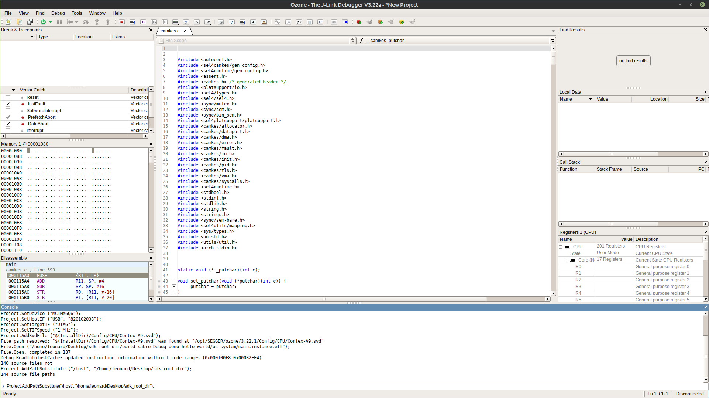
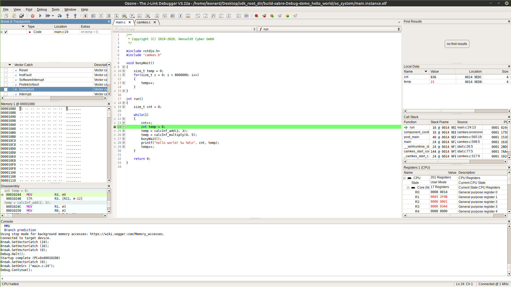

# Debugging HW Platforms Using Segger Tools

## Prerequisites

### Install J-Link

Go to the J-Link Software and Documentation Pack website here:
<https://www.segger.com/downloads/jlink/#J-LinkSoftwareAndDocumentationPack>,
choose the desired platform and download and install the J-Link package.

### Install Ozone

Go to the Ozone website here: <https://www.segger.com/downloads/jlink/#Ozone>,
choose the desired platform and download and install Ozone.

## Debugging Process

### HW Setup

Instructions accompanied by photos on how to connect the debug probe to
individual platforms are shown in the respective platform support
pages:

- [RPi3B+ Debugging with JTAG](../../platform-support/rpi-3-model-b+/debugging_jtag.md)
- [Nitrogen6_SoloX Debugging with JTAG](../../platform-support/nitrogen6-solo-x/debugging_jtag.md)
- [BD-SL-i.MX6 Debugging with JTAG](../../platform-support/bd-sl-i.mx6/debugging_jtag.md)

### Ozone Setup

After starting Ozone it is first necessary to configure the project that
will be used for the debug session. In order to do so, click on
**`File`** → **`New`** → **`New Project Wizard`** after which you will be
prompted with the following pop-up window:



Here you need to choose the platform you wish to debug (setup for each
individual platform is discussed in later sections), and the
**`Peripherals`** input can be left empty.

Next, it is necessary to configure the JTAG connection as follows
(common across platforms):



After configuring the JTAG interface and pressing **`Next`**, it is
necessary to select the .elf file that is to be debugged.

**Note:** Currently, the TRENTOS build system produces the complete
images with both **`.bin`** and **`.elf`** extensions (both elf files but with a
naming difference) located in the **`images/`** directory inside the build
directory. On the other hand, the individual elf files for different
components that are actually suitable for debugging are generated only
with a **`.bin`** extension and are located in the **`os_system/`** directory
inside the build directory. As a hack, it is necessary to rename these
files from **`.bin`** to **`.elf`** in order to use the complete functionality
of Ozone.

Depending on what part of the program you wish to debug, it is necessary
to choose the corresponding component elf file from the **`os_system/`**
directory, e.g.:

**`sdk_root_dir/<system-build-directory>/os_system/<component-name>.instance.elf`**

Finally, for the last step of the project configuration default values
can be used (except for the Nitrogen6_SoloX platform - details in the
platform specific section). After the project setup is completed, the
Ozone starts the configured debug session. As for **`gdbgui`**, Ozone is not
able to locate the source files based on the data in the provided elf
file for the same reason - the project was built using the
**trentos_build** container and the paths are set relative to the root
of the container. To fix this it is necessary to execute the following
command in the terminal (as shown in the lower left portion of the image
below):

```shell
Project.AddPathSubstitute ("/host", "<ABSOLUTE_PATH_OF_THE_SDK_ROOT_DIRECTORY>");
```



At this point the debug session is configured and ready for debugging.
In case this is the common setup to be used in the future, it is
possible to save the configured project by clicking **`File`** →
**`Save Project as`** which will result in a **`<PROJECT_NAME>.jdebug`**
file that contains all the selected settings and can be edited manually
for more convenience features as described in the Ozone manual
accessible here: <https://www.segger.com/downloads/jlink/UM08025>.

In order to actually start debugging it is necessary to power on the
board (which should already be connected to the probe and the probe
connected to the PC) and press the green power icon in the top left
corner of the window and choose **`Attach to Running Program`**. At this
point the debug session is ready and all Ozone features are available to
be used. An example of the running session is shown in the image below.



Description of all available features can be found in the Ozone manual:
<https://www.segger.com/downloads/jlink/UM08025>.

**Note:** Ozone adds and enables some break events by default - listed
in the Vector Catch window on the left, so in case you notice that the
program execution halts without hitting the desired SW breakpoint, check
that the events in the Vector Catch list are disabled.

**Note:** In case the debugged program contains empty loops (e.g. a delay loop)
stepping over these lines might cause **`gdb`** to halt and stop being usable
which would require a restart of the debug session. This is a known issue
(discussed here: <https://sourceware.org/bugzilla/show_bug.cgi?id=21221>) and
does not result from the presented setup. If you encounter this case, it is
enough to place a dummy operation in the body of the loop to remove the issue.

## VS Code Plugin

In addition to the Ozone SW from Segger, it is possible to use the VS Code text
editor to debug the HW platforms using the J-Link Base Compact probe. This is
possible after installing the necessary extensions and configuring the editor as
required.

Necessary extensions:

- C/C++
- Cortex-Debug

After the extensions have been installed, it is necessary to configure the debug
environment of VS Code. In order to do so, follow these steps:

- Open the folder **`<sdk_root_folder>/sdk`**
- Press **`Run → Add Configuration ...`**
- Select any shown environment
  - In case this is the first time **`Add Configuration ...`** is
        performed, this will create and open a **`launch.json`** file
        with a template content.
  - If you have already have a **`launch.json`** file, this will
        open it and add another configuration entry from a template
- Delete the content of the new template configuration and paste the
    following configuration into it. Be sure to:
  - Replace the \<PATH_TO_COMPONENT_ELF_FILE\> with the absolute
        path to the component elf file you wish to debug, e.g.
        **`~/sdk_root_directory/<system-build-directory>/os_system/<component-name>.instance.elf`**

```json
{
    "version": "0.2.0",
    "configurations": [
    {
    "type": "cortex-debug",
    "request": "attach",
    "name": "Debug J-Link",
    "cwd": "${workspaceRoot}",
    "executable": "<PATH_TO_COMPONENT_ELF_FILE>",
    "serverpath": "/opt/SEGGER/JLink/JLinkGDBServerCLExe",
    "servertype": "jlink",
    "device": "MCIMX6Q6",
    "interface": "jtag",
    "armToolchainPath": "/usr/bin/",
    }
    ]
}
```

- Save the file **`launch.json`**
- Go to
    **`Extensions → Cortex-Debug → Settings → Cortex-debug: Gdb Path → Edit in settings.json`**
    and add the following member to the JSON object:

```json
"cortex-debug.gdbPath": "/usr/bin/gdb-multiarch",
```

- Save the file **`settings.json`**
- In order for this setup to work, it is necessary to remove the
    following line from the **`~/.gdbinit`** file added for ease of use with
    **`gdbgui`** in the previous section:

```shell
target extended-remote :3333
```

After the setup is finished, the HW setup is completed based on the
instructions in previous sections depending on which platform is used,
and the board is powered on, it is possible to attach to the program
execution by pressing F5 or **`Run → Start Debugging`** in VS Code.
After the connection is successfully established, normal debugging
functions are available similar to Ozone (Ozone is more feature-rich,
but this setup can be convenient if VS Code is used as the primary
source editor).


