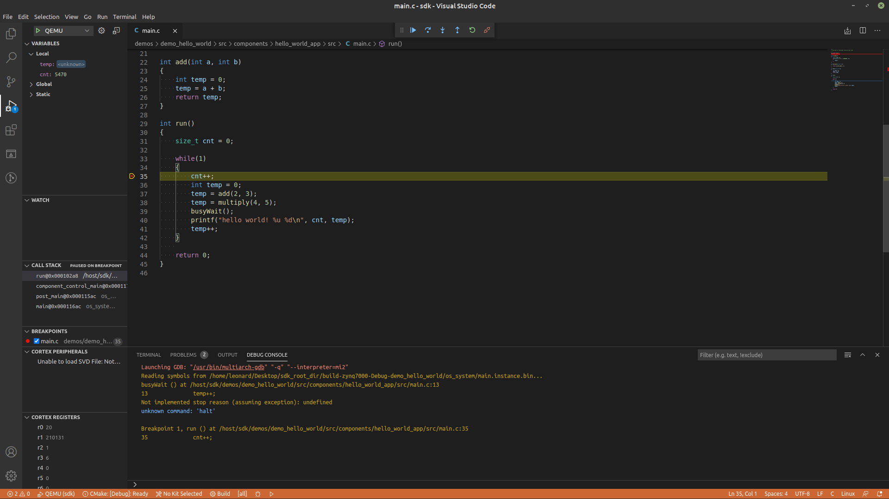

# Debugging QEMU

## Prerequisites

The only prerequisites for debugging TRENTOS applications running in
QEMU is the **`gdb`** debugger
([https://www.gnu.org/software/gdb](https://www.gnu.org/software/gdb/)).
In addition, we will use **`gdbgui`**
([https://www.gdbgui.com](https://www.gdbgui.com/)), a browser-based **`gdb`**
front-end written in Python, which provides some convenience features compared
to the puristic **`gdb`** command line.

First, install the **`gdb-multiarch`** package:

```shell
sudo apt install gdb-multiarch
```

Then, install the **`gdbgui`** tool:

```shell
python3 -m pip install --user pipx
python3 -m userpath append ~/.local/bin

# Restart the console to make sure the userpath is updated.
pipx install gdbgui
pipx upgrade gdbgui
```

After the installation of the **`gdbgui`** is complete, you have all the
necessary tools to start debugging TRENTOS applications in QEMU.

## Debugging Process

The debugging process is demonstrated using the simple Hello World demo from the
[Getting Started](../../introduction/getting-started.md) document. Once you have
built a working system image, you can debug it using **`gdb`** and QEMU. Open a
terminal, navigate to the build output directory and execute the QEMU simulate
script as follows.

```shell
cd build-zynq7000-Debug-demo_hello_world

 # "-S" pauses execution on startup, "-s" starts a GDB server on TCP port 1234
../sdk/scripts/open_trentos_test_env.sh ./simulate --extra-qemu-args="-S -s"
```

**Info:** TRENTOS systems are usually comprised of multiple components
(the seL4 microkernel, drivers, services and applications).
Unfortunately,**`gdb`** has no multitasking awareness by default and
can only work with one single binary/symbol table. Thus single-stepping
across context switches is not possible and debugging is limited to
following the execution of a single address space.

In a new terminal window, run the command shown below and replace the
**`<path/to/elf>`** argument with the path to the ELF file that contains
the application you want to debug. In the Hello World demo, the ELF file
of the main application printing the string is located
at **`build-zynq7000-Debug-demo_hello_world/os_system/main.instance.bin`**.

This will start the **`gdbgui`** tool and opens a **`gdb`** interface in
the default browser:

```shell
gdbgui --gdb gdb-multiarch --args <path/to/elf>
```

The following workspace shall now be opened in the browser:


Before connecting to the TCP port opened by the QEMU we should address
the error message shown in the middle terminal in the image above. The
reason **`gdb`** can\'t find the source files based on the data in the
provided elf file is that the project was built using the
**trentos_build** container and the paths are set relative to the root
of the container. To fix this it is necessary to execute the following
command in the **`gdb`** terminal (see lower-left sub-window of the
**`gdbgui`**).

```console
(gdb) set substitute-path /host <ABSOLUTE_PATH_OF_THE_SDK_ROOT_DIRECTORY>
```

This command replaces the **`/host`** part of the path for the source files
with their actual location on the host machine - in this case inside the
SDK root directory. After the command has been executed, clicking on the
**`show filesystem`** → **`Fetch source files`** buttons in the top left
corner of the window will refresh the file locations and make them
available for visualization of the program execution. For the example of
the Hello World demo, it is convenient to navigate to the **`main.c`** file
in
**`sdk_root_directory/sdk/demos/demo_hello_world/components/hello_world_app/src`**
since it contains all the executed code in this instance.

The next step is to connect to the TCP port opened by QEMU using the **`gdb`**
terminal.

Since QEMU is running inside the **trentos_test** docker container, it is first
necessary to find the IP address of the running container. In order to do so,
open a new terminal and run the following command.

```shell
$ docker network inspect bridge
[
...
"Containers": {
    "c21fb2428d11db64735fb45e9429d89f023c1ad7b4a57cb47acc7216962f5c71": {
        "Name": "xenodochial_leakey",
        "EndpointID": "d45832ee08e42ccb8bb231fb8904f9d4c16b56f352152a648db12af00bed9f95",
        "MacAddress": "02:42:ac:11:00:02",
        "IPv4Address": "172.17.0.2/16",
        "IPv6Address": ""
    }
},
...
]
```

In the output, under the node **`Containers`**, find the IP address of
the running container.

After the IP address of the container is obtained, connect
the **`gdbgui`** to QEMU as follows from the **`gdb`** terminal:

```console
(gdb) target extended-remote <CONTAINER_IP_ADDRESS>:1234
```

After a successful connection to QEMU is established, it is possible to
use the standard **`gdb`** tools like setting breakpoints, watchpoints,
single stepping, inspecting variables, etc.

An example of this is setting the breakpoint on line 9 of **`main.c`**
in the Hello World demo which will halt the demo before printing the
"hello world!" message.

```console
(gdb) break main.c:9
```

This is also possible to achieve by simply clicking the line number for
the line 9 provided the **`main.c`** file is opened in the central
window of the **`gdbgui`** interface.

After setting the breakpoint it should be visible on the right side of
the **`gdbgui`** interface (by default, the tool sets a breakpoint on
main, which is not the primary entry point in the case of our userspace
Hello World application, so in order to avoid unnecessary breaks this
breakpoint can be disabled by unchecking it). After pressing the
continue button in the taskbar, the program starts and halts at the
breakpoint in the run function and after pressing the continue button
once more, the terminal running QEMU should print the "hello world!"
message.

In order to debug different parts of the system, it is possible to load
different **`.elf`** files without closing the **`gdbgui`** tool. Simply
write the path to the ELF file you want to switch to in the top input
bar and press "Load Binary", after which the symbols contained in this
part of the system will become available. It is worth pointing out
that **`gdb`** offers auto-complete functionality for entering debug
symbols when, for example, adding a breakpoint or a watchpoint, by
simply pressing tab.

**Note:** In case the debugged program contains empty loops (e.g. a
delay loop) stepping over these lines might cause **`gdb`** to halt and stop
being usable which would require a restart of the debug session. This is
a known issue (discussed here: <https://sourceware.org/bugzilla/show_bug.cgi?id=21221>)
and does not result from the presented setup. If you encounter this case, it is
enough to place a dummy operation in the body of the loop to remove the issue.

## Ease of Use

Since during a single debug session it can happen that it is necessary
to start **`gdbgui`** and QEMU multiple times, it is possible to make some
adjustments that will make this process easier by automating parts of
it. Instead of manually typing in the commands to substitute the path
and connect to the container, it is possible to place them in a
**`~/.gdbinit`** script inside your home directory. This will cause the
**`gdbgui`** to execute them upon every start-up which means that the source
files will be automatically loaded correctly and **`gdbgui`** will be
connected to the running QEMU and ready for debugging.

```shell
set substitute-path /host <ABSOLUTE_PATH_OF_THE_SDK_ROOT_DIRECTORY>
target extended-remote <CONTAINER_IP_ADDRESS>:1234
```

## VS Code Plugin

In addition to **`gdbgui`**, it is possible to use the VS Code text editor
to debug the applications running in QEMU. This is possible after
installing the necessary extensions and configuring the editor as
required.

Necessary extensions:

- C/C++
- Cortex-Debug

After the extensions have been installed, it is necessary to configure the debug
environment of VS Code. In order to do so, follow these steps:

- Open the folder **`<sdk_root_folder>/sdk`**
- Press **`Run → Add Configuration ...`**
- Select any shown environment
  - In case this is the first time **`Add Configuration ...`** is
        performed, this will create and open a **`launch.json`** file
        with a template content.
  - If you have already have a **`launch.json`** file, this will
        open it and add another configuration entry from a template
- Delete the content of the new template configuration and paste the
    following configuration into it. Be sure to:
  - Replace the \<PATH_TO_COMPONENT_ELF_FILE\> with the absolute
        path to the component elf file you wish to debug, e.g.
        **`~/sdk_root_directory/build-zynq7000-Debug-demo_hello_world/os_system/main.instance.bin`**
  - Replace the \<CONTAINER_IP_ADDRESS\> with the actual IP
        address of the Docker container - see the previous section

```json
{
    "version": "0.2.0",
    "configurations": [
    {
        "type": "cortex-debug",
        "request": "attach",
        "name": "QEMU",
        "cwd": "${workspaceRoot}",
        "executable": "<PATH_TO_COMPONENT_ELF_FILE>",
        "armToolchainPath": "/usr/bin/",
        "servertype": "external",
        "gdbTarget": "<CONTAINER_IP_ADDRESS>:1234",
    }
    ]
}
```

- Save the file **`launch.json`**
- Go to
    **`Extensions → Cortex-Debug → Settings → Cortex-debug: Gdb Path → Edit in settings.json`**
    and add the following member to the JSON object:

```json
"cortex-debug.gdbPath": "/usr/bin/gdb-multiarch",
```

- Save the file **`settings.json`**
- In order for this setup to work, it is necessary to remove the
    following line from the **`~/.gdbinit`** file added for ease of use with
    **`gdbgui`** in the previous section:

```shell
target remote <CONTAINER_IP_ADDRESS>:1234
```

After the setup is finished and the QEMU is started in the container and is
halted (as described in the previous section), it is possible to attach to
the program execution by pressing F5 or **`Run → Start Debugging`** in
VS Code. After the connection is successfully established, normal debugging
functions are available similar to **`gdbgui`** (this setup can be more convenient
if VS Code is used as the primary source editor).


