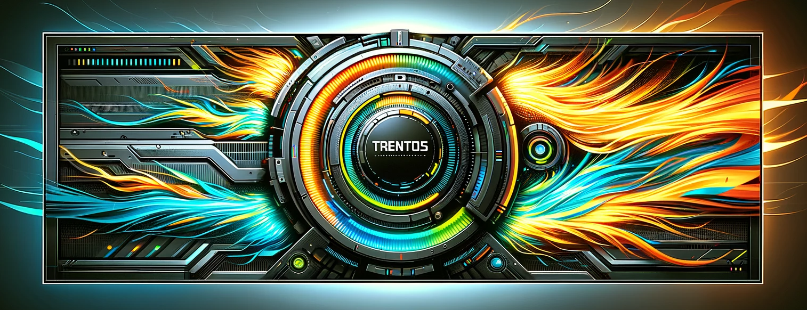

# 

```
##########################################################
#                     Information                        #
# Due to a change in the delivery format of TRENTOS some # 
# shown paths have changed.                              #
# Unfortunaltely not all documentation is yet updated.   #
# Please feel free to open an issue if problems arise.   #
##########################################################
```

## Overview

TRENTOS is an operating system based on the seL4 microkernel and the
CAmkES (Component Architecture for microkernel-based Embedded Systems)
framework. Developing TRENTOS applications and systems requires a
certain understanding of both, so the following sections provide some
pointers to background information.

```{toctree}
:caption: Introduction
:maxdepth: 1

introduction/getting-started
introduction/sel4
introduction/camkes
```

```{toctree}
:caption: API
:maxdepth: 1

api/cert-parser_api
api/config-service_api
api/configuration_service_api
api/crypto_api
api/file-system_api
api/key-store_api
api/logger_api
api/socket_api
api/tls_api
```

```{toctree}
:caption: Components
:maxdepth: 1

components/cert-server
components/chan-mux
components/crypto-server
components/entropy-source
components/network-stack_pico-tcp
components/nic_chan-mux
components/nic_dummy
components/nic_imx6
components/nic_rpi
components/ram-disk
components/rpi_spi_flash
components/sd-host-controller
components/storage_chan-mux
components/storage-server
components/time-server
components/tls-server
components/uart
```

```{toctree}
:caption: Component Interfaces
:maxdepth: 1

component-interfaces/nic-interface
component-interfaces/socket-interface
```

```{toctree}
:caption: Platform Support
:maxdepth: 1

platform-support/using-sd-card-with-trentos
platform-support/rpi-3-model-b+/platform
platform-support/nitrogen6-solo-x/platform
platform-support/bd-sl-i.mx6/platform
platform-support/nvidia-tegra/platform
```

```{toctree}
:caption: Demos
:maxdepth: 1

demos/demo-iot_qemu
demos/demo-iot_rpi3b+
demos/demo-iot_imx6
demos/demo-tls
demos/demo-network-filter_qemu
demos/demo-network-filter_nitrogen6-solox
```

```{toctree}
:caption: Tools
:maxdepth: 1

tools/proxy-application
tools/configuration-provisioning-tool
tools/ram-disk-generator-tool
tools/flasher-tool-rpi3b+
```

```{toctree}
:caption: Development
:maxdepth: 1

development/buildsystem
development/function-call-tracing
development/hardware-tools
development/runtime-debugging/runtime-debugging
development/runtime-debugging/debugging-qemu
development/runtime-debugging/debugging-hw-platforms_open-ocd
development/runtime-debugging/debugging-hw-platforms_segger
development/object-oriented-c
development/known_issues
```

```{toctree}
:caption: Glossary
:maxdepth: 1

glossary/acronyms
glossary/terms
```
