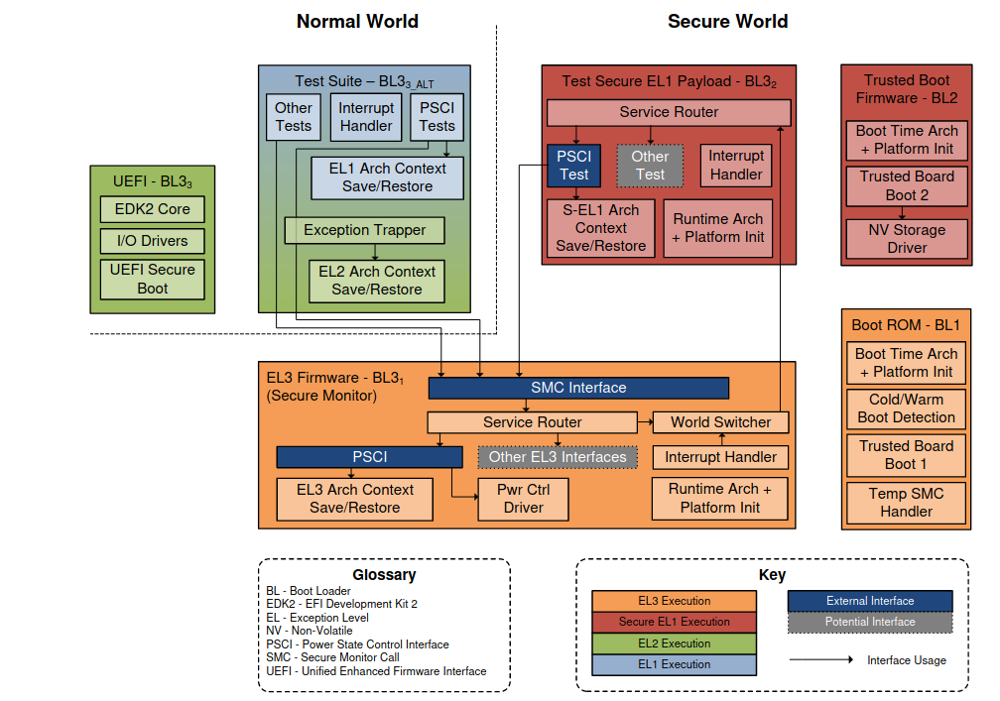
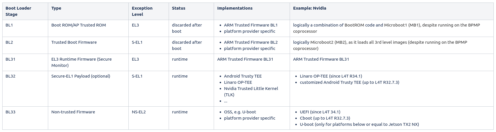
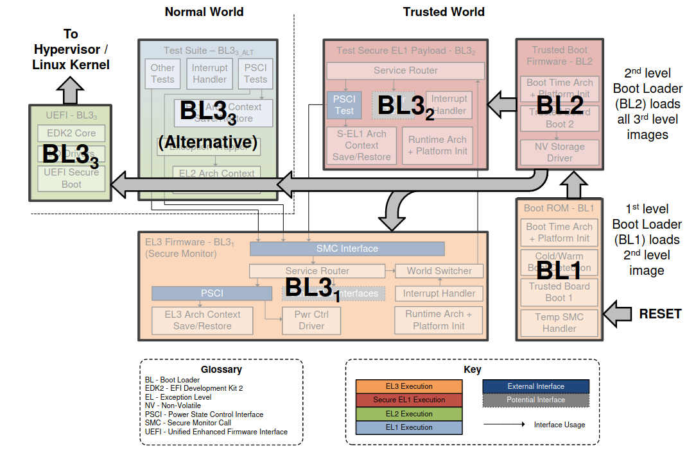

# ARM Trusted Firmware

## Introduction
- see also TrustZone (aka ARM Security Extension) for a overview about ATF
- a reference implementation of secure world software for Armv7-A and Armv8-A, leveraging ARM TrustZone support
- includes a Secure Monitor executing at Exception Level 3 (EL3)
- implements various ARM interface standards
    - The Power State Coordination Interface (PSCI)
    - Trusted Board Boot Requirements CLIENT (TBBR-CLIENT)
    - SMC Calling Convention
    - System Control and Management Interface (SCMI)
    - Software Delegated Exception Interface (SDEI)
    - PSA FW update specification

## Background: Trusted Execution Environment (TEE)
- secure area of a main processor
    - architecture
    - a hardware isolation mechanism
    - a secure operating system running on top of that isolation mechanism
- features
    - confidentiality
    - integrity
        - data integrity: prevent unauthorized access from outside TEE
        - code integrity: prevent code inside TEE from being replaced/modified by unauthorized entities
- hardware
    - hardware-based memory encryption ???
- standardization
    - GlobalPlatform: https://globalplatform.org/specs-library/?filter-committee=tee
- vendors
    - ARM
        - TrustZone
            - Samsung Knox
        - Realm Management Extension/Confidential Compute Architecture (CCA)
    - AMD
        - Platform Security Processor (PSP) -> licensed ARM TrustZone
        - AMD Secure Encrypted Virtualization, and Secure Nested Paging extension
    - Intel
        - Software Guard Extensions (SGX)
    - RISC-V
        - MultiZone Security Trusted Execution Environment
        - Keystone Customizable TEE Framework
        - Penglai Scalable TEE for RISC-V

## ARM TrustZone
- a system-wide hardware isolation mechanism
    - secure world
    - monitor
    - secure OS
    - trusted applications (trustlet)
- normal world
    - rich OS + TrustZone drivers
    - applications
- partitioning of all the SoC's hardware and software resources

## Linaro Trusted Firmware Project
- https://www.trustedfirmware.org/

## Secure Operating System (OS)
### Architecture
- small OS kernel
- a (Linux) kernel driver to transfer data between the secure environment and the Rich OS
- a userspace library to communicate with trusted applications (secure tasks/services) via the kernel driver

### Workflow
- transition from the Secure World to the Non-Secure World via a dedicated instruction -> Secure Monitor Call (SMC)
- the CPU will enter in monitor mode and will have access to all hardware, including the protected peripherals and memory regions
- now, the TEE firmware/operating system can be executed

### Examples
- OP-TEE
    - implements the TEE Internal Core API v1.1.x (the API exposed to Trusted Applications)
    - implements the TEE Client API v1.0 (the API describing how to communicate with a TEE)
    - supports Arm Firmware Framework for Arm A-profile (FF-A), which is a new way of communication between normal world and secure world
        - https://www.linaro.org/blog/op-tee-and-the-need-for-ff-a/
- Android Trusty OS
    - based on Little Kernel (LK)
    - https://source.android.com/docs/security/features/trusty
    - https://source.android.com/docs/core/architecture/partitions/tos-partitions

## Architecture

The following table clusters the different boot loader stages:

## Boot Flow

The following table describes the tasks of each dedicated boot loader stage:

| Boot Loader Stage   | Task         | Services |
|---------------------|--------------|----------|
| BL1 |  |  | 
| BL2 |  |  | 
| BL31 |  | - Interfaces     - SMC Calling Convention (SMCC)     - since ARMv8.4: Platform Security Architecture Firmware Framework for ARM A-profile (PSA FF-A)  - Power Management     - Power State Coordination Interface (PSCI)     - System Control and Management Interface (SCMI)  - Exception Handling     - Software Delegated Exception Interface (SDEI)         - Reliability, Availability, and Serviceability (RAS)         - ...     - ...  - TOS Dispatcher | 
| BL32 |  |  | 
| BL33 |  |  | 

## Components
TODO

## Services
Services are accessed via SMC instruction, from exception levels below EL3. They

- follow SMC Calling Convention
- use SMC function IDs that fall in the SiP range

The following services are provided by BL31:

- Power Management
    - Power State Coordination Interface (PSCI) Runtime Service
        - transported by SMC calls
        - used for
            - CPU hotplug (on/off)
            - CPU idle (suspend/resume)
            - system shutdown and reset
    - System Control and Management Interface (SCMI) driver
        - requires a conforming power controller → ARM System Control Processors (SCP)
        - allows to delegate power management to SCP
- Exception Handling
    - Software Delegated Exception Interface (SDEI)
        - SDEI Dispatcher
        - delivers extraordinary system events (either normal or critical priority)
        - OS/hypervisor register system event callback
        - platform error handling
            - Reliability, Availability, and Serviceability (RAS) extensions (https://en.wikipedia.org/wiki/Reliability,_availability_and_serviceability)
                - a mandatory extension for the Armv8.2 architecture and later
                - an optional extension to the base Armv8 architecture
    - ...
- TODO: ARM general → align with others
    - ARM SiP (Silicon Provider) services: non-standard, platform-specific services offered by the silicon implementer or platform provider
        - Performance Measurement Framework (PMF)
            - a caller can retrieve timestamps captured at various paths in TF-A execution
        - Execution State Switching service
            - lower exception level (EL2 or NS EL1) may request to switch execution state (AArch64 <-> AArch32)
            - only available if ATF is built for AArch64
        - DebugFS interface
            - aimed at exposing firmware debug data to higher SW layers such as a non-secure component
    - Exception Handling Framework (EHF)
        - takes care of the following exceptions
            - Interrupts
            - Synchronous External Aborts
            - Asynchronous External Aborts
- TODO: Nvidia specific → align with others
    - NVIDIA Generic interface (NVG)
    - Machine Check Architecture (MCA): https://en.wikipedia.org/wiki/Machine_Check_Architecture
    - Machine Check Exception (MCE): https://en.wikipedia.org/wiki/Machine-check_exception
        - firmware is in charge of CPUs power state transitions
        - Tegra MCE Abstract Request Interface (ARI) driver manages all NVG requests to MCE firmware running in the background
        - communicate with MCE firmware on CPU state configurations and (power) state transition requests from the CPU idle driver

## Interfaces
- SMC Calling Convention (SMCC)
    - Secure Monitor Call (SMC)
- Platform Security Architecture Firmware Framework for ARM A-profile (PSA FF-A)
    - standards
        - FF-A 1.0
        - FF-A 1.1
    - standard set of interfaces between Secure Partitions (SP) and Secure Partition Manager (SPM)
        - Secure Partitions (SP): mutually distrustful software sandboxes running in the secure world, e.g. a Trusted OS besides a platform secure services
        - Secure Partition Manager (SPM)
            - for systems implementing ARMv8.4-A Secure-EL2 extension
            - enables multiple, isolated Secure Partitions (SPs) to run at Secure-EL1
            - initializes SPs at boot time & enables communication between service requestors and providers
            - implementation
                - S-EL1 (e.g. part of OP-TEE)
                - S-EL2 (in a secure hypervisor), e.g. Hafnium as reference Secure EL2 SPM
                - EL3
                    - OP-TEE Secure Partition Manager Core (SPMC) integrated with the Secure Partition Manager Dispatcher (SPMD)
        - between SPs and normal world

## Workflow
### BL31
- BL1 passes control to BL31 at BL31_BASE
- checking boot type
    - cold boot -> BL31 stage only executed by primary CPU
    - warm boot -> BL31 executed by all CPUs
- re-initialize all architectural and platform state (despite BL1 already had performed some initialization before)
- receive bl31_params provided by BL2
- initialize a UART (PL011 console), which enables access to the printf family of functions in BL31
- enable issuing of snoop and DVM (Distributed Virtual Memory) requests to the CCI slave interface corresponding to the cluster that includes the primary CPU
- enable Memory Management Unit (MMU) within each BL stage
    - platform-specific architecture setup function -> blX_plat_arch_setup()
    - setting up translation tables -> reuse memory translation library (lib/xlat_tables)
    - ...
- enable instruction and data cache within each BL stage
- initialize the GIC
    - enable secure interrupts in the GIC CPU interface
    - disable the legacy interrupt bypass mechanism
    - configure the priority mask register to allow interrupts of all priorities to be signaled to the CPU interface
    - mark SGIs 8-15 and the other secure interrupts on the platform as secure
    - target all secure SPIs to CPU0
    - enable these secure interrupts in the GIC distributor
    - configure all other interrupts as non-secure
    - enable signaling of secure interrupts in the GIC distributor
- enable system-level implementation of the generic timer counter through the memory mapped interface
- grant access to the system counter timer module
- initialize the power controller device (in particular, initialise the locks that prevent concurrent accesses to the power controller device)
- provide runtime firmware services
    - a subset of the Power State Coordination Interface (PSCI) API
    - ...
- pass control (using the "bl_params" list populated by BL2 in memory)
    - to a normal world BL image, pre-loaded at a platform-specific address by BL2
    - optionally to the BL32 image, pre-loaded at a platform-specific address by BL2

## Secure Boot
- ARMv7-A
    - mostly vendor-specific solutions
    - TF-A + BL2 secure boot loader
- ARMv8-A
    - TF-A + BL32

## Build Process
TODO: describe process for Nvidia ATF & Trusty TEE exemplarily

- L4T Driver Package (BSP) Sources
    - ATF (atf_src.tbz2) -> bl31.bin
    - Trusty (trusty_src.tbz2) -> lk.bin
- Generate tos.img / tos_t194.img to be used during flash process
    - monitor -> bl31.bin
    - os -> lk.bin
- Replace existing tos.img / tos_t194.img in <Linux_for_Tegra>/bootloader/ folder

TODO: steps for customization

- modify BL31 (here: ATF)
- modify BL32 (here: Trusty TEE)
- replace BL32 (here: Trusty TEE) by some other baremetal service (choose a different SPD)
    - existing ATF sample services
        - sp_min (for AARCH32): A minimal AArch32 Secure Payload (SP_MIN) to demonstrate PSCI library integration with AArch32 EL3 Runtime Software
            - https://trustedfirmware-a.readthedocs.io/en/latest/design/firmware-design.html#memory-layout-on-arm-development-platforms
        - tsp (for AARCH64)
            - https://trustedfirmware-a.readthedocs.io/en/latest/perf/tsp.html
            - https://trustedfirmware-a.readthedocs.io/en/latest/components/el3-spmc.html#test-secure-payload-tsp
    - a custom service → modifying the existing ATF sample services
- build and deploy a TEE application
    - use a predefined Nvidia sample application
    - create a custom application
        - https://forums.developer.nvidia.com/t/building-new-trusted-applications-ta-using-trusty-on-jetson-xavier-nx/189624

## Documentation
- https://trustedfirmware-a.readthedocs.io/en/latest/index.html
- https://developer.arm.com/Tools%20and%20Software/Trusted%20Firmware-A
- https://github.com/ARM-software/arm-trusted-firmware