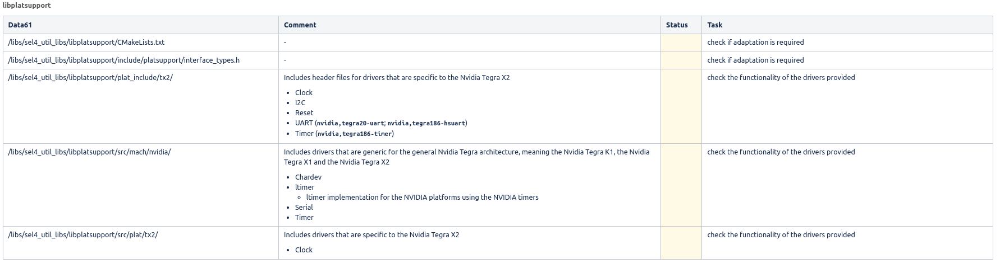
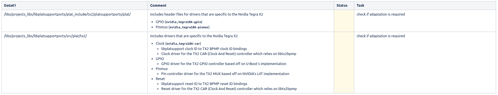
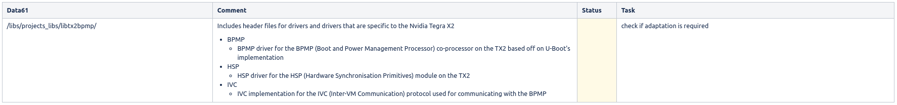
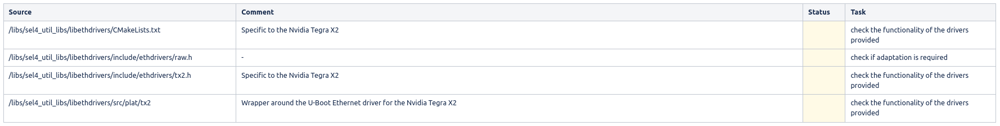
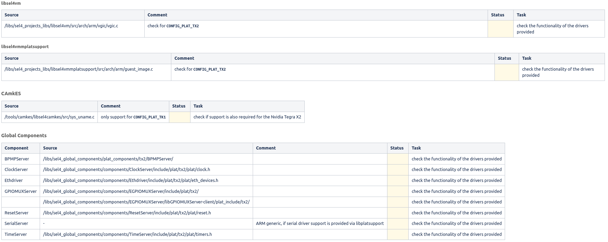

# NVidia Tegra X2

- This page shall be used to provide an overview of all workpackes that are necessary for the porting of TRENTOS to the Nvidia Tegra X2 SoC.
- Main focus here is on supporting the specific Tegra X2 NX version as SoM, used together with the custom carrier board A206 from SeeedStudio.
- for a general overview see also
    - https://en.wikipedia.org/wiki/Tegra
    - https://en.wikipedia.org/wiki/Nvidia_Jetson

## Hardware
### Tegra X2/X2i (T186)
The following provides an overview about the default Nvidia Tegra X2 SoC configuration:

- CPU: Nvidia Denver2 ARMv8 (64-bit) dual-core + ARMv8 ARM Cortex-A57 quad-core (64-bit)
- RAM: up to 8GB LPDDR4
- GPU: Pascal-based, 256 CUDA cores

### Tegra X2 NX (T186)
The Jetson TX2 NX uses a slightly reduced version of the Nvidia Tegra X2 SoC, containing the following hardware configuration:

- CPU: Nvidia Denver2 ARMv8 (64-bit) dual-core + ARMv8 ARM Cortex-A57 quad-core (64-bit)
- RAM: up to 4GB LPDDR4
- GPU: Pascal-based, 256 CUDA cores

## Variants of Nvidia Tegra X1

| Jetson Nano Version              | Revision                                                                    | Reference Carrier Board  | Jetson Module                        | Compatible property values |
|----------------------------------|-----------------------------------------------------------------------------|--------------------------|-----------------------------------|--------------------------|
| Jetson TX2 Developer Kit (P2771-0000)	| -  | P2597-0000        | P3310-1000	 | nvidia,p2597-0000+p3310-1000 |
| Jetson TX2 SoM	| -                      | P2597-0000        | P3310-1000	 |  |
| Jetson TX2i SoM	| -                      | P2597-0000        | P3489-0008	 |  |
| Jetson TX2 4GB SoM	| -                  | P2597-0000        | P3489-0888	 |  |
| Jetson TX2 NX SoM	| -                      | P2597-0000        | P3310-1000	 |  |

### SBC
Nvidia offers the Jetson TX2 in one SBC variant:

- [Jetson TX2 Developer Kit](https://developer.nvidia.com/embedded/jetson-tx2-developer-kit), which is marked as EOL
    - 8 GiB RAM
    - 32 GiB eMMC 5.1

### SoM
Nvidia also offers the Jetson TX2 in different SoM versions:

- [Jetson TX2 SoM](https://developer.nvidia.com/embedded/jetson-tx2)
    - 8 GiB RAM
    - 32 GiB eMMC 5.1
- [Jetson TX2 4GB SoM](https://developer.nvidia.com/embedded/jetson-tx2)
    - 4 GiB RAM
    - 16 GiB eMMC 5.1
- [Jetson TX2i](https://developer.nvidia.com/embedded/jetson-tx2i)
    - 8 GiB RAM
    - 32 GiB eMMC 5.1
- [Jetson TX2 NX SoM](https://developer.nvidia.com/embedded/jetson-tx2-nx)
    - 4 GiB RAM
    - 16 GiB eMMC 5.1

### Carrier Board
[SeeedStudio A206](https://www.seeedstudio.com/A206-Carrier-Board-for-Jetson-Nano-Xavier-NX-p-5132.html)

## Nvidia Developer Resources
- Nvidia JetPack SDK: https://developer.nvidia.com/jetpack-sdk-46
- Nvidia L4T
    - Latest (including Jetson Nano): https://developer.nvidia.com/embedded/linux-tegra-r3261
    - up to Jetson TK1: https://developer.nvidia.com/linux-tegra-r218
- Nvidia Jetson Linux Developer Guide: https://docs.nvidia.com/jetson/l4t/index.html
- Nvidia Jetson Nano Community
    - https://developer.nvidia.com/embedded/community/resources
    - https://forums.developer.nvidia.com/c/agx-autonomous-machines/jetson-embedded-systems/jetson-nano/76

### GPU
- https://www.kernel.org/doc/html/latest/gpu/tegra.html
- https://developer.nvidia.com/shield-open-source

### Porting Support
Jetson TX2 Platform Adaptation Guide: https://docs.nvidia.com/jetson/l4t/index.html#page/Tegra%20Linux%20Driver%20Package%20Development%20Guide/adaptation_and_bringup_tx2.html

### Compilation
- https://developer.ridgerun.com/wiki/index.php?title=Compiling_Jetson_TX1/TX2_source_code
- https://developer.ridgerun.com/wiki/index.php?title=Compiling_Tegra_X2_source_code

## Existing seL4 support
The mainline seL4 already provides support for the Nvidia Tegra X2 in a limited form and based on specific development boards. According to https://docs.sel4.systems/Hardware/, seL4 currently supports the following platforms:

- [Jetson TX2](https://docs.sel4.systems/Hardware/JetsonTX2.html) (Nvidia)
Previous Nvidia platforms are supported in form of the

- Nvidia Tegra K1
    - [Jetson TK1](https://docs.sel4.systems/Hardware/jetsontk1.html) (Nvidia)
    - [TK1 SOM](https://docs.sel4.systems/Hardware/CEI_TK1_SOM/) (Colorado Engineering)
- Nvidia Tegra X1
    - [Jetson TX1](https://docs.sel4.systems/Hardware/jetsontx1.html) (Nvidia)

### Resources
- Technical Reference Manual (TRM): https://developer.nvidia.com/embedded/downloads#?tx=$product,jetson_tx1 (after registration)
    - Tegra X1 TRM
    - Tegra X1 TRM
    - Nvidia Download Center: https://developer.nvidia.com/embedded/downloads

## Device Drivers
The seL4 already provides basic support for the Jetson TK1, the Jetson TX1 and the Jetson TX2 in a limited form. Support for the Jetson Nano SBC is generally based on the Jetson TX1 SoC, from which baseline support can be adopted.

### CMake-build system

| Data61                                                     | Comment                                                                                                                    | Status  | Task                   |
|------------------------------------------------------------|----------------------------------------------------------------------------------------------------------------------------|---------|------------------------|
| /tools/seL4/cmake-tool/helpers/application_settings.cmake	 | | okay | |

### Elfloader

| Data61 | Comment | Status  | Task |
|--------|---------|---------|------|
| /tools/seL4/elfloader-tool/src/arch-arm/smp_boot.c	 |  | okay | check the functionality of the drivers provided |
| /tools/seL4/elfloader-tool/src/drivers/uart/8250-uart.c | driver checks for compatibility String nvidia,tegra20-uart, which is available in   tx2.dts | okay | check the functionality of the drivers provided |
| /tools/seL4/elfloader-tool/src/arch-arm/smp_boot.c	 |  | okay | check the functionality of the drivers provided |

### seL4

| Data61 | Comment | Status  | Task |
|--------|---------|---------|------|
| /kernel/src/drivers/serial/tegra_omap3_dwapb.c | driver for the Nvidia UART IP	 | okay | - |
| /kernel/src/drivers/serial/config.cmake | includes the compatibility String nvidia,tegra20-uart for registering the driver available in tegra_omap3_dwapb.c | okay | check the functionality of the drivers provided |
| /kernel/src/drivers/smmu/config.cmake	 | includes the compatibility String arm,mmu-500 for registering the driver available in smmuv2.c | okay | check the functionality of the drivers provided |
| /kernel/src/drivers/timer/config.cmake | includes compatibility String arm,armv8-timer for registering the driver available in generic_timer.c | okay | check the functionality of the drivers provided |
| /kernel/src/plat/tx2/config.cmake	 | a new platform (KernelPlatformTx2, PLAT_TX2) was added  - usage of the  - tools/dts/tx2/tx2.dts  - src/plat/tx2/overlay-tx2.dts  - references  - arch/machine/gic_v2.h  - drivers/timer/arm_generic.h  - drivers/smmu/smmuv2.h  - includes references to  - ARM Generic Interrupt Controller: src/arch/arm/machine/gic_v2.c  - ARM L2 Cache Controller: src/arch/arm/machine/l2c_nop.c  According to the ARM documentation, the GIC-400 implements the GICv2 architecture. | okay | check the functionality |
| /kernel/src/plat/tx2/overlay-tx2.dts	 | seL4 seems to boot on the first non-Nvidia core (Cortex-A57) only   Question: no support for the Nvidia Denver cores ??? | okay | check if support for the Nvidia Denver cores is required or if the ARM Cortex-A57 cores are sufficient |
| /kernel/tools/hardware.yaml | ARM PMU: arm,armv8-pmuv3  - SMMU: arm,mmu-500  - ARM Global Timer: arm,armv8-timer  - Serial: nvidia,tegra20-uart  - ARM PSCI: arm,psci-1.0 | okay | check if some compatibility Strings have to be added here (see Nitrogen6_SoloX porting as a reference) |
| /kernel/tools/dts/tx2.dts	  | .dts file for the Nvidia Jetson TX2 | okay | check the .dts file needs adaptation |
| /kernel/tools/hardware/irq.py	 | check compatibility String in CONTROLLERS for   arm,gic-400  arm,cortex-a15-gic  Question: which one is used here, as both variants a referenced in other files and .dts ??? | okay | check if some compatibility Strings have to be added to CONTROLLERS |

## Libraries
The seL4 libraries can be split into

- libplatsupport (sel4_util_libs)
- libplatsupportports (projects_libs) → a collection of drivers ported from GPL-based sources such as U-Boot and Linux
- libtx2bpmp (projects_libs) → a port of the Tegra186 Boot and Power Management Processor (BPMP) interfaces from U-Boot to seL4
- libethdrivers (sel4_util_libs)
- libsdhcdrivers (projects_libs)
- libsel4vm (sel4_projects_libs)
- libsel4vmmplatsupport (sel4_projects_libs)

### projects_libs

#### libplatsupport

#### libtx2bpmp

#### libethdrivers

#### libsdhcdrivers
Currently, there is no support for SDHCI.

#### libsel4vm

### U-Boot
TODO

Nvidia provides their own U-Boot version with modifications, which is provided as part of their L4T package.

### Summary
In general, Data61 provides support for the Nvidia Tegra X2 in form of the Jetson TX2 development board. This affects the following parts:

- Bootloader support is provided via Nvidia, in form of their custom U-Boot variant, shipped within the L4T bundle
- The seL4 basic parts (build support, the seL4 Elfloader, the seL4 kernel) are already provided by Data61
- Userspace drivers are provided by Data61 for
    - Clock
    - Interrupt
    - Reset
    - Timer
    - UART
    - Pinmux
    - GPIO
- Additional drivers are provided by Data61 for the Boot and Power Management Processor (BPMP)
- Ethernet driver support is provided by Data61 based on U-Boot source code

#### Current Shortcomings
The following parts are currently missing:

- SD/MMC
- I2C
- SPI
- USB
Furthermore, it seems that Data61 is only providing support for the standard ARM Cortex-A57 cores, but is lacking support for the also ARMv8-A based Nvidia Denver2 cores. In addition, there is also no support for the Nvidia Pascal GPU. This especially affects the usage of CUDA-based GPGPU computing, which is required for machine/deep learning acceleration.

GPU support is currently provided by Nvidia on top of their own Linux distribution, shipped in form of the Linux 4 Tegra (L4T) bundle. Machine/Deep Learning Tools are provided for L4T in form of the Nvidia JetPack SDK. Nevertheless, CUDA is only supported on the proprietary graphics driver by Nvidia, but not by the open source driver Nouveau.

### Future Work
- ZF will definitely be interested in CUDA for Tegra support, as this is required for the machine/deep learning related activities
    - see Nvidia DRIVE
    - see Nvidia DRIVE OS
    - see Nvidia DRIVE OS SDK
- CUDA support is currently provided solely based on the Nvidia proprietary drivers for Windows, Linux and MacOS
    - CUDA support requires the proprietary GPU driver from Nvidia, the open source driver Nouveau doesn't seem to work
    - GPU driver support in Linux based on DRM, KMS, ... has to be investigated
    - How can we integrate a driver blob into seL4/TRENTOS-M ???
- Can we port drivers (and if yes, to which extent) provided by Nvidia for Linux (L4T) to seL4/TRENTOS ???
- Do we require support for further toolkits provided by Nvidia on Linux, e.g. the Nvidia JetPack SDK ???

