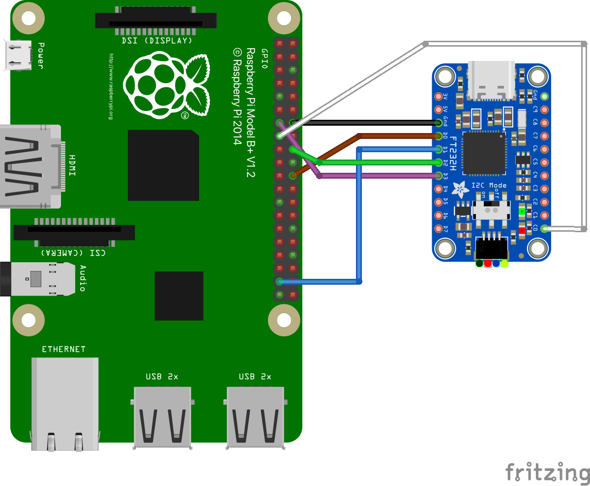

# RPi3B+ Debugging with JTAG

In the following, an exemplary setup is presented which allows JTAG
debugging on the RPi3B+. In order to connect to the RPi3B+ from the PC,
the two open-source tools OpenOCD and **`gdb`** are to be used. Please
refer to the [Runtime Debugging](../../development/runtime-debugging/runtime-debugging.md)
section to get an overview on debugging TRENTOS applications both on HW and in
QEMU. This chapter aims only to provide debugging details specific to
the RPi3B+ platform:

- connection between the RPi3B+ board and the Adafruit FT232H board
    used as simple JTAG adapter
- the RPi3B+ OpenOCD configuration

## JTAG Pin Mapping

According to
<https://www.raspberrypi.org/documentation/configuration/config-txt/gpio.md>,
JTAG support needs to be enabled on the RPi3B+ via the **`config.txt`** file.
This has already been prepared in the file provided with the SDK.

```console
enable_jtag_gpio=1
```

This selects the alternate mode ALT4 for some Broadcom SOC GPIOs, so the JTAG
signals are routed and exposed at the 2x20 pin header. See also
<https://pinout.xyz/pinout/jtag> about the pin mapping details. The table
below gives an overview of the signals, the routing and where to connect the
Adafruit FT232H board to the RPi3B+ to do JTAG debugging:

| JTAG Signal                 | Adafruit<br>FT232H | Cable color in the picture below  | RPi3B+ Pin on the 2x20 Pin Header | Broadcom<br>SOC GPIO Signal | Notes                                                                                                                                                                                                                 |
|-----------------------------|--------------------|-----------------------------------|-----------------------------------|-----------------------------|-----------------------------------------------------------------------------------------------------------------------------------------------------------------------------------------------------------------------|
| TCK<br>(Test Clock)         | D0                 | brown                             | 22                                | 25                          | JTAG spec recommends a pull-down resistor (4.7k - 10k) to avoid random clock signals if the pin is floating. The Adafruit FT232H board does not provide such a resistor, but debugging usually works without it, too. |
| TMS<br>(Test Mode Select)   | D3                 | violet                            | 13                                | 27                          | JTAG spec recommends a pull-up resistor (4.7k - 10k) to avoid having this pin floating. The Adafruit FT232H board does not provide such a resistor, but debugging usually works without it, too.                      |
| TDI<br>(Test Data In)       | D1                 | blue                              | 37                                | 26                          | JTAG spec recommends a pull-up resistor (4.7k - 10k) to avoid having this pin floating. The Adafruit FT232H board does not provide such a resistor, but debugging usually works without it, too.                      |
| TDO<br>(Test Data Out)      | D2                 | green                             | 18                                | 24                          | JTAG adapter should use a 33R line resistor.The Adafruit FT232H board does not provide such a resistor, but debugging usually works without it, too.                                                                  |
| GND                         | GND                | black                             | 14                                | -                           | Ground                                                                                                                                                                                                                |
| TRST<br>(Test Reset)        | C0                 | white                             | 15                                | 22                          | A pull-down resistor (4.7k - 10k) should be used to ensure the JTAG debug logic is disabled when unused. The Adafruit FT232H board does not provide such a resistor, but debugging usually works without it, too.     |
| SRST<br>(System Reset)      | -                  | -                                 | -                                 | -                           | optional, unused                                                                                                                                                                                                      |
| RTCK<br>(Return Test Clock) | -                  | -                                 | 16                                | 23                          | optional, unused                                                                                                                                                                                                      |

More details about the JTAG signals can be found in the IEEE Standard
1149.1 available at <https://standards.ieee.org/standard/1149_1-2013.html> and
also at <https://www2.lauterbach.com/pdf/app_arm_jtag.pdf>. Raspberry Pi
specific details can be found at
[https://metebalci.com/blog/bare-metal-raspberry-pi-3b-jtag](https://metebalci.com/blog/bare-metal-raspberry-pi-3b-jtag/).



## OpenOCD Configuration File

As mentioned in the [Debugging Applications on HW Platforms](../../development/runtime-debugging/debugging-hw-platforms_open-ocd.md)
section, OpenOCD requires two different configuration files - one
for the FT232H board and one regarding the particular platform. The
configuration file specific to the RPi3B+ platform is located in the
same directory as the FT232H configuration file
(**`sdk/resources/openocd_cfgs/rpi3.cfg`**).

## Segger Toolchain Setup

As of now the RPi3B+ platform is not supported by the Segger toolchain:

- <https://forum.segger.com/index.php/Thread/6627-SOLVED-J-Link-edu-connection-to-Cortex-A53/>

Even though the newer versions of the probes support the Cortex-A53 (as
shown here:
<https://wiki.segger.com/Software_and_Hardware_Features_Overview>) on
which the Broadcom BCM2837 is based upon, the SoC itself is not
supported. Furthermore, Ozone does not allow for the selection of any
Cortex-A53 based platforms, and while the command tool **`JLinkGDBServer`**
does support some Cortex-A53 based SoCs from NXP, their settings do not
work for the RPi3B+ out of the box. In order to add support for RPi3B+,
it would be necessary to create a custom J-Link configuration script for
the board, which is not trivial. Documentation on writing the J-Link
script can be found on the Segger wiki here:
<https://wiki.segger.com/J-Link_script_files>.
