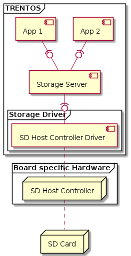
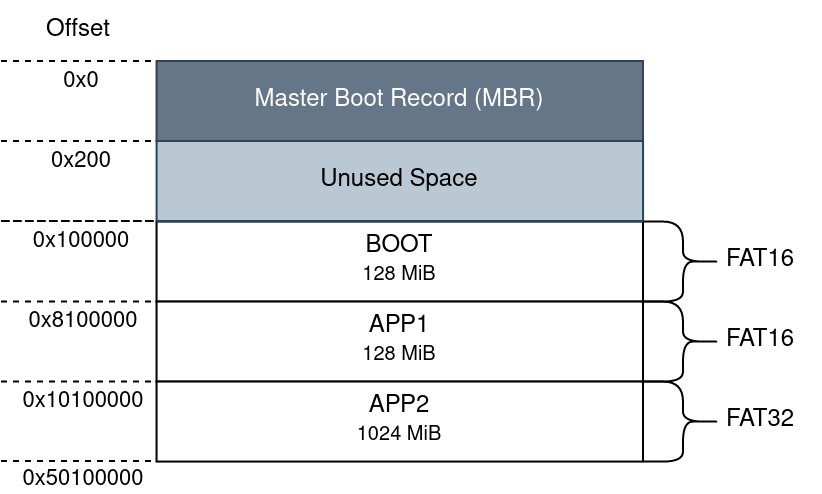
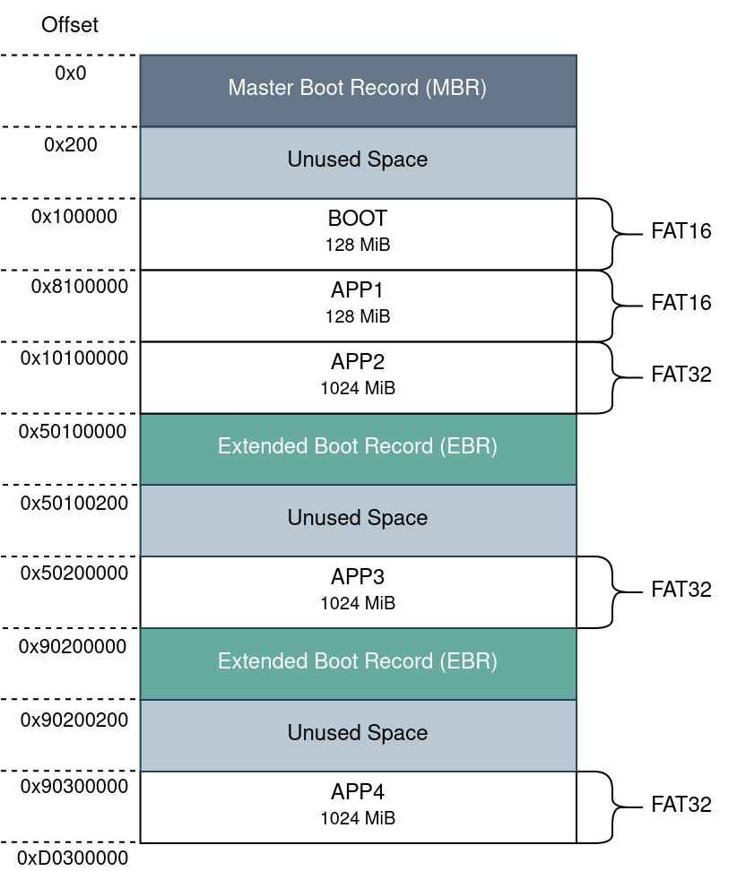
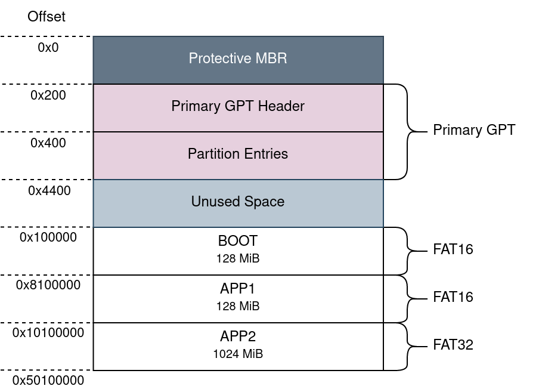

# Using an SD Card with a TRENTOS System

## Overview

TRENTOS based systems that need to enable multiple client components to
access a single storage device can do so by employing a
[StorageServer](../components/storage-server.md) component.

As this server will statically assign a single "slice of storage" to
every client connected to it, this partitioning of the storage device
needs to be adapted to the SD card, to allow for interoperability
between the operating system running on a PC and the embedded TRENTOS
system on the board.

This chapter will demonstrate how an example partition table layout
(either as MBR or GPT) can be created on an SD card and how the static
configuration of a StorageServer component needs to be adapted to this
layout so that files written to the different partitions on the SD card
can be easily exchanged between the TRENTOS system and the PC.

The guiding example system architecture for the setup steps outlined in
this chapter is shown in the diagram below. In this TRENTOS system, the
StorageServer component needs to manage two memory slices, each
one individually mapped to one of the two connected clients.



## Master Boot Record (MBR)

Derived from the architecture shown in the overview section above, a
possible Master Boot Record (MBR) partition table layout for this
example system could be structured as follows:



**Info:** The layout is 1 MiB aligned so even though the MBR itself only
has a size of 512 Byte, the reserved space for this record is 1 MiB.

Setting up the illustrated layout can be done by utilizing a tool such
as **`parted`**. Any other tool that can create and manipulate partition
tables could also be used for this task. It is important to note that
throughout all the following steps, it will be assumed that the SD card
has the device path **`/dev/sda`**.

In order to be able to reformat the SD card, all existing partitions on
it need to be unmounted in case they were automatically mounted once the
card got connected to the PC.

```shell
umount /dev/sda?*
```

Once all the currently existing partitions of the SD card have been
successfully unmounted, it can be overwritten with the new partition
layout. Note that using **`sudo`** for some of the following commands
may not be required, this depends on your Linux group membership giving
your account access to the device path (in the current example
**`/dev/sda`**).

```shell
sudo parted --script /dev/sda mklabel msdos \
    mkpart primary 1MiB 129MiB \
    mkpart primary 129MiB 257MiB \
    mkpart primary 257MiB 1281MiB
```

This command will create an MBR formatted layout with the three entries for the
"BOOT", "APP1" and "APP2" partitions.

The created partitions will be formatted to FAT with a file system
formatting tool such as **`mkfs.vfat`**.

```shell
sudo bash -c 'mkfs.vfat -n "BOOT" /dev/sda1 \
    && mkfs.vfat -n "APP1" /dev/sda2 \
    && mkfs.vfat -n "APP2" /dev/sda3'
```

In case you a preparing the SD card to be used with the
[Raspberry Pi 3 Model B+](../platform-support/rpi-3-model-b+/platform.md)
it is additionally required to set the LBA flag (0x0C = FAT32 with LBA)
for the "BOOT" partition. Without this flag set, the board will not be
able to boot from this partition.

```shell
sudo parted --script /dev/sda set 1 lba on
```

Remount all the partitions on the SD card (either by reinserting it into
the PC or with the following command).

```shell
ls /dev/sda?* | xargs -n1 udisksctl mount -b
```

The SD card should now be partitioned into the created partitions and
these partitions should be FAT formatted. This can be verified by
running:

```shell
sudo parted /dev/sda u MiB print
```

If all steps succeed, the expected outcome should look similar to the
following snapshot.

```console
Model: Generic STORAGE DEVICE (scsi)
Disk /dev/sda: 30437MiB
Sector size (logical/physical): 512B/512B
Partition Table: msdos
Disk Flags:
Number  Start    End      Size     Type     File system  Flags
 1      1,00MiB  129MiB   128MiB   primary  fat16        lba
 2      129MiB   257MiB   128MiB   primary  fat16
 3      257MiB   1281MiB  1024MiB  primary  fat3
```

The SD card itself is now prepared with the partition table layout but
the resulting partition size and offset configuration still need to be
adapted for the configuration of the
[StorageServer](../components/storage-server.md) component.

```c
//-----------------------------------------------------------------------------
// StorageServer
//-----------------------------------------------------------------------------
// 129 MiB reserved for MBR and BOOT partition.
#define MBR_STORAGE_SIZE    (1*1024*1024)
#define BOOT_STORAGE_SIZE   (128*1024*1024)// 128 MiB for APP1
#define APP1_STORAGE_OFFSET (MBR_STORAGE_SIZE + BOOT_STORAGE_SIZE)
#define APP1_STORAGE_SIZE   (128*1024*1024)// 1024 MiB for APP2
#define APP2_STORAGE_OFFSET (APP1_STORAGE_OFFSET + APP1_STORAGE_SIZE)
#define APP2_STORAGE_SIZE   (1024*1024*1024)
```

With the presented setup in place, the pre-partitioned SD card can now
be mounted on both, the TRENTOS system and the PC.

This described setup was tested on the
[Nitrogen6_SoloX](../platform-support/nitrogen6-solo-x/platform.md),
the [BD-SL-i.MX6](../platform-support/bd-sl-i.mx6/platform.md),
and the [Raspberry Pi 3 Model B+](../platform-support/rpi-3-model-b+/platform.md)
using SD cards driven by the
[SdHostController](../components/sd-host-controller.md) component with
applications accessing the different partitions on the SD card through the
[StorageServer](../components/storage-server.md) component.

To get a better understanding of how this setup can be applied to a
TRENTOS system, it is recommended to take a closer look at the
[IoT Demo App for i.MX6](../demos/demo-iot_imx6.md). This application makes use
of an MBR partitioned SD card that is managed by a
[StorageServer](../components/storage-server.md) component.

### Creating an Extended Partition

MBR has a clear limitation in that it only supports up to four primary
partitions. If more partitions are required, it is necessary to
designate one of the primary partitions as an \"extended partition\"
which can then be subdivided into several logical partitions inside of
it. The structure of this extended partition is described by one or more
extended boot records (EBRs) located in the first sector of the extended
partition.

Assuming two additional components will be connected to the
StorageServer component and these also require dedicated memory slices (wrapped
into partitions) to operate on, the initial partition table could be extended to
the following layout.



**Info:** The layout is 1 MiB aligned so even though the MBR and EBRs only have
a size of 512 Byte the reserved space for these records is 1 MiB, leaving some
unused space in between. It is also important to note that the diagram simplifies
the placement offsets of the EBRs, as the following EBRs after the initial EBR
are not necessarily placed directly at the end of the preceding logical
partition but rather within the reserved 1MiB range between the logical
partitions. For further information, please refer to the EBR
specification.

To extend the already created table to the variant shown above, it is
necessary to first designate one of the four possible primary partitions
as an extended partition followed by the creation of the two additional
logical partitions for \"APP3\" and \"APP4\". All the following steps
are based on the assumption that the utilized SD card has already been
partitioned with the MBR and the first three partitions for \"BOOT\",
\"APP1\", and \"APP2\" as outlined in the previous section.\

```shell
sudo parted --script /dev/sda \
    mkpart extended 1281MiB 3331MiB \
    mkpart logical 1282MiB 2306MiB \
    mkpart logical 2307MiB 3331MiB
```

Both additional partitions will also be formatted to FAT. Note that we
are skipping the fourth partition as this is the beginning of the
extended partition that only contains the initial EBR which described
how large the complete extended partition is and where the first logical
partition and the next EBR are located.

```shell
sudo mkfs.vfat -n "APP3" /dev/sda5 \
    s&& sudo mkfs.vfat -n "APP4" /dev/sda6
```

Mount the additionally added partitions.

```shell
udisksctl mount -b /dev/sda5 \
    && udisksctl mount -b /dev/sda6
```

Verify that the extended partition containing the added logical
partitions was created successfully by running:

```shell
sudo parted /dev/sda u MiB print
```

The expected outcome should look similar to the following snapshot.

```console
Model: Generic STORAGE DEVICE (scsi)
Disk /dev/sda: 30437MiB
Sector size (logical/physical): 512B/512B
Partition Table: msdos
Disk Flags:
Number  Start    End      Size     Type      File system  Flags
 1      1,00MiB  129MiB   128MiB   primary   fat16
 2      129MiB   257MiB   128MiB   primary   fat16
 3      257MiB   1281MiB  1024MiB  primary   fat32
 4      1281MiB  3331MiB  2050MiB  extended               lba
 5      1282MiB  2306MiB  1024MiB  logical   fat32
 6      2307MiB  3331MiB  1024MiB  logical   fat32
```

The extended partition table also needs to be updated for the configuration of
the [StorageServer](../components/storage-server.md) component of the example
system.

```c
//-----------------------------------------------------------------------------
// StorageServer
//-----------------------------------------------------------------------------
// 129 MiB reserved for MBR and BOOT partition.
#define MBR_STORAGE_SIZE    (1*1024*1024)
#define BOOT_STORAGE_SIZE   (128*1024*1024)// 128 MiB for APP1
#define APP1_STORAGE_OFFSET (MBR_STORAGE_SIZE + BOOT_STORAGE_SIZE)
#define APP1_STORAGE_SIZE   (128*1024*1024)// 1024 MiB for APP2
#define APP2_STORAGE_OFFSET (APP1_STORAGE_OFFSET + APP1_STORAGE_SIZE)
#define APP2_STORAGE_SIZE   (1024*1024*1024)// 1 MiB reserved for EBR in between
// the logical partitions of the extended partition.
#define EBR_STORAGE_SIZE    (1*1024*1024)// 1024 MiB for APP3
#define APP3_STORAGE_OFFSET (EBR_STORAGE_SIZE + APP2_STORAGE_OFFSET + APP2_STORAGE_SIZE)
#define APP3_STORAGE_SIZE   (1024*1024*1024)// 1024 MiB for APP4
#define APP4_STORAGE_OFFSET (EBR_STORAGE_SIZE + APP3_STORAGE_OFFSET + APP3_STORAGE_SIZE)
#define APP4_STORAGE_SIZE   (1024*1024*1024)
```

## GUID Partition Table (GPT)

**Warning:** Using the GPT layout scheme with the
[Raspberry Pi 3 Model B+](../platform-support/rpi-3-model-b+/platform.md) will
result in an inability to boot as the board expects an SD card with an MBR
partition table layout. If you are preparing an SD card for this platform it is
advised to follow the steps outlined above on how to correctly partition a
storage device with an MBR layout.

Compared to the MBR partition table layout, the GUID Partition Table
(GPT) additionally includes the primary GPT, which can be subdivided
into the primary GPT header and the partition entries. Based on the
system architecture shown in the overview section the following GPT
layout example will be used as the guideline for all setup steps.



Setting up the partition table layout can be done by utilizing a tool
such as **`parted`**. Any other tool that can create and manipulate
partition tables could also be used for this task. It is important to
note that throughout all the following steps, it will be assumed that
the SD card has the device path **`/dev/sda`**.

In order to be able to reformat the SD card, all existing partitions on
it need to be unmounted in case they were automatically mounted once the card
got connected to the PC.

```shell
umount /dev/sda?*
```

Once all the currently existing partitions of the SD card have been
successfully unmounted, it can be overwritten with the shown partition
layout. Note that using **`sudo`** for some of the following commands
may not be required, this depends on your Linux group membership giving
your account access to the device path (in the current example
**`/dev/sda`**).

```shell
sudo parted --script /dev/sda mklabel gpt \
    mkpart primary 1MiB 129MiB name 1 "BOOT" \
    mkpart primary 129MiB 257MiB name 2 "APP1" \
    mkpart primary 257MiB 1281MiB name 3 "APP2"
```

This will create a GPT formatted layout with the three entries for the "BOOT",
"APP1" and "APP2" partitions.

The created partitions will be formatted to FAT with a file system
formatting tool such as **`mkfs.vfat`**.

```shell
sudo bash -c 'mkfs.vfat -n "BOOT" /dev/sda1 \
    && mkfs.vfat -n "APP1" /dev/sda2 \
    && mkfs.vfat -n "APP2" /dev/sda3'
```

Remount all the partitions on the SD card (either by reinserting it into
the PC or with the following command).

```shell
ls /dev/sda?* | xargs -n1 udisksctl mount -b
```

The SD card should now be partitioned into the created partitions and
these partitions should be FAT formatted. This can be verified by
running:

```shell
sudo parted /dev/sda u MiB print
```

If all steps succeed, the expected outcome should look similar to the following
snapshot.

```console
Model: Generic STORAGE DEVICE (scsi)
Disk /dev/sda: 30437MiB
Sector size (logical/physical): 512B/512B
Partition Table: gpt
Disk Flags:
Number  Start    End      Size     File system  Name   Flags
 1      1,00MiB  129MiB   128MiB   fat16        BOOT
 2      129MiB   257MiB   128MiB   fat16        APP1
 3      257MiB   1281MiB  1024MiB  fat32        APP2
```

The SD card itself is now prepared with the partition table layout but
the resulting partition size and offset configuration still need to be
adapted for the configuration of the
[StorageServer](../components/storage-server.md) component.

```c
//-----------------------------------------------------------------------------
// StorageServer
//-----------------------------------------------------------------------------
// 129 MiB reserved for GPT and BOOT partition.
#define GPT_STORAGE_SIZE    (1*1024*1024)
#define BOOT_STORAGE_SIZE   (128*1024*1024) // 128 MiB for APP1
#define APP1_STORAGE_OFFSET (GPT_STORAGE_SIZE + BOOT_STORAGE_SIZE)
#define APP1_STORAGE_SIZE   (128*1024*1024) // 1024 MiB for APP2
#define APP2_STORAGE_OFFSET (APP1_STORAGE_OFFSET + APP1_STORAGE_SIZE)
#define APP2_STORAGE_SIZE   (1024*1024*1024)
```

With the presented setup in place, the pre-partitioned SD card can now
be mounted on both, the TRENTOS system and the PC.

This described setup was tested on the
[Nitrogen6_SoloX](../platform-support/nitrogen6-solo-x/platform.md)
and the
[BD-SL-i.MX6](../platform-support/bd-sl-i.mx6/platform.md) using SD cards driven
by the [SdHostController](../components/sd-host-controller.md) component with
applications accessing the different partitions on the SD card through the
[StorageServer](../components/storage-server.md) component.
